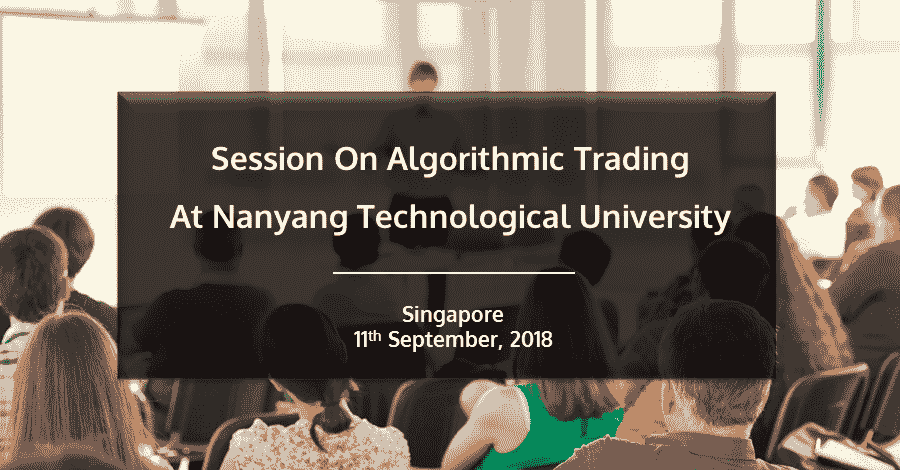
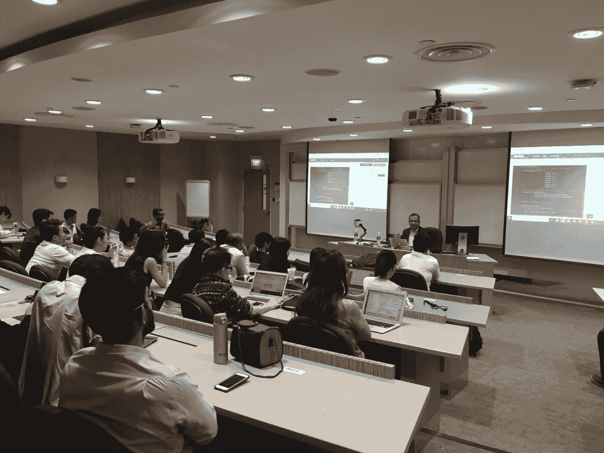

# 新加坡南洋理工大学的算法交易课程

> 原文：<https://blog.quantinsti.com/session-algorithmic-trading-ntu/>

### 

### **简介**

新加坡南洋理工大学邀请 QuantInsti 为他们的 MFE 学生进行算法交易的会议。

nitesh Khandelwal(QuantInsti 首席执行官)和 Prodipta Ghosh(QuantInsti 副总裁)与这些聪明的学生进行了互动，并与他们分享了他们的行业经验！

### **会议亮点**

一些重点会议包括:

*   概观
*   系统结构
*   市场数据类型
*   系统策略
*   技术指标
*   管理战略组合

### **关于 NTU**

新加坡南洋理工大学(NTU 新加坡)是一所国际化的研究密集型公立大学。2018 年，NTU 在 Quacquarelli Symonds (QS)世界大学排名中名列全球第 12 位，也是许多世界级机构的所在地。

## **活动照片**

