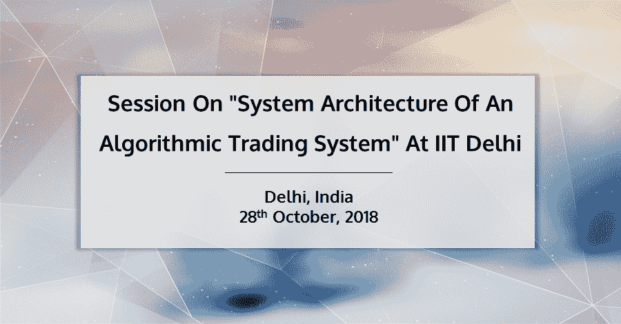
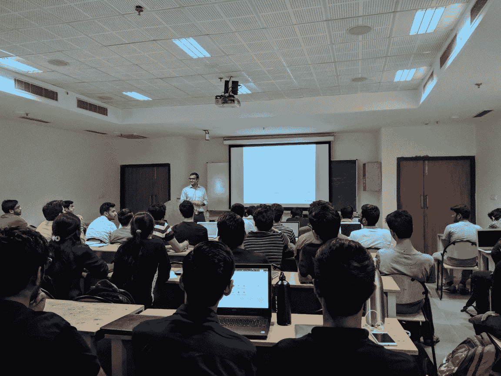
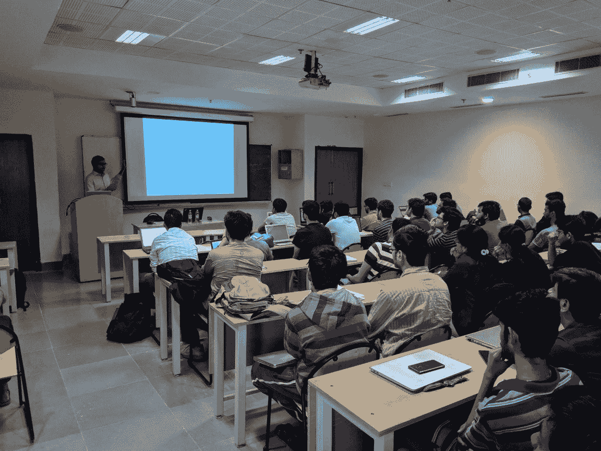

# 在 IIT 德里举行的“算法交易系统的系统架构”会议

> 原文：<https://blog.quantinsti.com/session-iit-delhi-october-2018/>

### **概述**

[QuantInsti](https://www.quantinsti.com) 于 2018 年 10 月 28 日为 IIT 德里举办了一场关于“算法交易系统的系统架构”的会议。nitesh Khandelwal(quantin STI 的联合创始人和主管)在这个会议上介绍了算法交易系统的内部知识。

### **关于演讲者**

 

#### **Nitesh Khan delwal(QuantInsti 联合创始人兼首席执行官)**

Nitesh Khandelwal 毕业于 IIT 坎普尔大学电气工程专业，并获得了 IIM 勒克瑙大学的管理学研究生学位，他的职业生涯始于财政部的银行部门。在一家自营交易公司短暂担任领导后，他在孟买共同创立了 iRage。如今，iRage 是印度算法交易领域的领先企业。后来，当 Nitesh 搬到新加坡时，他成立了一家贸易公司，在全球交易所进行交易。

2016 年，他将重心转移到 QuantInsti 担任其 CEO。QuantInsti 继续致力于将面向科学&技术的贸易知识和途径带给全球大众，并且已经帮助来自 130 多个国家的用户实现了同样的目标。

## **活动照片**

<figure class="kg-card kg-gallery-card kg-width-wide"></figure>