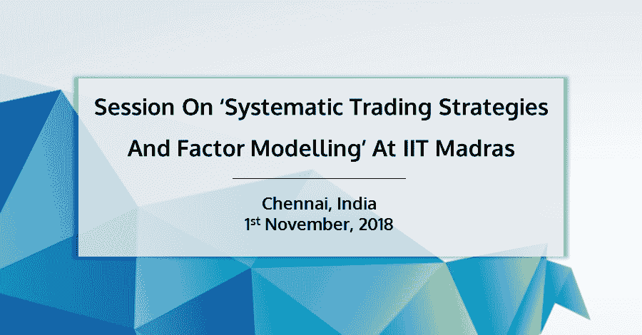
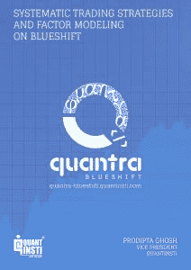

# 在 IIT 马德拉斯举行的“系统交易策略和因素建模”会议

> 原文：<https://blog.quantinsti.com/session-iit-madras-november-2018/>

### **概述**

IIT·马德拉斯于 2018 年 11 月 1 日主持了一场关于“系统交易策略和因素建模”的会议。prodipta Ghosh(QuantInsti 副总裁)解释了如何利用像 T2 Quantra blue shift T3 这样的平台构思、转换和测试自己的交易策略。

### **T2】**

#### **Prodipta Ghosh(QuantInsti 副总裁)**

Prodipta 是一位经验丰富的 quant，目前作为副总裁领导 QuantInsti 的 Fin-tech 产品和平台开发。

他在银行业工作了十多年，在孟买和伦敦的德意志银行的交易和结构部门担任过各种职务，并在渣打银行担任企业银行家。在此之前，Prodipta 作为科学家在印度国防 R&D 组织(DRDO)工作。