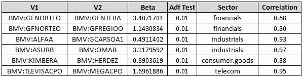
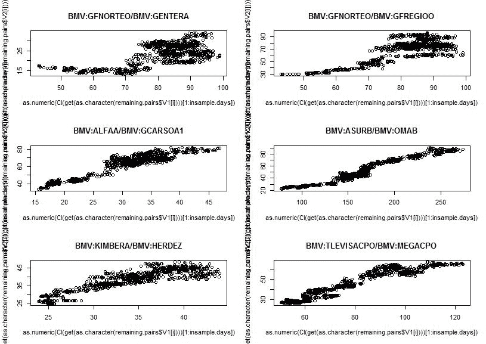
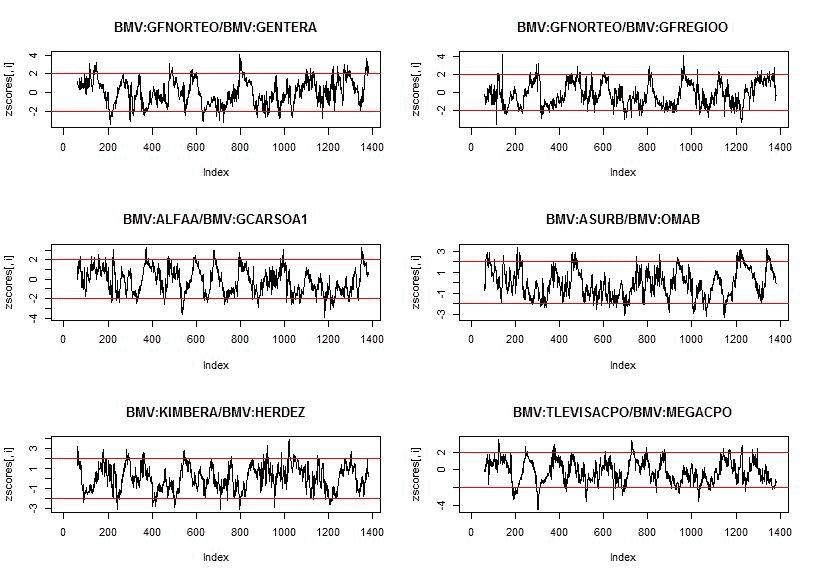
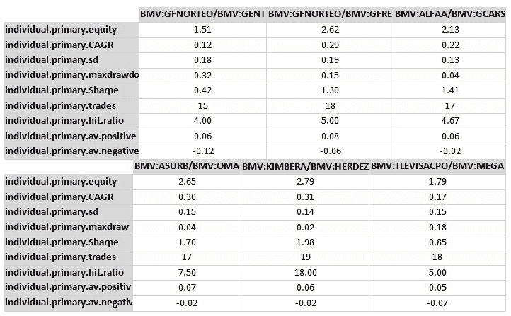
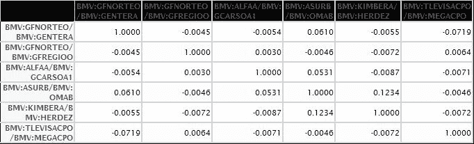
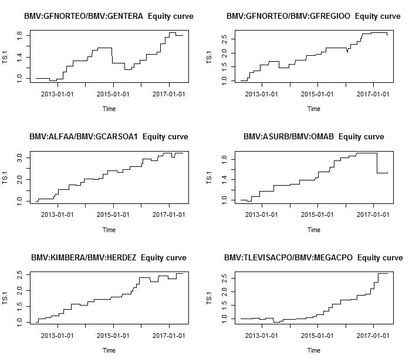
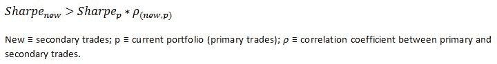
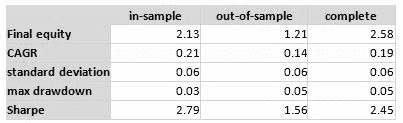
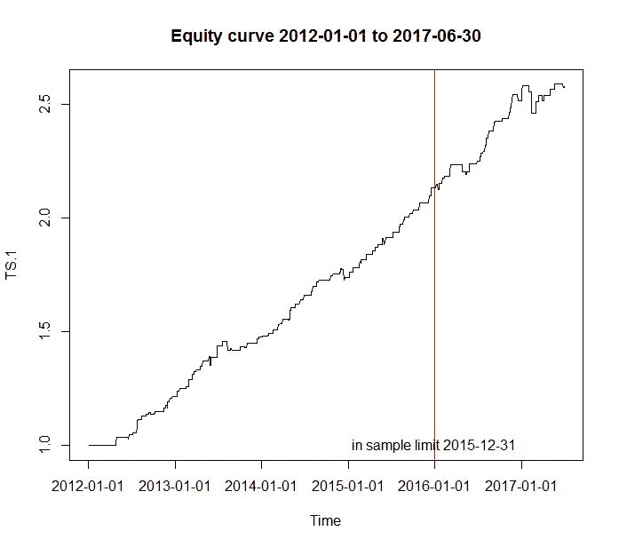

# 统计套利:墨西哥股票市场的配对交易[EPAT 项目]

> 原文：<https://blog.quantinsti.com/statistical-arbitrage-pair-trading-mexican-stock-market/>

本文是作者提交的最后一个项目，作为他在 QuantInsti 的算法交易(EPAT)高级管理课程的一部分。请务必查看我们的[项目页面](https://www.quantinsti.com/category/project-work-epat/)，看看我们的学生正在构建什么。

### **关于作者**

**[哈维尔塞万提斯](https://www.linkedin.com/in/javier-cervantes-cfa-4513aa129/)，CFA**

Javier Cervantes 目前是 BCP 证券公司的公司债券交易员，专门从事 MXN 债券。他也是 CFA 特许持有人，于 2017 年 8 月获得特许证书。Javier 拥有 ITAM 墨西哥自治技术学院的经济学学士学位。

### **项目**

在墨西哥证券交易所运营的 algo 交易公司/策略非常少。我相信这将提供很好的机会，因为竞争很少。与更发达的市场相反，套利机会并不容易实现，这表明那些寻找并能够利用它们的人可能有机会。

这是这个策略的主要动机，也是我联系 Quantinsti 的主要原因。由于参与交易的玩家很少，学习算法交易可能会给我未来带来很好的机会。

事实上，墨西哥市场并不发达，也会造成一定的复杂性。墨西哥证券交易所大约有 200 家上市公司。其中，我过滤了那些信息不完整的股票(使用谷歌金融)，得到了 117 只股票(见附件 Excel“emis oras bmv . xlsx”)，这些股票将被进一步过滤和清理，以满足某些条件。

本项目实施的交易策略称为“[统计套利交易](https://blog.quantinsti.com/statistical-arbitrage/)”，也称为“Pairs Trading”，是一种反向策略，旨在从某一对比率的均值回复行为中获利。这种策略背后的假设是，显示协整特性的货币对的价差本质上是均值回复的，因此如果价差显著偏离均值，将提供套利机会。

交易策略将在 2012 年 1 月 1 日至 2017 年 6 月 30 日期间进行回溯测试。这一期间将分为样本内回测(2012 年 1 月 1 日至 2015 年 12 月 31 日)和样本外回测。

在确定策略之前，我必须确定哪些股票可以交易。为此，我将建立每日交易量，协整和相关性限制。一旦股票领域被清理干净，回溯测试就可以开始了。

给定所选的股票，我将首先对那些在给定时间范围内没有完整每日价格的股票应用一个过滤器。一旦这些股票被剔除，我设定的最低日均交易量为 1500 万比索(MXN)才有资格交易。

现在，股票已经根据其数据和每日流动性进行了筛选，每个行业的每个可能的股票对都将进行协整测试。进行 ADF 测试时，另一个假设是要测试的货币对是稳定的。对于 p 值< 0.025，将拒绝零假设。

要使用的最后一个滤波器是相关性。相关系数低于 0.60 的那些对将被消除。以下几对是成功晋级的:

以下是将在交易策略中使用的其余每一对的价格散点图:

现在，将为剩下的每个价格比率创建 zscores。在移动平均和标准偏差计算中用于构建 zscores 的时间范围是 60 天。这是带有+2/-2 标准偏差线的 zscore 图的外观:

[交易策略](https://quantra.quantinsti.com/course/statistical-arbitrage-trading)将包括创建一个**一级卖出**信号，如果一对股票的交易高于平均值 2 到 2.25 个标准差，则做空相对昂贵的股票，同时买入相对便宜的股票，此时，该比率的 75%的可用风险资本将被卖出。如果该对的 zscore 跨越 2.25 个标准差，则剩余 25%的风险资本会出现一个**二级卖出**信号。当一对交易分别低于平均值 2 和 2.25 个标准差时，会产生类似的**初级买入**和**次级买入**信号。一旦回溯测试完成，两步进场信号的有用性将使用集合结果的夏普比率进行评估。一旦这对组合的 zscore 越过 0，每笔交易的退出信号就会被触发。

如果把每一对都当作一个单独的交易，下面是会得到的结果:

可以看出，不同对之间的结果差异很大。最大提取率从 2%到 32%不等。CAGR 从 12%到 31%不等。如果每一对的回报相关性很低，这种策略可以从多样化中获益。让我们来看看相关矩阵:

这是为之前分析的每一对股票生成的权益曲线:

将一个人的全部风险资本分配给一对可能风险太大。鉴于观察到的配对之间的相关性相对较低，让我们分析以下策略:我们现在假设每个剩余的配对都接受相同的初始风险资本分配。

首先，我们分别分析一级和二级交易，并测试我们是否从执行单独的(一级和二级)进场信号中获益。如果满足以下条件，投资组合的夏普比率将因增加新工具而提高:

评估 2.41>2.12 中的先前表达式结果；因为这个条件是真的，使用两个进场信号运行策略将导致这个交易策略的更高的夏普比率。

以下是完整交易策略的最终结果:

首先要注意的是，样本内夏普比率(2.79)高于之前仅使用初级信号交易计算的夏普比率(2.41)。第二，这种策略的最大提款相当低，这使得杠杆的使用具有很大的灵活性。第三，我们可以观察到样本外的结果较低，但仍然提供了异常的风险调整后的回报。

这是这一策略产生的权益曲线:

上述结果无法直接比较，但我们可以估计这一策略与墨西哥股市指数 IPC(谷歌股票代码“INDEXBMV:ME”)的相关性。对于样本内数据，相关系数为 0.62，这可以为“市场投资组合”提供多样化的好处。另一种可以实现这种模式的策略是“股票化市场中性的多空投资组合”。该策略包括使用市场指数期货(名义上相当于卖空股票所需的储备现金头寸)的被动投资策略，并寻求通过我们的统计套利策略产生一些 alpha。

### **结论:**

有重大的机会，可以抓住在墨西哥股票市场的战略适合许多类型的投资者。

你还必须意识到，在实施这个交易策略之前，还有一些事情需要考虑；许多将取决于投资者类型:

*   鉴于该策略中观察到的低最大提款，谨慎使用杠杆可以进一步增强之前的结果
*   先前的结果没有考虑隐性和显性交易成本
*   建议进行进一步的回溯测试，尤其是在不同的时间段，以便更好地掌握这种交易策略在不同市场条件下的表现。人们也可以在 ADF 测试中使用不同的变量值来测试策略，如进入水平、风险资本分配、时间范围、相关性和置信度
*   和两步进场信号一样，我们可以用多步出场策略来检验结果。特别重要的是实施止损，止损可以基于不同水平的 zscore、相关性、波动性等
*   假设策略中使用的所有股票都可以卖空。该战略的实际执行可能会出现复杂情况。

**参考书目:**

欧内斯特·陈。算法交易，获胜策略，以及它们的基本原理。

蔡，瑞伊。金融时间序列分析

QUANTINSTI。统计套利(配对交易和指数套利)讲座

### **下一步**

如果你想学习算法交易的各个方面，那就去看看算法交易(EPAT)的[高管课程。课程涵盖统计学&计量经济学、金融计算&技术和算法&定量交易等培训模块。EPAT 为你提供了在算法交易中建立一个有前途的职业生涯所需的技能。](https://www.quantinsti.com/epat/)[现在报名](https://www.quantinsti.com/epat/)！

**更新**

我们注意到一些用户在从雅虎和谷歌金融平台下载市场数据时面临挑战。如果你正在寻找市场数据的替代来源，你可以使用 [Quandl](https://www.quandl.com/) 来获得同样的信息。

免责声明:就我们学生所知，本项目中的信息是真实和完整的。所有推荐都不代表学生或 QuantInsti 的保证。学生和 QuantInsti 否认与使用这些信息有关的任何责任。本项目中提供的所有内容仅供参考，我们不保证通过使用该指南您将获得一定的利润。

### **下载中的文件:**

*   BMV.csv 发行者
*   巴黎交易 BMV 墨西哥。稀有