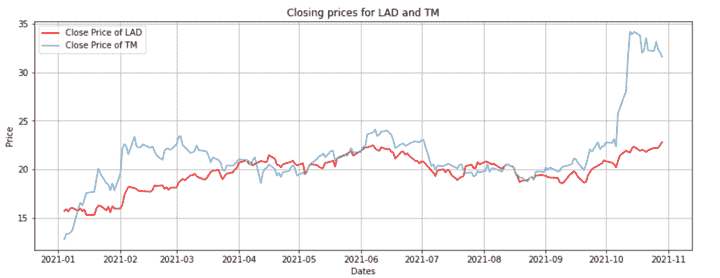
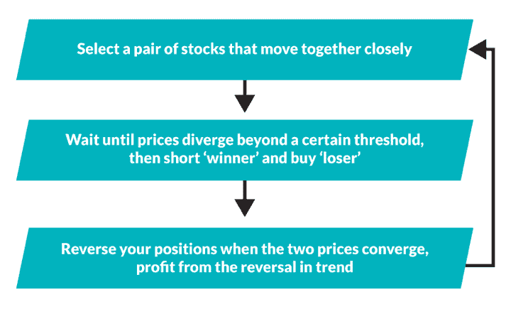

# 套利策略:理解统计套利的运作

> 原文：<https://blog.quantinsti.com/statistical-arbitrage/>

由[查尼卡·塔卡](https://www.linkedin.com/in/chainika-bahl-thakar-b32971155/)

统计套利起源于 20 世纪 80 年代左右，由摩根士丹利和其他银行牵头。统计套利策略，也被称为 StatArb，在金融市场中得到了广泛的应用。这一策略的流行持续了 20 多年，围绕这一策略产生了不同的模式，以获取高额利润。

简单来说，统计套利包括一套量化驱动的算法交易策略。这些策略旨在通过分析价格模式和金融工具之间的价格差异，利用数千种金融工具的相对价格变动。

这里需要注意的一点是，统计套利不是一种高频交易(HFT)策略。它可以被归类为中频策略，交易周期在几个小时到几天内。

让我们了解更多关于统计套利的信息，因为本博客涵盖:

*   [什么是套利？](#what-is-arbitrage)
*   [什么是统计套利？](#what-is-statistical-arbitrage)
*   [统计套利是如何运作的？](#how-does-statistical-arbitrage-work)
*   [统计套利的类型](#types-of-statistical-arbitrage)
*   [使用统计套利策略的风险](#risk-of-using-statistical-arbitrage-strategies)
*   [统计套利和配对交易](#statistical-arbitrage-and-pairs-trading)
*   [如何在 pairs 交易中使用统计套利？](#how-to-use-statistical-arbitrage-in-pairs-trading)

* * *

## 什么是套利？

套利是同时交易多种金融证券以从价格差异中获利的过程。

这可以通过多种方式实现，例如:

*   相同证券在不同市场的买卖(空间套利)
*   同时买卖[证券](https://quantra.quantinsti.com/glossary/Security)的[现货价格](https://quantra.quantinsti.com/glossary/Spot-Price)和[期货合约](https://quantra.quantinsti.com/glossary/Futures)
*   买入被收购公司的股票，同时卖出收购公司的股票(合并套利)。

套利可应用于金融工具，如

*   [股票](https://quantra.quantinsti.com/glossary/Stocks)、
*   [债券](https://quantra.quantinsti.com/glossary/Bond)，
*   [衍生品](https://quantra.quantinsti.com/glossary/Derivative)、
*   商品等。

套利是一种无风险的策略，尽管情况并非总是如此。始终存在[执行风险](https://quantra.quantinsti.com/glossary/Execution-Risk)的可能性，即由于市场的高波动性和价格的突然变化导致无法以有利可图的价格完成交易的风险。涉及的其他风险是交易对手风险和[流动性](https://quantra.quantinsti.com/glossary/Liquidity)风险。

现在让我们看看这个例子。假设一家公司 ABC 的股票在伦敦证券交易所的交易价格为每股 10 美元，而同样的股票在纽约证券交易所的交易价格为 10.5 美元，那么套利策略将是在伦敦证券交易所(LSE)以 10 美元购买股票，在纽约证券交易所(NYSE)以 10.5 美元出售，每股获利 0.5 美元。

* * *

## 什么是统计套利？

在金融界，统计套利(或 stat arb)指的是一组交易策略，它们利用均值回归分析在非常短的时间内投资于多达数千种证券的不同投资组合，通常只有几秒钟，但也可能长达几天。

统计套利(Stat Arb)是一种[交易策略](https://quantra.quantinsti.com/glossary/Trading-Strategy)，基于一项或多项资产相对于该资产预期未来价值的统计错误定价。

此外，StatArb 的策略之一是对算法进行编码，以监控历史上已知具有统计相关性或协整性的金融工具或资产，关系中的任何偏差都表明存在交易机会。

统计套利涉及统计学、定量方法和数据挖掘的计算方法，可以通过算法高频交易。

因此，统计套利包括不同类型的策略，如[对交易](https://quantra.quantinsti.com/glossary/Pairs-Trading)、[指数套利](https://quantra.quantinsti.com/glossary/Index-Arbitrage)、篮子交易或[delta](https://quantra.quantinsti.com/glossary/Delta)-中性策略。这些策略因投资组合中工具的数量、类型和权重及其风险承受能力而异。

成对交易中最受欢迎的例子之一是百事可乐对可口可乐的股票。两只股票属于同一个行业，或者同一个业务类型，并且随着同样的市场事件影响它们的价格而同步波动。

例如，如果百事可乐的股票与可口可乐相比上涨了很多，那么人们可能会做空百事可乐，做多可口可乐，以期待有利的回报。

* * *

## 统计套利是如何运作的？

当股票等证券倾向于在上升和下降周期中交易时，Stat arb 起作用，量化方法寻求利用这些趋势。

定量交易的趋势行为使用软件程序来跟踪模式或趋势。揭示的趋势是基于交易的数量、频率和证券价格。

在下图中，您可以看到两只股票之间的统计套利，即汽车行业的 LAD (Lithia Motors Inc .)和 TTM (Tata Motors Limited ADR)。

Close prices for statistical arbitrage

在上图中，拉德和 TTM 的股票价格。你可以看到两只股票在整个时间跨度内都非常接近，只有几次分开。

正是在这些分离期，基于股价将再次靠拢的假设，出现了套利机会。

识别这种机会的关键在于两个主要因素:

*   确定需要高级[时间序列分析](/time-series-analysis/)和统计测试的配对
*   为利用市场地位的战略指定进入点和退出点

热门平台上有大量内置的 [pairs trading](/pair-trading-strategy-excel-model/) 指标，用来识别和进行配对交易。然而，很多时候，交易成本是从策略中获利的一个关键因素，但在计算预期回报时通常不考虑交易成本。

因此，建议交易者在回测时考虑所有影响交易最终盈利能力的因素，制定自己的统计套利策略。

* * *

## 统计套利的类型

不同的统计套利策略包括:

*   市场中性套利
*   交叉资产套利
*   跨市场套利
*   ETF 套利

### 市场中性套利

市场中性意味着利用一个或多个市场的价格上涨和下跌，同时试图避免特定的市场风险。此外，市场中性套利意味着使用对冲等策略，这有助于利用基于历史数据的股票价格差异。

### 跨市场套利

它寻求利用同一资产在不同市场的价格差异。该策略是在估值较低的市场买入资产，然后在估值较高的市场卖出。

### 交叉资产套利

该模型押注于金融资产与其基础资产之间的价格差异。例如，在股票指数期货和构成该指数的股票之间。

### ETF 套利

ETF 套利可以被定义为一种跨资产套利的形式，它识别 ETF 的价值和其基础资产之间的差异。

* * *

## 使用统计套利策略的风险

统计套利并非完全无风险，因为它依赖于从以下原因留下的缺口中寻找机会:

### 平均值回复

在市场价格最终回到平均值之前，价格与平均值的偏离。回归均值的做法通常被称为均值回归。在 Quantra 课程中详细学习[均值回归策略](https://quantra.quantinsti.com/course/python-mean-reversion-strategies-ernest-chan)。

### 无能

价格差距是在高频交易中造成的，以便利用任何持续毫秒左右的低效率。这样，在交易过程中可以捕捉到大量的低效率，因为高估的股票可以卖空，低估的股票可以买入。

### 价格差异

在成对交易策略的情况下，成对股票的价格差异也是统计套利最常用的方法之一，因为当成对股票的价格彼此不同时，就会出现低效率。

但是，当有外部干预，如货币贬值等时，问题就出现了。此外，当套利策略的假设受到干扰时，例如，如果配对股票之间的关系发生变化，该策略就会失败。

* * *

## 统计套利和配对交易

StatArb 是[配对交易策略](/pairs-trading-basics/)的进化版本，其中股票根据基本面或基于市场的相似性进行配对。

当一对股票中的一只表现优于另一只时，表现较差的股票被买入，同时预期它会超越表现更好的股票。通过做空其他表现突出的股票，多头头寸可以免受市场变化/运动的影响。

在统计套利策略中，大量的股票参与其中。此外，还有很高的投资组合周转率和大量的交易。这增加了交易和滑点成本。

因此，该战略通常以自动化的方式实施，并非常重视降低交易成本。统计套利策略已经成为对冲基金和投资银行的主要力量。

Steps of statistical arbitrage strategy

在上图中，你可以看到一个统计套利策略的实施步骤。

StatArb 考虑的不是成对的股票，而是一百只或更多股票的投资组合——一些做多，一些做空——这些股票按照行业和地区仔细匹配，以消除对 [beta](/asset-beta-market-beta-python/) 和其他风险因素的暴露。

* * *

## 如何在 pairs 交易中使用统计套利？

为了使统计套利在成对交易策略中发挥作用:

1.  首先，你要[选择配对的股票](/pairs-trading-basics/)。
2.  在你选择了股票之后，第二，你将找出这两只股票的收盘价，并将它们可视化。
3.  现在，您将计算并可视化该对的分布和分布的 z 值
4.  然后，您将通过运行增强的 Dickey-Fuller 来检查传播的平稳性。
5.  最后，如果根据 ADF 测试，货币对是稳定的，则可以产生交易信号[。一段时间后，配对的股票总是回到他们的平均水平。](/pair-trading-strategy-backtesting-using-quantstrat/)

* * *

## 用 Python 实现成对交易中的统计套利

第一步是选择配对的股票。我们买入了 Blink Charging Co(股票代码:BLNK)和 NIO(股票代码:NIO)这两只股票。

让我们先来看看这两只股票的收盘价。