# 使用趋势跟踪指标的策略:MACD、ST 和 ADX [EPAT 项目]

> 原文：<https://blog.quantinsti.com/strategy-using-trend-following-indicators-macd-st-adx/>

本文是作者提交的最后一个项目，作为他在 QuantInsti 的算法交易(EPAT)高管课程的一部分。请务必查看我们的[项目页面](https://www.quantinsti.com/category/project-work-epat/)，看看我们的学生正在构建什么**。**

### **关于作者**

Gopal 是一名管理专业人士，在 IT 行业拥有超过 20 年的经验，拥有强大的全球交付背景，对量化金融和小工具充满热情。他高度重视流程，专注于通过自动化来实现质量。他在 PreludeSys India Ltd. 负责交付，Gopal 拥有远程教育共生中心的 MBA 学位。他已于 2016 年 11 月成功完成了算法交易(EPAT)[高管项目的课程工作。](https://www.quantinsti.com/epat/)

有句名言说得好:“趋势是朋友”。根据权威人士的说法，股票市场的成功率是 5%。当然，每个人都想成为那 5%的人！要进入那 5%的范围，即使不是不可能，也是很困难的。我们所需要的只是一个适当的策略。即使制定了战略，了解市场状况是否有助于该战略也很重要。成为一个成功的交易者的决定性因素是及时了解市场。

我的策略是基于几年前我从一位受人尊敬的著名技术分析师那里得到的培训。我使用了这一策略，并根据我从导师 Abhishek Kulkarni 先生那里得到的反馈对其进行了改进。

### **使用该策略的动机**

我跟踪图表已经有几年了。作为我学习的一部分，我使用了一些技术和趋势指标。我对技术分析师如何使用这些指标来应对市场很感兴趣。

由于我的强项是编程，所以我用了一个策略，不太重概念。在作业阶段，我用 R 实现了[对交易策略](https://blog.quantinsti.com/pair-trading-statistical-arbitrage-on-cash-stocks/)。

### **战略详情**

我的策略适用于趋势市场——包括熊市和牛市。它使用几个技术指标来识别市场的动能，并在市场的多头和空头进行交易。

我用过的[趋势跟踪指标](https://blog.quantinsti.com/indicators-build-trend-following-strategy/)是[移动平均线收敛发散](https://blog.quantinsti.com/moving-average-trading-strategies/) (MACD)指标，一个趋势跟踪动量指标和超级趋势(ST)指标，一个趋势跟踪指标。

### **关于使用 MACD 和 ST 作为趋势指标的简要说明**

**移动平均收敛发散(MACD)**

MACD 是使用两个指数移动平均线(EMA)计算的——短期和长期。MACD 的指数移动平均线被用作信号线，表示上涨或下跌的动力。

使用 MACD 时，需要考虑两个入口点。一，当 MACD 线穿过信号线时。第二，当 MACD 在正数区域时，这意味着较小的移动平均线在较大的移动平均线之上。

**超级趋势(ST)**

超级趋势指标是一种趋势指标，用于确定价格是处于上升趋势还是下降趋势。如果价格高于指标线，那么价格点就是一个支撑点。如果价格低于指标线，那么它就是一个阻力点。

我已经通过管理仓位大小优化了策略，为 MACD 设定 1 个单位的权重，为超级趋势设定 2 个单位的权重。我希望 MACD 能提供快速的出入境通道。当与 SuperTrend 一起使用时，它将提供更清晰的趋势运行。

### **选择股票**

使用这种策略没有特定的股票标准。然而，任何有效的策略，流动股票是首选。因此，这个策略的重点是漂亮的 50 只股票。

### **数据用途**

我在每天的时间框架内对这个策略进行了回溯测试，从雅虎下载了每天的数据。

我从 2012 年开始测试我的策略。显然，我用过的一些股票没有 2012 年的数据。这是一个众所周知的警告，我用它来测试我的趋势跟踪指标策略。

我用 Python 实现了我的策略，还有像 Numpy、Panda、Matplotlib、TA-Lib 这样的包。TA-Lib 通过必要的参数帮助计算 MACD。

由于没有现成的方法来计算超级趋势价格点，我已经编码了该方法，并在程序中使用。

当我把这个话题介绍给我的导师 Abhishek 时，他建议我使用平均方向指数(ADX)指标来即兴制定策略。ADX 是 TA-LIB 包中另一个可用的方法，用于确定价格趋势。

基于 MACD 和 ST 的买卖策略只有在股票有趋势时才执行。股票走势将根据 ADX 决定。只有当 ADX 数据高于预定阈值时，才会做出任何买入/卖出决定。ADX 跌破阈值的那一刻，所有未平仓头寸将在第二天开市时平仓。

### **战略的实施**

我在这个策略中使用的 Python 包包括:

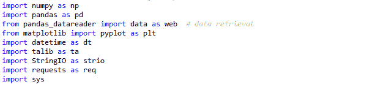

我创造了一种方法来计算超级趋势指标。可以通过在数组中传递数据来进一步优化。然而，为了简单起见，我传递每条记录来标识高频带、低频带和超级趋势。

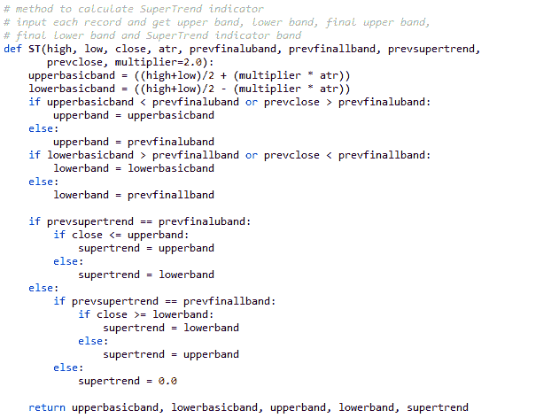

如果决定进行回溯测试的时期是在很久以前，有可能一些股票在这段时间内没有在市场上交易。这是一个众所周知的警告。

以下 Python 代码从 nseindia.com 获取最新的 Nifty50 列表，并将输出转换为数据框。

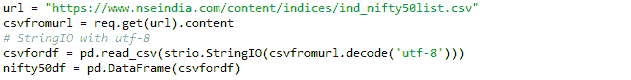

要设置数据检索的日期并从 yahoo finance 中检索历史数据:

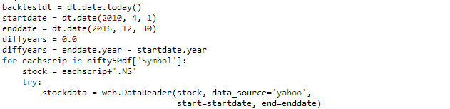

在浏览和分析这些数据后，我发现雅虎提供的“调整后收盘”数据在公司对该股采取行动时是有偏差的。为此，我在程序上做了一点小小的调整。如果每日回报有巨大的差异，比如说差异小于 0.75 或大于 1.50，那么我用“收盘”数据更新“调整后的收盘”数据。

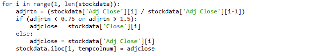

以下 Python 代码将技术指标数据放入数据框中进行进一步处理。

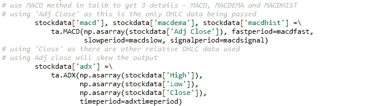

虽然平均真实范围(ATR)指标没有直接用于策略中，但它是计算超级趋势所需要的。我使用下面的代码将它放入数据框中。

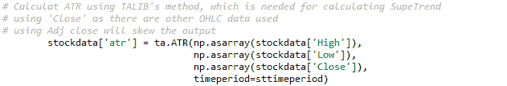

现在计算 SuperTrend 并将其添加到数据框中。

为了识别交叉，我已经为每天的交易数据准备了包含前期数据的数据框架-需要 2 期数据趋势指标，MACD 和 ST 以避免回测偏差。对于 ADX 来说，前一天的数据就足够了。

生成 MACD 和 ST 交易信号，并将信号添加到数据帧中。(我已经张贴了详细的内联注释，后面是 for 循环代码。)

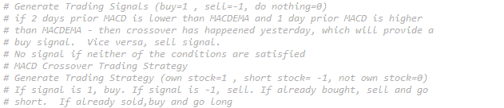

ADX 指标为策略提供了重要的数据点，以确定股票是否是趋势性的。只有当 ADX 高于阈值时，买入或卖出才会发生。ADX 下降到阈值以下时，所有未平仓头寸将被平仓。

当出现 MACD 交叉或 ST 交叉时，ADX 用于决定股票交易。该战略使用了两个指标。一个是信号(macdsig/supersig)，一个是策略(macdstr/superstr)。

当 MACD / ST 出现正交叉且 ADX 呈趋势时，信号和策略设置为“1”。当 MACD / ST 出现负交叉，ADX 出现趋势时，信号和策略设置为“-1”。

当没有交叉时，信号设置为‘0’，但使用策略变量来决定是继续交易还是结束交易(无论买入还是卖出)。当 ADX 高于阈值(趋势)时，此策略变量设置为延续前一天的相同值。如果不是趋势，策略值设置为 0，从而给出一个完整的信号来关闭所有未平仓交易。

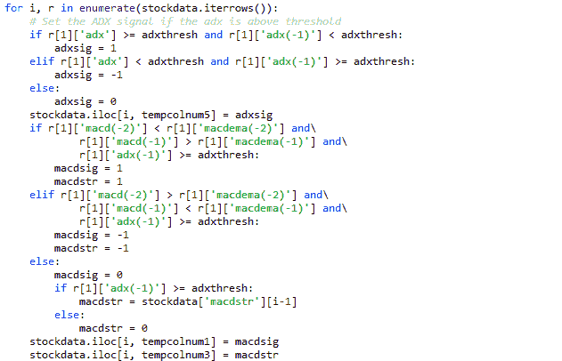

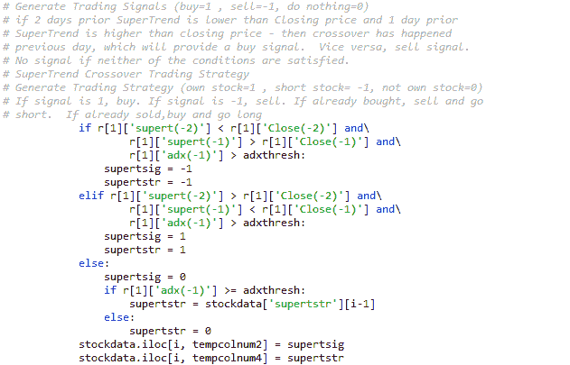

为了根据分析分别计算 MACD 交叉和 ST 交叉的日回报率，为了得到接近准确的回报，我根据每日活动交替使用了“调整收盘”和“收盘”数据。

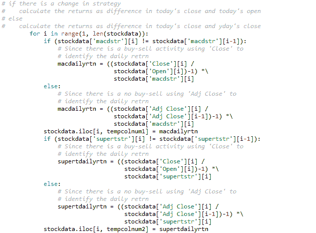

所有数据准备工作完成后，将实施策略和信号的实际处理。

我在数据框中包含了一个带佣金的输出列，以帮助找到佣金后的利润。第一笔交易我考虑了 1%，有反向交易时考虑了 2%。

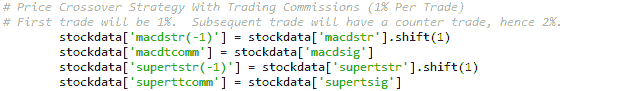

这里实现了信号和策略的处理。趋势指标， MACD 和 ST 分别处理，但使用相同的逻辑。处理时，数据框中的单独列用于计算准确的利润/损失。

使用的逻辑是

*   当信号和策略相同且积极时，买入。
*   如果跑路交易卖出了，那就补仓买入。
*   如果没有，就买。

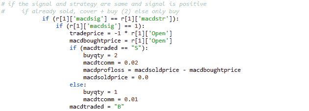

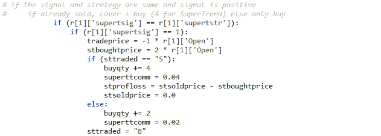

还有，

*   当信号和策略相同且为负值时，卖出。
*   如果连续交易被买入，那么卖出并做空。
*   如果没有，就做空。

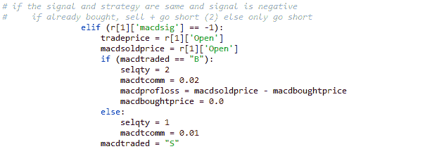

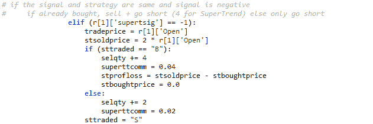

当信号和策略相同(0)且没有信号时，平仓。如果买入了正在运行的交易，那么卖出，如果卖出了，那么回补。

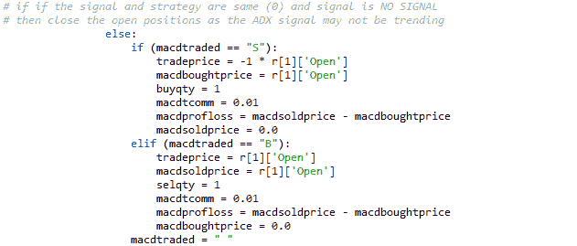

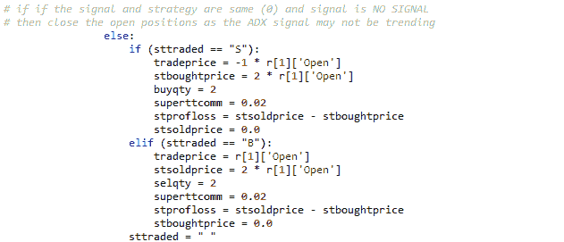

所有其他计算都在每行级别完成，并存储在数据框的附加列中——累积回报、年化回报、年化标准差、年化夏普比率。以上数据用于计算趋势指标，分别为 MACD 和 ST。

综合计算:

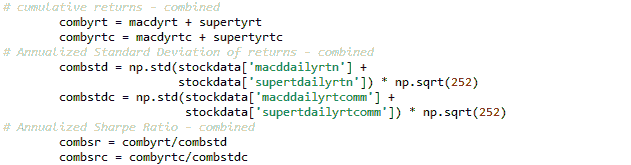

根据路由的位置，在控制台或文件上打印相同的内容。

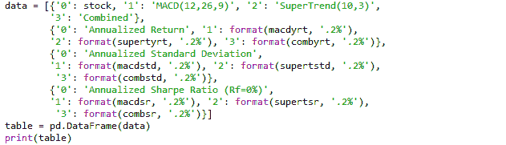

此外，还计算了交易成功的详细信息，用于进一步分析策略——CAGR、交易成功率和平均盈亏。

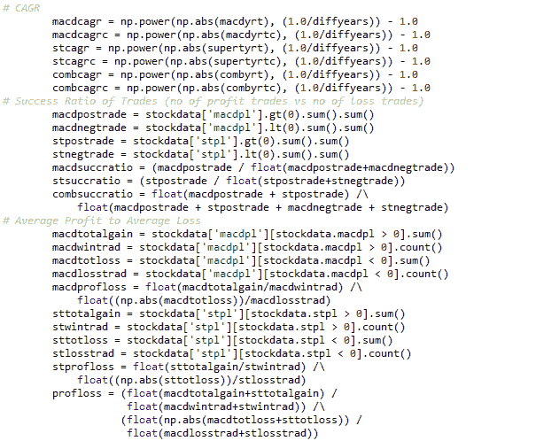

要打印出数据:

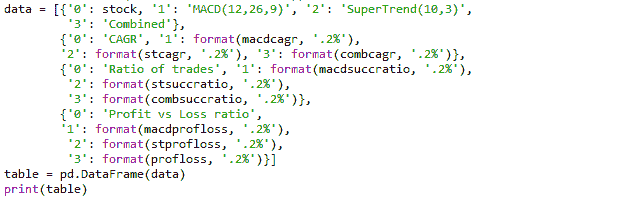

要使用 Matplotlib 绘制图表:

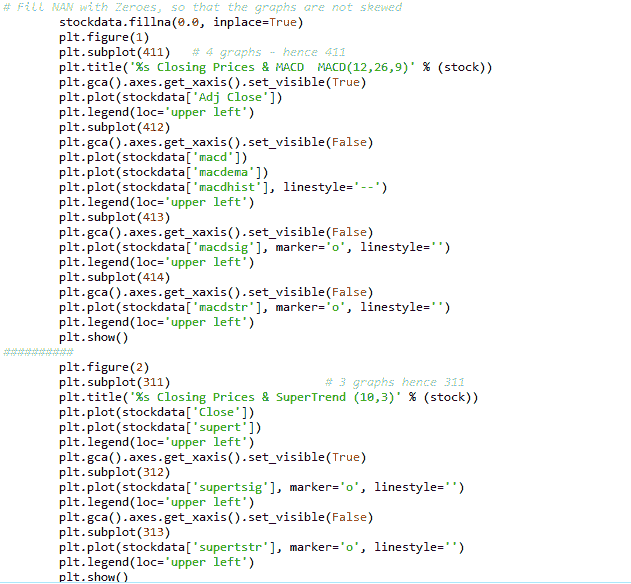

我花了很多时间来完成这个策略，因为(1)我工作非常忙(2)我必须接受角膜移植手术。

我经常和我的导师 Abhishek 联系，分享工作进展中的代码。他一直很友好，定期给予反馈。QuantInsti 团队令人鼓舞，并为各种示例项目提供了指导。

我不认为这种不展示结果的博客体验是完整的。

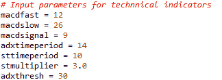

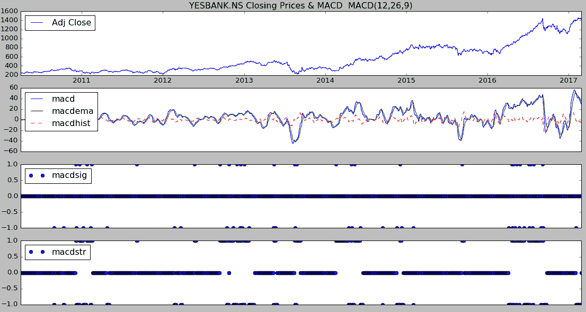

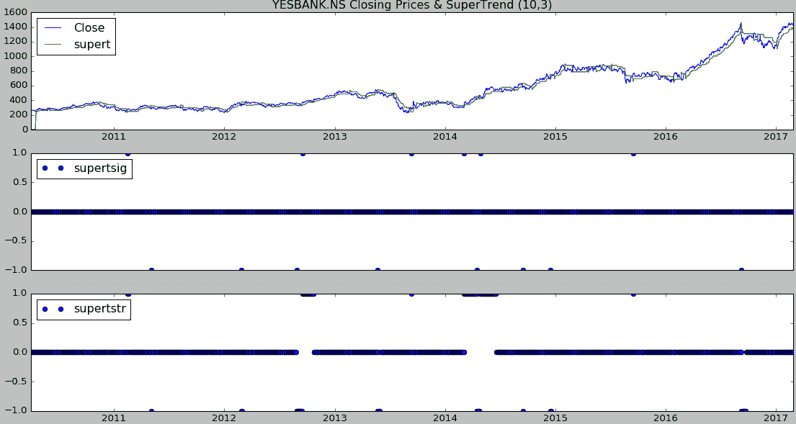

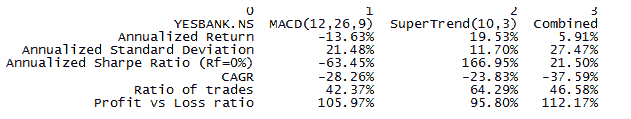

经历这个项目和编码这个策略是一次很好的学习经历。Stackoverflow，Pandas 文档是我访问技术诀窍时最喜欢的网站。我试图保持代码简单明了。我已经优化了代码，并通过将数据帧的循环减少到最少来临时凑合。我保持了代码的动态性，这样在数据帧中包含新列的任何代码都不会影响程序的其他部分。

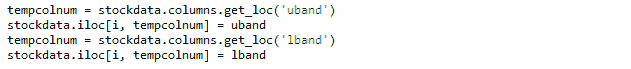

我确信 Python 专家可以进一步润色代码。我很感谢你花时间阅读这个策略。如果你们中的任何人找到了更简单的方法来做我所做的事情，请随时给我写信。

EPATian 的另一个项目是利用简单的均值回归策略对 ETF 进行配对交易。这个项目的目标是观察大型和中型金融交易所交易基金之间是否存在套利机会。[点击这里](https://blog.quantinsti.com/pairs-trading-with-etf/)阅读更多。

**更新:** *我们注意到一些用户在从雅虎和谷歌金融平台下载市场数据时面临挑战。如果你正在寻找市场数据的替代来源，你可以使用 [Quandl](https://www.quandl.com/) 来获得同样的信息。*

*免责声明:就我们学生所知，本项目中的信息是真实和完整的。所有推荐都不代表学生或 QuantInsti 的保证。学生和 QuantInsti 否认与使用这些信息有关的任何责任。 本项目提供的所有内容仅供参考，我们不保证通过使用这些指导您将获得一定的利润。*

### **下载中的文件:**