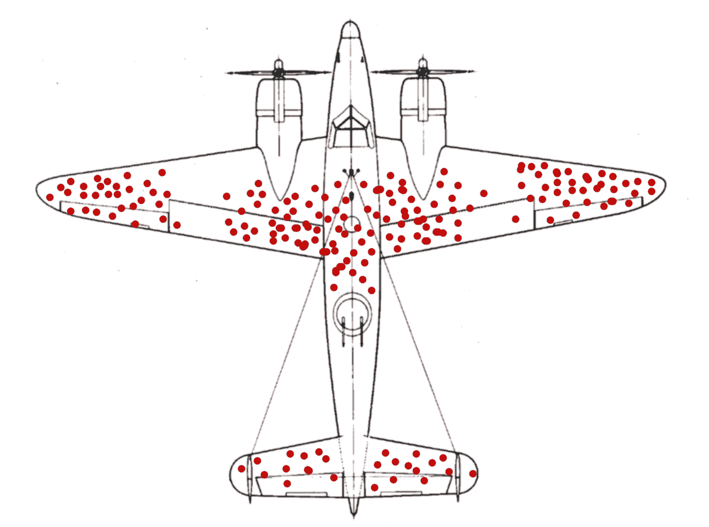
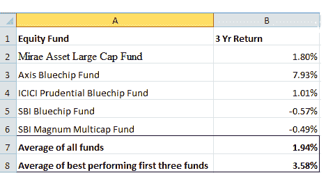

# 生存偏差:例子，影响，回避！

> 原文：<https://blog.quantinsti.com/survivorship-bias/>

由[查尼卡·塔卡](https://www.linkedin.com/in/chainika-bahl-thakar-b32971155/)

这篇文章帮助你探索围绕生存偏差的一切，以及它的一般意义和它如何影响金融市场。我们还将讨论你应该在多大程度上让生存偏差来指导你的交易决策，以及它是哪种偏差的一部分。

本文涵盖:

*   什么是生存偏差？
*   [生存偏差的例子](#Example-survivorship-bias)
*   [生存偏差的工作](#Working)
*   [生存偏差对交易的影响](#Impact-trading)
*   [生存偏差的重要性](#Importance)
*   如何避免生存偏差？

## 什么是生存偏差？

幸存者偏差，也称为幸存者偏差，基本上是在相同的历史表现的基础上看待市场上现有股票的方式。也可以有一些股票的一般特征，它们可以干预对股票表现或市场指数的估计。因此，投资者或交易者的决定变得有偏见。

此外，当投资者做出一个由于偏差而被误导的决策时，这就是投资者所承担的生存偏差风险。

现在，让我们看一个生存偏差的例子。

## 存活偏差的例子

为了使对生存偏差的理解更有趣，我们可以看一个军队中偏差的例子。

来源:[维基百科](https://en.wikipedia.org/wiki/Survivorship_bias)

第二次世界大战期间，军队看着完成任务返回的飞机。他们看到飞机在某些地方受到了敌人炮火的伤害。这些位置在图像中显示为红点。

首先，有人建议这些地方应该用重型装甲来加固，这样飞机受到的损伤就会最小。

然而，有人指出，这项研究只在那些幸免于撞击的飞机上进行。

那些没有返回的飞机呢？

红点似乎是飞机被击中后仍能返回的地方。因此，建议对没有红点标记的地方，例如发动机，进行加固。

好的，让我们进一步了解生存偏差的工作原理。

## 生存偏差的工作

谈到生存偏差的工作，这是一个相当简单的过程。现在让我们假设在 2018 年，一个交易者有一个由股票、债券和共同基金组成的投资组合。明年，也就是 2019 年，这些债券因当年表现不佳而被从投资组合中移除。

现在，投资组合只包括股票和共同基金。

如果你只根据股票和共同基金来计算这两年的投资组合表现，而不考虑债券的糟糕表现，那么在 2018 年，结果肯定会受到生存偏差的影响。之后，股票和共同基金也有可能表现不佳。

生存偏差的另一个例子可以在下面看到。当你跟踪一个人却不知道损失是否会大于收益时，你最终会成为生存偏差的受害者。

来源:[培养基](https://medium.com/@solorwell/dont-let-gurus-sell-you-on-survivorship-bias-dd85e3c94b68)

最后明确提到，像这样的励志演讲必须附带免责声明或警告，可能会出现生存偏差。因此，你需要相应地权衡你所承担的风险和潜在收益。

好了，现在我们将进入下一个讨论，生存偏差如何影响投资者。

## 生存偏差对交易的影响

生存偏差的影响来自于对股票或市场指数的看法，这种看法可能看起来过于乐观或过于悲观。这两种情况都会影响投资者的交易决策，因为相反的实际情况会导致损失。

在交易的情况下，市场可能会变得不稳定，一些股票可能表现不佳。

投资共同基金是投资金融市场的一个例子，其中可能存在生存偏差。在经济衰退时期，投资共同基金可能会帮助你的基金度过市场危机。

帮助这些基金生存下来的因素可能是它们的综合崩溃，甚至是基金管理公司对市场做出有效反应的能力。

另一方面，其他一些共同基金可能表现不佳，可能已经被迫关闭。总之，净效应只会是一个正面扭曲的结果，无法描绘实际结果。

因此，为了得到实际的结果，重要的是要考虑到市场上所有的共同基金。如果你希望只研究顶级共同基金，那么你必须考虑所有顶级共同基金在衰退期间的表现，然后再做决定。

让我们再举一个例子，假设你投资了 5 只共同基金，你的投资组合在 2020 年的 3 年回报率如下:

来源:[清税](https://cleartax.in/s/best-mutual-funds)

当你取出所有基金的平均值，你发现你的净收益是 1.94%。另一方面，如果你查看表现最好的前三只基金的平均值，结果是平均值为 3.58%，远远高于 1.94%。

现在，如果你把未来投资的决策建立在表现最好的共同基金的基础上，这将带来生存偏差风险。然而，1.94%回报的实际结果表明，你应该投资于共同基金，同时考虑到实际损失。

接下来让我们讨论生存偏差的重要性。

## 生存偏差的重要性

在生存偏差中，有一种可能性是，在对投资组合进行估值时，有些投资可能因为表现不佳而没有被考虑在内。

让我们用上述投资共同基金的例子来理解这一点。因此，根据投资组合的历史估值，对同一投资组合的投资可能看起来有利，但实际上可能并非如此。

因此，重要的是要保持你正在进行回溯测试的数据库不受生存偏差的影响，然后在考虑了我们刚刚讨论过的变量之后做出交易决定。

这里有一个视频可以帮助你更好地了解生存偏差的重要性:

[https://www.youtube.com/embed/GyEbt9zUhAM?feature=oembed](https://www.youtube.com/embed/GyEbt9zUhAM?feature=oembed)

展望未来，让我们找出如何避免生存偏差。

## 如何避免生存偏差？

为了防止生存偏差，在开始工作或研究数据库之前，您可以做一些简单的事情。首先，你必须对数据来源进行真正的选择，因为你不应该挑选已经有偏差的数据。

我们在上面的视频中提到了一些数据库源，如 [Tick data](https://www.tickdata.com/) 和 [Kibot](http://www.kibot.com/agent/) ，您可以使用它们来选择数据库。提到的来源并没有删除不再存在的观察。它仅仅意味着投资组合或数据库的估价应该包括所有的变量，而不管它们的性能状态如何。

这就是你的决定将如何基于实际观察或估价。

## 结论

我们讨论了如果我们不查看包含所有变量(表现最好和表现不好的)的数据库，不管是债券、股票还是共同基金，生存偏差是多么容易发生。即使一个表现不佳的变量在评估时被从数据库中跳过，也会导致不可靠的信息。这些信息会导致你在交易时做出错误的决定。生存偏差的有趣方面也让我们意识到，虽然它可能在一些领域如军事上成功，但在交易中会导致糟糕的评估。我们可以通过追踪您研究的数据库的正确来源来降低生存偏差风险。

<small>免责声明:本文中提供的所有数据和信息仅供参考。QuantInsti 对本文中任何信息的准确性、完整性、现时性、适用性或有效性不做任何陈述，也不对这些信息中的任何错误、遗漏或延迟或因其显示或使用而导致的任何损失、伤害或损害承担任何责任。所有信息均按原样提供。</small>