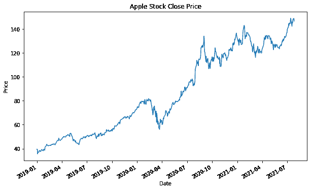
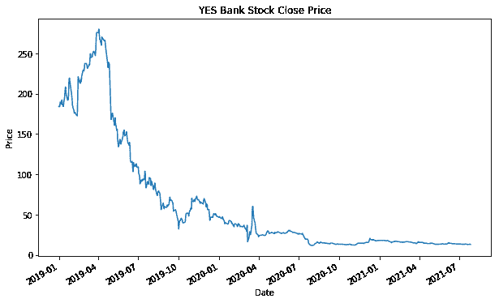

# 摆动交易:概述，设置，技术分析和策略

> 原文：<https://blog.quantinsti.com/swing-trading/>

由[维布·辛格](https://www.linkedin.com/in/vibhu-singh001/)和[雷基特·帕查内卡](https://www.linkedin.com/in/rekhit/)

你是百米短跑运动员还是马拉松运动员？还是介于两者之间？还是两者都有？说到交易，摇摆交易介于短跑和马拉松之间。

所以如果你不喜欢跑得太快或跑得更远，你想在交易中应用同样的哲学，那么摆动交易适合你。

在这篇博客中，我们将关注摇摆交易的概念，并创建一个摇摆交易策略。

我们将讨论以下主题:

*   [什么是摇摆交易？](#what-is-swing-trading)
*   [摇摆交易 vs 日内交易](#swing-trading-vs-day-trading)
*   [摇摆交易设置](#swing-trading-setups)
*   [在摇摆交易中交易哪种资产？](#which-asset-to-trade-in-swing-trading)
*   [摇摆交易在哪个市场交易？](#which-market-to-trade-in-swing-trading)
*   [技术分析在摇摆交易中的作用](#role-of-technical-analysis-in-swing-trading)
*   [如何创建摇摆交易策略？](#how-to-create-a-swing-trading-strategy)
*   [摇摆交易的优势](#advantages-of-swing-trading)
*   [摇摆交易的缺点](#disadvantages-of-swing-trading)

* * *

## 什么是摇摆交易？

Apple close price

看到这些股价，你首先想到的是什么？是的，苹果公司的股价在上涨，是的，银行的股价在下跌。但如果你仔细观察，价格会以之字形上下波动。这些模式被称为摆动。

当价格达到一个高水平，然后开始下降，这被称为摆动高。同样，当价格到达低位，然后开始向上移动，这被称为摆动低点。

波动交易是一门艺术，它能识别波动的高点和低点，并建立交易头寸。目标是确定总体趋势并从中获取更大收益。例如，在苹果股票价格中，当价格在 2020 年 4 月左右创下新低时，你可以做多并获得收益。

* * *

## 摇摆交易 vs 日内交易

大部分人都搞不清摆动交易和日内交易。我们先来了解一下这两者的区别以及摆动交易的一些属性。

摆动交易和日交易的主要区别是持有期。[日内交易](https://quantra.quantinsti.com/course/day-trading-strategies)是在一个交易日内买卖证券。例如，您在市场开盘时建立买入头寸，并在交易日结束时平仓。

然而，在摇摆交易中，你持有的头寸从几天到几周不等。这意味着你今天开仓，几周后平仓。

根据时间框架，我们可以将交易风格分为两种类型。

*   **持仓交易:**这是一种长期交易风格，持有期从几个月到几年不等。
*   **刷单交易:**刷单交易被认为是一种短线交易，你在几秒到几分钟内开仓并平仓。

| **交易风格** | **保持时间** |
| 缩放比例 | 几秒到几分钟 |
| 日间交易 | 仅限白天 |
| 摇摆交易 | 几天到几周 |
| 头寸交易 | 几个月到几年 |

| 日间交易 | 摇摆交易 |
| 交易头寸持续几个小时或更少。所有交易头寸应在交易日结束时平仓。 | 交易头寸持续几天到几周。 |
| 没有隔夜风险。 | 隔夜持有风险 |
| 高度杠杆化 | 与日间交易相比杠杆更低 |
| 利用微小的价格变动 | 捕捉更大的价格波动 |

* * *

## 摇摆交易系统

你知道你需要找到波动的高点和低点，并抓住收益。

但是你如何找到波动的高点和低点呢？
*会目测秋千或使用烛台图案或一些技术指标吗？*

目视检查可能会出错，所以我们不会这样做。使用[烛台模式](/candlestick-patterns-meaning/)也不是一个合适的方法，因为它是一种自主交易。

例如，不同交易者的支撑位和阻力位可能不同。因为这可能导致难以确定成功与否的主观分析，所以我们也不会走这条路。

我们将采用一些有数学依据的方法。我们将使用技术指标来识别波动的低点和高点。一旦我们确定了切入点，我们还需要计划退出。我们可以用止损和止盈来退出策略。

您还需要选择要实施摇摆交易策略的资产。

* * *

## 在摇摆交易中交易哪种资产？

您可以从以下选项中选择资产:

*   股票，
*   商品，
*   期货，
*   债券，和
*   货币和[加密货币](https://quantra.quantinsti.com/course/crypto-trading-strategies-intermediate)。

作为摇摆交易者，你必须创建一个多样化的投资组合。你至少应该有十个不同的职位，而且应该在不同的部门。如果可以的话，在你的波段交易中加入其他资产类别。

例如，包括以下内容(假设这些证券符合您策略的基本和技术标准):

*   科技股，
*   发达市场股票，
*   新兴市场股票，
*   交易所交易基金，以及
*   实物黄金。

但是太多的好事会伤害你。分散投资太多是可能的——比如持有 30 个或更多的头寸。摇摆交易者需要专注才能获得大利润。你持有的头寸越多，投资组合的回报就越接近市场。

所有这些头寸代表了投资组合多样化的不同方式。持有多个头寸可以降低特质风险(这是一种将风险归因于单个头寸的奇特说法)。多样化可以让你的投资组合抵御市场波动——一些头寸的收益可以抵消其他头寸的损失。

* * *

## 在摇摆交易中哪个市场交易？

只要资产价格图中有可识别的波动，波动交易可以在任何市场使用。但是可以看出，当市场趋势时，摇摆交易是最有益的。

想想吧。你可能有一个只做多的摇摆交易策略。你发现低点太晚了，当你开始交易时，价格已经上涨了。但是因为你知道市场的趋势，亏损的风险被最小化了。

* * *

## 技术分析在摇摆交易中的作用

在前面的章节中，我们简要地讨论了如何识别波动低点和高点。你如何识别这些波动？答案是技术指标。

但是任何技术指标都可以使用吗？
*不正是吗？*

因为我们想在趋势市场中交易波动，我们将使用趋势指标来识别这些波动低点。最简单的技术指标之一是均线。

您也可以使用:

*   移动平均收敛-发散(MACD)指标，
*   威廉姆斯的分形，
*   随机指标，
*   相对强度指标(RSI)，
*   论天平卷(OBV)等。

现在你一定在想，*你应该只用一个技术指标吗？*

实际上，如果你想确定产生的交易信号，你可以使用两个或三个指标的组合。如果你使用两个指标，两个都给你买入信号，你会比只用一个更有信心做多。

然而，如果你使用更多的指标，你的交易信号可能会减少。这就是为什么我们试图限制用于摇摆交易的技术指标的数量。

你如何交易波动？

让我们试着列出你需要创建一个摇摆交易策略的步骤。

* * *

## 如何创建摇摆交易策略？

在你创建摇摆交易策略之前，你应该决定你要交易哪些资产。最好，你可以选择趋势股，如苹果，特斯拉。不限于股票，也可以看看大宗商品。

一旦你选择了股票，你就可以决定你将使用的技术指标。在我们的波段交易课程中，我们选择了 MACD 和威廉姆斯分形。

在您计划投入使用之前，策略应该总是经过彻底的回溯测试。确保你有计划交易的资产的历史数据。比如你想交易苹果，可以下载过去 10 -15 年的每日历史数据。如果你想更仔细地了解资产价格，你甚至可以查看分钟时间框架数据。

一旦有了所需的历史数据，就可以设置策略的规则。你要做的第一件事是计划你的进场规则。

如果你使用 MACD 指标，你的进场原则是当 MACD 线穿过信号线并在信号线上方时买入。

除了进入规则，退出规则同样重要。一个退出规则将取决于你对指标的选择。如果你使用 MACD 指标，当 MACD 线低于信号线时，你可以退出。

你还应该有基于获利和止损水平的退出规则。摇摆交易者寻求小利润，从长远来看，小利润会越积越多。因此，如果你的资产回报率为 4%，摇摆交易者就会退出交易。

此外，如果你的资产价格下跌并超过 2%的损失，摇摆交易者将退出交易。止盈和止损水平取决于你的风险回报比。在这个例子中，风险回报比为 1:2。这个比例是主观的，取决于个人的风险偏好。

除了上面的退出标准，摇摆交易者通常会在一个月后退出交易，不管盈利还是亏损。回想一下，波段交易者不会在交易中停留很长时间。

因此，通过这种方式，您可以为自己的摆动交易策略定义进场和出场规则。

然而，摇摆交易也有一些风险。让我们在下一节找出优缺点。

* * *

## 摇摆交易的优势

摇摆交易的优势如下:

*   如果你在趋势市场交易，摇摆交易的风险较小
*   这是初学者使用的简单策略
*   不像日内交易者，你不必在一天结束前平仓
*   你不必整天坐在电脑前跟踪市场

* * *

## 摇摆交易的缺点

摇摆交易的缺点如下:

*   存在缺口风险。例如，如果关于公司的负面消息在盘后时间被披露，第二天可能会出现大幅下跌，并导致相当大的损失
*   应详细研究所使用的技术指标，以检查其固有的缺点

* * *

### 结论

新手和有经验的交易者都使用摆动交易策略。底层逻辑相对更容易理解和实现。

但是像任何其他交易策略一样，摇摆交易策略不是没有风险的，你必须小心选择技术指标以及进入和退出交易的参数。

首先，你可以随时查看 Quantra 上的摇摆交易策略课程，了解并学习如何在真实市场中实施。要了解更多关于摇摆交易策略的信息，请探索我们的[摇摆交易策略](https://quantra.quantinsti.com/course/swing-trading-strategies)课程。

* * *

*<small>免责声明:股票市场的所有投资和交易都涉及风险。在金融市场进行交易的任何决定，包括股票或期权或其他金融工具的交易，都是个人决定，只能在彻底研究后做出，包括个人风险和财务评估以及在您认为必要的范围内寻求专业帮助。本文提到的交易策略或相关信息仅供参考。</small>T3】*