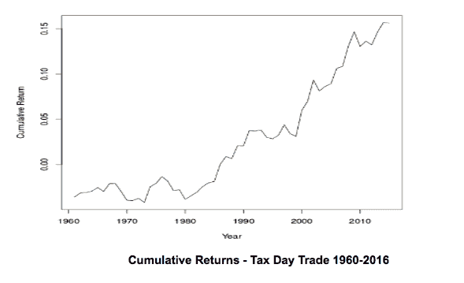

# 纳税日交易-季节性优势？

> 原文：<https://blog.quantinsti.com/tax-day-trade-seasonal-advantage/>

JB 玛沃德的客座博文

尽管有效市场假说可能会有所暗示，但金融市场中仍存在许多季节性边缘和市场异常。

通常，棘手的部分是发现这些异常，并能够在它们被发现和套利之前从中获利。

斯蒂芬·莫菲特(Stephen Moffitt)调查的纳税日交易是另一个至今仍然存在的优势。

### **纳税日策略**

纳税日交易是一种基于美国联邦所得税到期日的交易策略。这是一个单日交易，你在纳税日收盘时进入标准普尔 500，然后在第二天收盘时卖出。

因此，这是一个非常容易执行的交易，它依赖于简单的行为偏差。

### **交易结果**

自 1980 年以来，纳税日交易每年的回报率约为 0.5%。你可以看到自 1980 年以来的回报率相当稳定:

来源:莫菲特、史蒂文，《纳税日交易:一个有效的市场异常》(2017 年 2 月 2 日)。可在 [SSRN](https://ssrn.com/abstract=2910752) 买到。

这个策略最有趣的部分是为什么在 1980 年后有优势，而在此之前没有。自 1980 年以来，回报率一直非常稳定。但是在 1980 年之前，结果远没有吸引力…

### **为什么会有边缘？**

为了理解这一点，我们必须看一看实际的税法和当时发生的变化，以了解优势的基础。

在那段时间里，美国的税收和退休状况发生了两大变化。

#### **1974 年**

*   1974 年雇员退休收入保障法案(ERISA) -建立有限制的个人退休帐户。

#### **1981 年**

*   1981 年经济复苏税法(肯普-罗斯法案)-允许所有在职纳税人创建个人退休账户(IRA)。

### **爱尔兰共和军的力量**

1974 年制定的法律允许一些纳税人在纳税截止日当天或之前向免税个人退休账户(IRA)缴款。

1981 年的变化意味着爱尔兰共和军扩大到包括所有工人。

个人退休帐户是一个强有力的工具，因为他们允许免税捐款。

从 2017 年开始，你可以选择在取款时不缴税，也可以选择缴纳捐款税。或者不缴纳任何供款，在提取时缴纳税款。

这种账户非常受公众欢迎，因为它们可以大幅减少通常用于资本收益的税收。

### **股市异常**

因此，市场优势是存在的，因为许多人不到最后一刻都不想交税。

这可能是出于[行为原因](https://jbmarwood.com/charlie-munger-mental-models/)(比如想要推迟令人不快的报税任务)或理性原因(比如直到最后一天才获得正确报税所需的所有信息)。

不管是哪种情况，大量的投资者都坚持到最后一刻，然后他们会争先恐后地把钱投资到个人退休帐户，以节省税收。

其结果是，正当纳税人试图避税、应该缴税的时候，资金源源不断地流入美国股市。

分析显示，自 1980 年以来，在纳税日收盘时买入标准普尔 500 期货，一天后收盘时退出，平均收益为 0.5%。

### **结论**

这种策略似乎是金融市场中存在的另一种季节性优势，表明市场并非完全有效。

像所有市场异常现象一样，没有人能保证它会继续有效，但在过去 30 年左右的时间里，它一直表现稳定。

今年(2018 年)美国的纳税日是 4 月 17 日星期二。

*免责声明:这篇客座博文中提供的观点、意见和信息仅属于作者个人，并不代表 QuantInsti 的观点、意见和信息。本文中所做的任何陈述或共享的链接的准确性、完整性和有效性都不能得到保证。我们对任何错误、遗漏或陈述不承担任何责任。与侵犯知识产权相关的任何责任由他们承担。*