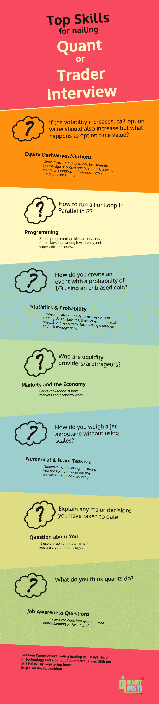

# 获得量化分析师或交易者面试的顶级技巧

> 原文：<https://blog.quantinsti.com/top-skills-nailing-quant-trader-interview/>

想保住一份量化分析师或交易员的工作吗？为了得到理想的工作，你应该关注以下几个方面。

## **1)股票衍生品/期权**

衍生品是高度交易的工具。必须了解期权定价模型、希腊人、波动性、对冲和各种期权策略。

## **2)编程**

回测、编写低延迟和超高效代码需要良好的编程技能。

## **3)统计&概率**

概率和统计是交易的关键部分。基本统计学、时间序列、多元分析等。用于制定战略和风险管理。

## 4)市场和经济

对市场和经济如何运作有很好的了解。

## **5)数字&脑筋急转弯**

数字和思维问题测试用合理的推理得出答案的能力。

## 关于你的问题

问这些是为了确定你是否适合这份工作。

## **7)工作意识问题**

工作认知问题评估你对工作简介的理解。