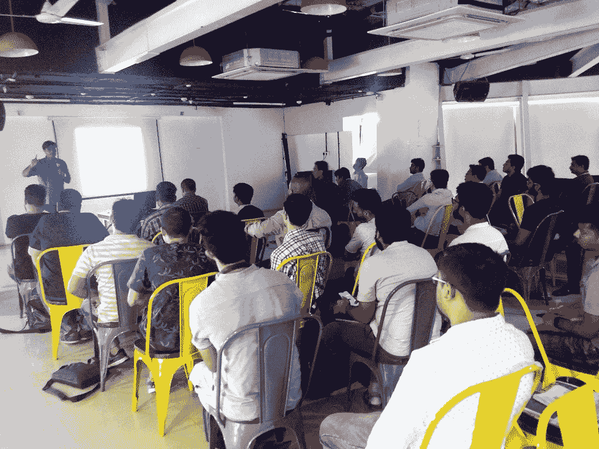
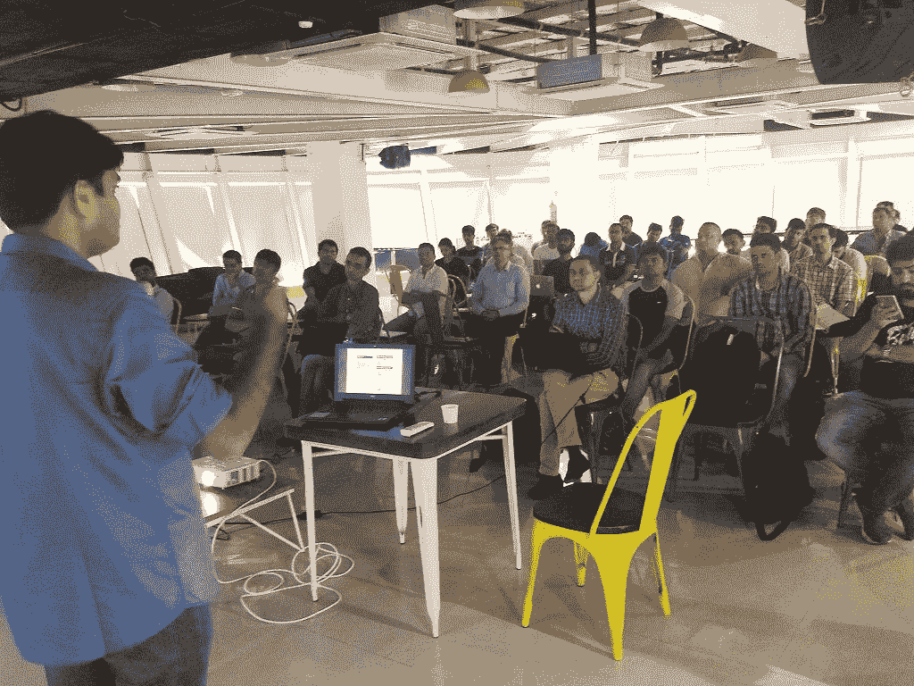
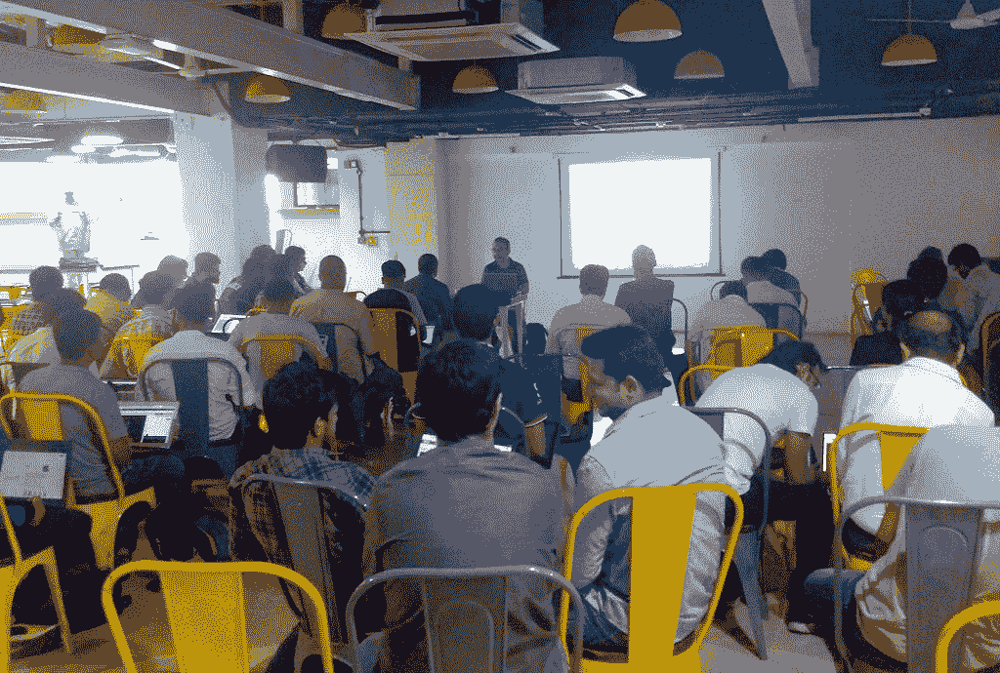
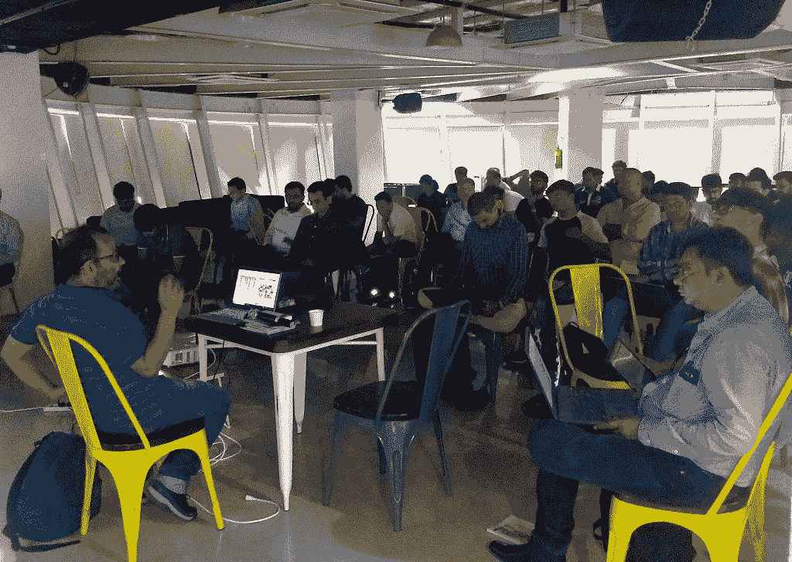

# 使用量化方法交易:要素投资| PyData

> 原文：<https://blog.quantinsti.com/trade-using-quant-methods-factor-investing/>

* * *

*此活动已经结束*

* * *

2019 年 6 月 22 日星期六
格林威治时间下午 2:30 至 7:30+5:30

由 Sukanya M 主持。

* * *

## 细节

PyData Mumbai 很高兴能与 QuantInsti 联合举办此次 Algo 交易活动。QuantInsti 是一家领先的培训和教育提供商，在 165 多个国家提供算法和量化交易方面的培训和教育，并拥有世界上第一个认证项目。QuantInsti 与许多知名的行业合作伙伴密切合作，并为这些协会为彼此和整个社区增加的价值感到自豪。

举几个例子，QuantInsti 为证券交易所、国际知名券商开设了课程；与领先的行业参与者一起举办研讨会，并受邀参加全球顶级行业活动。

除此之外，QuantInsti 的课程中还包含一些工具&功能，为我们的用户&课程参与者提供更多信息。

* * *

## **议程**

**参加研讨会的先决条件:**
a .外汇动量交易
b .使用 Python 中的真实外汇市场数据创建动量交易策略。在内置平台上做回测，分析结果。
资源:[https://quantra.quantinsti.com/courses?
filter = Momentum % 20 trading % 20 in % 20 forex](https://quantra.quantinsti.com/courses?filter=Momentum%20Trading%20in%20Forex)

**会议 A** -下午 2:30 至 4:15-由伊山·沙阿
主持 A .资产定价
b .要素投资

**会议 B** - 4:30 至 6:30 -由 Prodipta Ghosh 主持:基于动量的策略的实际演示(本会议需要一台笔记本电脑)
a .回溯测试工具介绍
b .基于动量的投资
c .动量的类型:时间序列和横截面【T11

* * *

## **学习成果**

a.计算投资一项资产的预期回报 b .解释要素投资
c .计算超过市场投资组合的表现

* * *

## **演讲者简介**

### **伊山沙阿**

向他学习如何建立数据模型、交易规则、自相关函数等统计参数以及如何使用统计学和机器学习来自动化您的交易策略。

*行业经验*
配对交易策略是伊山的另一个专业领域，他在课程中详细介绍了配对交易策略建模。他在金融市场拥有丰富的经验，在不同的资产类别中担任不同的角色。他曾在巴克莱银行的全球市场团队&和美国银行 Merill Lynch 共事。

### Prodipta Ghosh

IIM PGDM 勒克瑙

Prodipta 是 R、Python 和量化交易技术方面的专家。他对 quant &能够将复杂的理论与实践相结合的一切都有诀窍。他就金融计算与金融市场相关的编程概念&发表演讲。

*行业经验*
Prodipta 是一位经验丰富的 quant，目前在 QuantInsti 担任副总裁，领导 Fin-tech 产品和平台开发。

他在银行业工作了十多年，在孟买和伦敦的德意志银行的交易和结构部门担任过各种职务，并在渣打银行担任企业银行家。在此之前，Prodipta 作为科学家在印度国防 R&D 组织(DRDO)工作。

*全球曝光*
他曾为东南亚的多个机构/企业举办讲座/研讨会，包括马来西亚的肯南加、IIM 的艾哈迈达巴德、IIT 的钦奈和新加坡的 NTU。

* * *

## **活动照片**

<figure class="kg-card kg-gallery-card kg-width-wide"></figure>