# 基于指数动量的交易指数期权[EPAT 项目]

> 原文：<https://blog.quantinsti.com/trading-index-options-index-momentum/>


本文是作者提交的最后一个项目，作为他们在 QuantInsti 的算法交易 (EPAT)的[高管课程的一部分。请务必查看我们的项目页面，看看我们的学生正在构建什么。](https://www.quantinsti.com/epat)

**关于作者**

***[Naveen Edamana](https://www.linkedin.com/in/naveenedamana/)**在 IT 行业拥有超过 10 年的经验，在技术领域享有盛誉，目前在 Oracle India Pvt. Ltd .担任首席顾问。Naveen 以优异的物理成绩毕业，之前曾在 NIIT、新达和安联工作过。*

### **项目摘要**

项目目标是建立和研究基于指数动量的指数期权交易模型。交易指数期权模型的设计考虑了以下标准:

*   信号生成的最少参数
*   限制意外事件导致的财务风险
*   保证金要求低或为零

本项目研究的交易指数期权模型使用 NIFTY 及其期权的每日 OHLC 数据。进场和出场信号是用漂亮的 OHLC 蜡烛线的简单移动平均线(SMA)得出的。这些信号是为看涨期权或看跌期权中的多头头寸生成的

### **简介/项目动机**

期权的使用有很多原因，包括投机、对冲、扩散和创建合成头寸。大量的期权交易模型被广泛使用，并有据可查。然而，大多数模型要求两个或两个以上的看涨/看跌期权组合头寸，具有相同或多重执行价格，有/无日历价差。手动跟踪和交易这些组合可能会变得复杂。因此，需要定制/自动化的软件来跟踪投资组合的表现，并几乎同时或在很短的时间内执行仓位的进/出。时间范围内的快速价格变化可能会极大地影响模型的回报。

在这个项目中，试图使用基于指数的期权作为工具来跟踪指数[动量](https://quantra.quantinsti.com/course/momentum-trading-strategies)并以最小的风险产生可接受的回报。该项目的目标如下:

*   建立一个简单的“进入和退出”的交易模式
*   信号很快产生，不需要复杂的计算——使用简单的 OHLC 图表和一些简单的分析工具就可以得出结论
*   该模型应该只有有限的金融风险，保护投资者免受意外市场波动的影响。
*   在交易窗口开始的 10-20 分钟和结束的 10-20 分钟内进行交易，应该足够模型运行

#### **交易模式-策略**

为了满足项目设定的目标和标准，设计了以下交易指数期权模型。交易模式:

*   使用 Nifty-50 的 OHLC 数据，NIFTY-50 期货和期权的当前和近月 OHLC 数据
*   使用 NIFTY-50 每日 OHLC 数据的高值和低值的 15 天 SMAs 生成进场/出场信号
*   还为现有信号生成使用预设目标/止损限制
*   信号仅用于进入多头头寸，在当天收盘前的最后 5-10 分钟执行
*   在任何时间点只维持一个未平仓头寸

人们还可以了解情绪指标，如何解读它们，并根据这些解读设计交易策略。

#### **参赛规则**

买入/卖出期权进入多头头寸的交易模型规则如下:

*   *如果当天的 OHLC 烛台为绿色，在下列情况下输入多头仓位:*

当天的 OHLC 烛台(包括主体和尾部)位于 HIGH-SMAs 上方，前一天的 OHLC 烛台为绿色(以下任何一种) 前一天的 OHLC 烛台的主体穿过两个 SMA 或前一天的 OHLC 烛台的主体穿过两个 SMA 或前一天的 OHLC 烛台的主体在低 SMA 下方但具有上部尾部穿过低 SMA 或前一天的 OHLC 烛台的主体在两个 SMA 之间，尾部(上部或下部或两者)穿过一个或两个 SMA 或前一天的 OHLC 烛台(主体和尾部)在两个 SMA 之间

*   *如果当天的 OHLC 烛台为红色，在下列情况下输入多头头寸:*

当天的 OHLC 烛台(包括主体和尾部)位于 LOW-SMAs 下方，前一天的 OHLC 烛台是红色的(以下任何一种) 前一天的 OHLC 烛台主体穿过两个 SMA 或前一天的 OHLC 烛台主体穿过两个 SMA 或前一天的 OHLC 烛台主体在高 SMA 之上但具有较低的尾部穿过高 SMA 或前一天的 OHLC 烛台主体在两个 SMA 之间，尾部(上部或下部或两者)穿过一个或两个 SMA 或前一天的 OHLC 烛台(主体和尾部)在两个 SMA 之间

#### **退出规则**

*买入/卖出期权的多头头寸退出交易模型规则如下:*

如果头寸的价值已经达到或超过目标值，退出头寸并记录利润或

如果头寸的价值已经达到或低于止损限额，退出头寸并记录损失或

在多头头寸的情况下，退出头寸，如果:当天的 OHLC 烛台低于低 SMA 或当天的 OHLC 烛台的身体或尾巴(或两者)穿过任何或两个 SMA

如果是长期看跌头寸，在以下情况下退出头寸:当天的 OHLC 烛台高于高 SMA 或当天的 OHLC 烛台的主体或尾部(或两者)穿过任何或两个 SMA，或者如果头寸在到期日或到期日之前未能达到目标/止损，则标记头寸到期

#### **目标/止损规则**

交易模型有预定义的目标值和止损限额。这些值是在输入时计算的。使用的公式是:

```py
Profit booking TARGET price = Buy Rate * (1 + pre-fixed target percentage)
and
Stoploss limit = Buy Rate * (1 - pre-fixed target percentage)
```

#### **仓位大小规则**

头寸规模(即在多头交易的情况下要购买的手数或单位数)由当前账户余额决定。帐户余额的预定义百分比值用于购买最大可能的手数(一手= 75 个期权单位)。使用的公式是:

```py
lot count = floor ((account balance * pre-fixed percentage / 100) / option price / lot size)
and
number of units to purchased = lot count * lot size
```

#### **执行价格&到期选择规则**

交易模型使用自动柜员机/OTM 执行价格创建头寸。到期时间可以是当月或近月，根据预定义的到期天数限制值进行选择。

#### **交易费用规则**

交易模型将经纪费用和税收视为买卖双方交易成本的一部分。

#### **预定义值**

交易模型基于一些预定义的参数。它们是:

*   考虑当月或近月期权行权的到期期限的天数
*   用于购买期权手数/单位的账户余额限额的百分比
*   获利(目标)限额
*   止损限额
*   经纪费
*   税收百分比

### **回测&交易指数期权评估**

为了评估交易指数期权模型，使用 PYTHON 语言将交易策略转换成算法。使用 Python 代码，对交易模型进行回测，评估模型的有效性。

#### **数据收集**

为了进行回溯测试，从 2007 年 1 月 1 日到 2017 年 11 月 30 日的数据从 NSE 的网站上收集。以下数据可从 NSE 网站以 bhav / excel 文件的形式获得:

*   NIFTY 50 的每日 OHLC 数据
*   漂亮期货的每日 OHLC 数据
*   漂亮期权(看涨和看跌期权)的每日 OHLC 数据

这些下载的数据被上传到 Oracle 数据库表中，然后由 Python 代码使用 Oracle 数据库连接器模块(cx_Oracle)读入这些表，用于测试周期。

以下是 w.r.t NIFTY-50 指数可用的各种字段

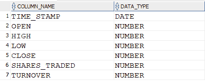

以下是各种可用的期货和期权领域


#### **数据准备**

数据准备和过滤在 Python 代码中执行。执行以下步骤:

*   每日 OHLC 数据从 NIFTY、当月期货和近月期货的数据库中提取，用于测试周期的执行。
*   使用 NIFTY 的高和低 OHLC 值计算数据集的 15 天简单移动平均值
*   烛台(OHLC)属性-颜色和位置 w . r . t . SMAs-是派生的
*   烛台属性被扫描，以识别基于进入规则的交易信号

#### **交易指数模型测试&优化参数**

整个数据集被分成四个测试块:

*   第一组:从 2007 年 1 月 1 日至 2010 年 12 月 31 日
*   第二组:从 2011 年 1 月 1 日至 2015 年 12 月 31 日
*   第三套:2016 年 1 月 1 日至 2017 年 11 月 30 日
*   全套:从 2007 年 1 月 1 日至 2017 年 11 月 30 日

使用集合 1 和 2 优化交易模型规则和参数，并在其他集合上运行相同的规则和参数进行验证。根据多项测试，运行以下确定的优化规则/参数:

*   据观察，ATM 执行价格能产生最好的结果
*   投资部分(账户余额的百分比)= 15%
*   获利目标限额= 100%
*   止损限额= 75%
*   距离到期限制的天数= 20

#### **设置 1 -测试结果**

以下是具有优化参数的组 1 的测试结果:

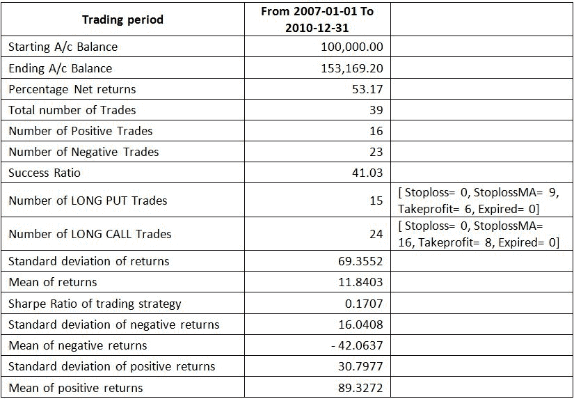

下图显示了策略回报与漂亮回报的对比以及本期的账户余额。

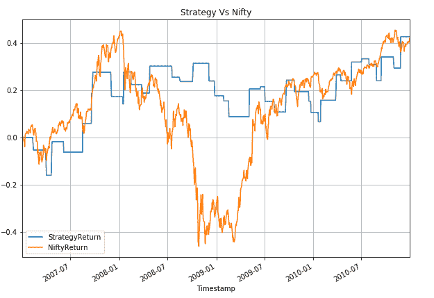

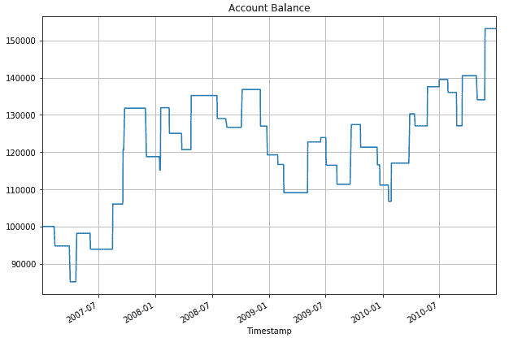

#### **设置 2 -测试结果**

以下是具有优化参数的组 2 的测试结果:

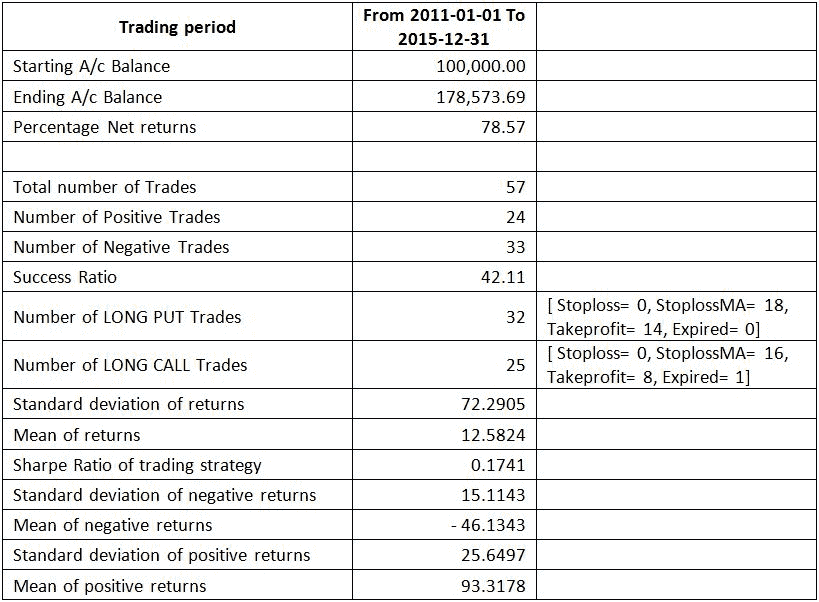

下图显示了策略回报与漂亮回报的对比以及本期的账户余额。


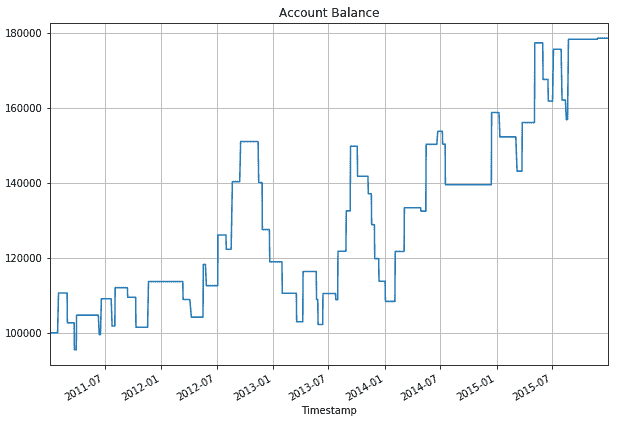

#### **设置 3 -测试结果**

以下是具有优化参数的组 3 的测试结果:

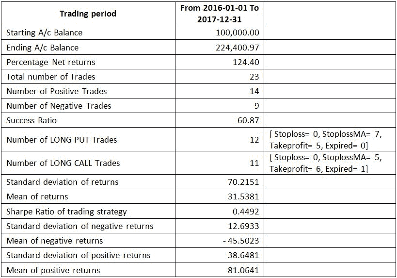

下图显示了策略回报与漂亮回报的对比以及本期的账户余额。

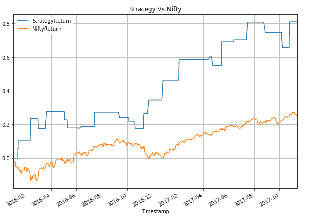

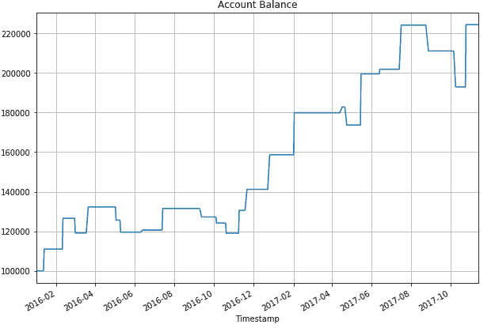

#### **全套测试结果**

以下是优化参数的全套测试结果:

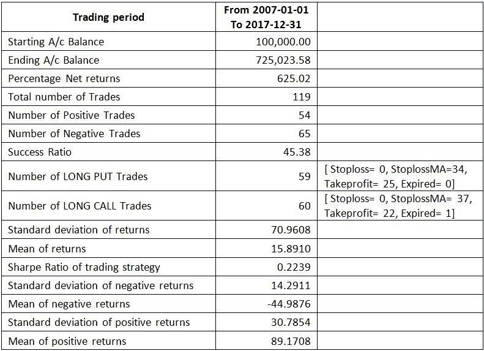

下图显示了策略回报与漂亮回报的对比以及本期的账户余额。

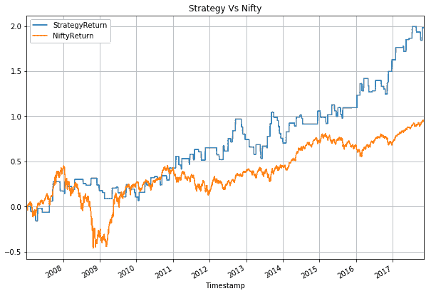

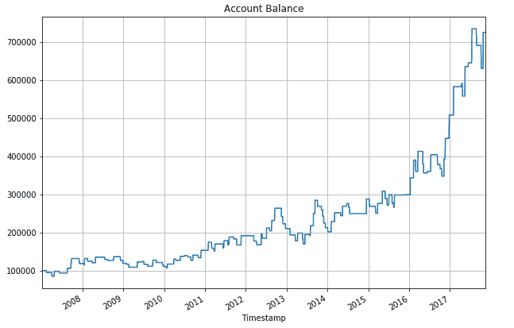

#### **交易模式的主要发现、挑战/限制**

交易指数期权模型被观察到提供合理的回报，同时最小化金融风险。交易指数期权模型在 10 年的时间框架内仅用 119 笔交易就提供了 600%的回报。尽管模型的成功率并不吸引人，但由于负回报的平均值的绝对值小于正回报的平均值，且标准差较小，因此提供了净值生成。

交易指数期权模型也能够在 2008 年市场崩盘期间保护投资者，如从集合 1 /全套测试结果的图表中观察到的。在 2011 年、2015 年和 2016 年 11 月/12 月期间也观察到同样的情况。

然而，交易指数期权模型未能利用 2009 年市场的大幅复苏。此外，它未能防止 2012 年下半年和 2013 年市场波动时的提款。

尽管从图表来看，与做多交易相比，交易指数期权模型在做多交易方面表现良好，但是，做多交易产生的回报是做多交易的 3 倍。多头交易产生的净利润为 457，651 印度卢比，而多头交易产生的净利润为 167，372 印度卢比。

面临的主要挑战之一是过早退出，导致无法充分利用动力驱动。下图显示了 2017 年的第一个交易信号是在 2017 年 1 月 24 日生成的，目标是 100%的买入价。目标于 2017 年 2 月 2 日实现。

然而，交易指数期权模型在 2017 年 3 月 6 日生成了下一个交易信号，错过了 2017 年 2 月期间获得的整个 NIFTY 的势头，因为该配置文件没有任何未平仓头寸。

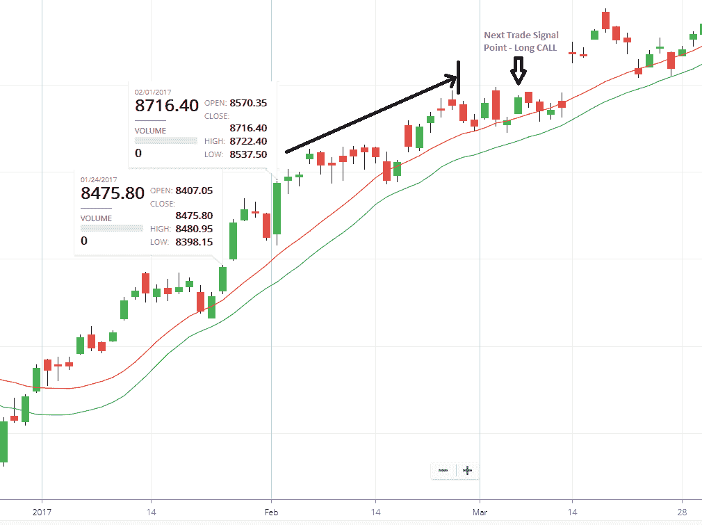

试图解决这个问题没有多大帮助，任何后续的长期买入都以止损告终，因为在 2 月 12 日至 17 日的日期范围内，Theta 衰减和 NIFTY 下跌。

类似地，观察到的另一个问题是在止损退出的情况下，导致错过跟随它的势头。

### **结论**

在这个项目中使用的交易指数期权模型需要相当大的未来改进，以及处理由于目标/止损触发的提前退出。使用额外的分析工具有助于改进模型。

### **阅读更多**

您可能还会发现我们之前的以下文章很有意思:

*   [利用期权进行分散交易](/dispersion-trading-using-options/)
*   [指数套利——一种自动化期权交易策略](/index-arbitrage-automated-options-trading-strategy/)
*   [使用 Python 进行期权交易的未平仓权益](/open-interest-options-trading-python/)
*   [使用机器学习的覆盖呼叫策略](/covered-call-strategy-machine-learning/)

### **下一步**

如果你想学习算法交易的各个方面，那就去看看算法交易(EPAT)的[高管课程。课程涵盖统计学&计量经济学、金融计算&技术和算法&定量交易等培训模块。EPAT 为你提供了在算法交易中建立一个有前途的职业生涯所需的技能。立即注册！](https://www.quantinsti.com/epat)

免责声明:就我们学生所知，本项目中的信息是真实和完整的。所有推荐都不代表学生或 QuantInsti 的保证。学生和 QuantInsti 否认与使用这些信息有关的任何责任。本项目中提供的所有内容仅供参考，我们不保证通过使用该指南您将获得一定的利润。

### **下载中的文件:**

*   使用基于指数动量的指数期权进行交易- Python 文件