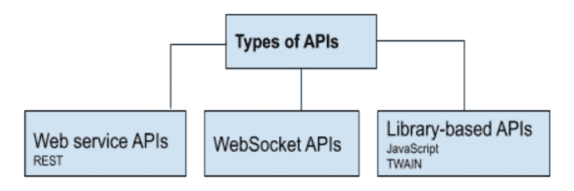
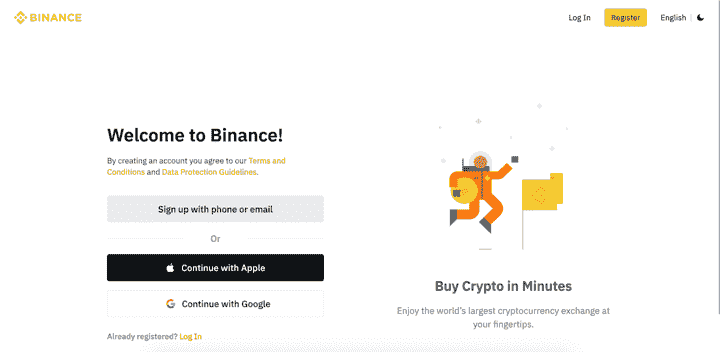
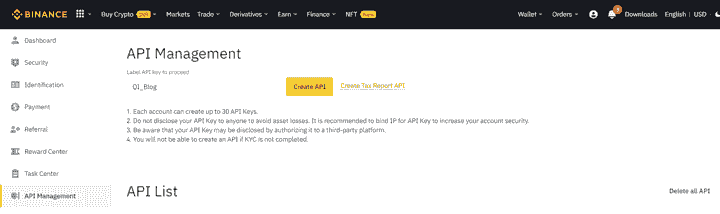
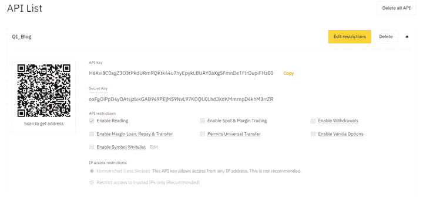
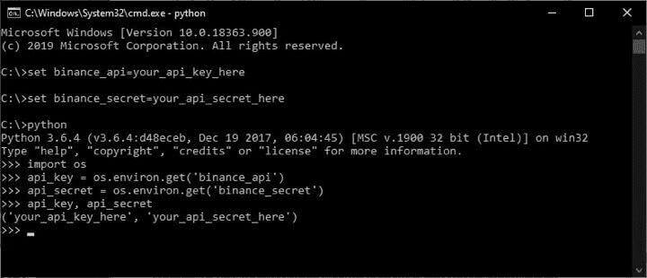

# 交易 API:它是什么，类型，用途，用于交易的 API，等等！

> 原文：<https://blog.quantinsti.com/trading-markets-using-apis/>

由[查尼卡·塔卡](https://www.linkedin.com/in/chainika-bahl-thakar-b32971155/)

不断增长的市场，监管机构的批准，以及越来越多的[算法交易](/algorithmic-trading/) API，都使得使用 API 的交易市场成为一种趋势。此外，经纪人在很大程度上为散户和公司提供算法交易发挥了关键作用。

交易市场有不同的方式。一种方法是使用经纪人提供的交易 API。这个博客简要介绍了 API，它们的类型和一些提供交易 API 的经纪人。

让我们通过包含以下内容的索引进一步了解这一切:

*   什么是 API？
*   [API 示例](#example-of-an-api)
*   [API 的类型](#types-of-api)
    *   [REST API](#rest-api)
    *   [WebSocket API](#websocket-api)
    *   [基于库的 API](#library-based-api)
*   [为什么要用 API 进行交易？](#why-use-api-for-trading)
*   [获得实时和历史市场数据的流行 API](#popular-api-to-get-real-time-and-historical-market-data)
    *   [外部供应商](#external-providers)
        *   [全局数据馈送](#global-datafeeds)
        *   [真实数据](#true-data)
        *   [Finnhub](#finnhub)
    *   [券商](#brokers)
        *   [零风筝连接](#zerodha-kite-connect)
        *   [互动经纪人](#interactive-brokers)
*   [经纪人自动化交易的 API](#brokers-api-to-automate-trading)
    *   [互动经纪人](#interactive-brokers)
    *   [密码交易员的币安](#binance-for-crypto-traders)
    *   [零风筝连接](#zerodha-kite-connect)
*   [使用 API 开始交易的步骤](#steps-to-start-trading-with-api)
*   [使用 API 进行交易的示例](#example-of-trading-with-an-api)
    *   [如何安装 Python-币安库？](#how-to-install-the-python-binance-library?)
    *   如何保护 API 密钥？
    *   [如何用币安 API 获取比特币的最新价格？](#how%20-to-get-the-latest-price-for-bitcoin-with-binance-api)
*   [获取 API 的资源](#resources-for-getting-api)

* * *

## 什么是 API？

API 是应用编程接口的缩写。API 是一种软件中介，能够让两个软件应用程序相互对话。让我们深入了解 API 是如何工作的。

正如您在下图中看到的，当您向应用程序发送执行某项操作的请求时，API 的角色位于应用程序和服务器之间。

因此，在交易时，当您向应用程序发出获取数据的请求时，应用程序会通过交易 API 将请求发送到服务器。到达服务器后，请求得到处理，并显示出期望的结果。

* * *

## API 的示例

API 为交易者提供以下服务:

*   市场反馈(用于分析的历史数据、流或实时数据)
*   订单相关设施(修改以及下订单、状态更新、交易信息等。)
*   关于订单簿(收到订单的地方)和交易簿(显示执行的订单)等的报告。
*   交易信息和更多！

* * *

## API 的类型

现在让我们来看看不同的 API 类型。我发现这个图表很好地划分了 API 类型。我们将介绍一些在交易中使用的 API。

API 是这样分类的:

<figure class="kg-card kg-image-card kg-width-full"></figure>

### REST API

REST 或表述性状态转移是一个 API，它使用 HTTP 来发出请求。它用于需要根据用户操作传输某些信息的应用程序中。

对于实时传输或数据流，REST 不是最好的协议，可以使用 WebSockets 来代替。我们将在下一部分讨论 WebSockets。

当交易者的需求是:

*   **灵活性-** 因为他们可以同时处理不同订单执行的大量请求
*   ******可扩展性-****** 因为它们是为两个软件应用程序之间的通信而设计的，不管它们的大小或能力如何
*   ******易于适应 web 技术-****** 这使得它们易于构建和使用

### WebSocket API

WebSocket 是一种允许与服务器之间传输数据的协议。连接到服务器的套接字保持打开以进行通信。因此，可以实时按需推送或请求数据。

当交易者的要求是:

*   实时传输或流数据，这是交易时 WebSocket API 的一大优势。它有助于实时市场时段的数据传输，尤其是高频交易。
*   获取数据后定制交易策略

### 基于库的 API

基于库的 API 使得开发者很方便，因为库是由代码或二进制函数组成的。可以直接引用这些库来使应用程序与 API 进行交互。因此，开发人员不必花时间写代码。

基于库的 API 的主要用途是可以拉取市场报价，可以发送或修改订单，可以提取历史数据等。在图书馆的帮助下。例如，Zerodha 的 Kite Connect API 有自己的 [kiteconnect 库](https://kite.trade/docs/pykiteconnect/v3/)，其中包含交易订单、执行等代码。都能找到。

* * *

## 为什么要用 API 做交易？

现在让我们看看为什么 API 是交易的首选。以下是一些好处:

### 安全

交易 API 网站与您之间的通信是通过小数据包进行的，这些数据包只包含它被告知要获取的信息。例如，只有交易订单通过交易 API，而没有来自系统的其他信息。

### 根据需要定制 API

有了交易 API，最有用的一点是用户界面可以根据交易者的需求定制。因此，可以根据您的喜好使用交易 API。

### 获取实时数据

有了交易 API，你可以获得交易的流数据或实时数据。对于任何交易者来说，获取实时数据是主要的，也是第一步。通过快速访问实时数据，您可以使您的交易之旅取得成功。

### 灵活的 REST API

交易 API 为您提供了灵活的 RESTful API，它与多种计算机语言兼容，最适合您的需求。

* * *

## 获得实时和历史市场数据的流行 API

有两种类型的数据提供程序用于访问实时数据:

1.  外部提供商
2.  经纪人

### 外部提供商

以下是已知的**印度外部实时数据提供商**，其优势包括通过直接交换连接实现低延迟馈送。：

*   [全局数据馈送](https://globaldatafeeds.in/)
*   [真实数据](https://www.truedata.in/)

现在，让我们看看实时数据的**全球外部提供商**，即 [Finnhub](https://finnhub.io/) 。Finnhub 利用最先进的机器学习算法来收集、清理和标准化全球市场的数据。

### 经纪人

通过 API 提供数据的最著名的**经纪人**有:

*   [Zerodha - Kite Connect](https://kite.trade/) - **印度经纪人**
*   [互动经纪人](https://www.interactivebrokers.com/en/trading/ib-api.php) - **全球经纪人**

* * *

## 经纪人自动化交易的 API

更进一步，下面是使用 API 来自动化交易过程的流行经纪人:

*   [互动经纪人](https://www.interactivebrokers.co.in/en/index.php?f=40071&wid=723243519)
*   [密码交易员的币安](https://www.binance.com/en)
*   [零风筝连接](https://zerodha.com/)

* * *

## 用 API 开始交易的步骤

交易者使用交易 API 的一个常见做法是为 Python 安装 Anaconda。由于 [Python 是最首选的语言](/python-programming/)，所有步骤都用 Python 本身解释。

让我们来了解一下如何用 API 开始交易。以下是常见步骤:

### 步骤 1 -注册和密钥

向 API 提供者注册并获得 API 密钥(API 密钥和 API 秘密密钥)

### 步骤 2 -构建 API

选择构建 API 的语言或应用程序。你可以使用任何最适合你的语言。比如 C，C++，Python，Java 等等。另外，如果你喜欢高频交易，那么通常会选择 C++，而在低频交易中，通常会选择 Python。

### 步骤 3 -登录

现在，使用 API 密钥登录交易 API

### 第 4 步-访问

登录后，您现在可以访问所有功能，如获取数据(历史数据和当前数据)、下订单、修改订单、获取您帐户的详细信息，如可用保证金、您持有的股票以及所下订单的状态等。

* * *

**建议阅读:**

*   [使用 IBrokers 包在交互式代理 API 中实现 R](/using-ibrokers-package-implement-r-interactive-brokers-api/)
*   [使用 IBridgePy 在交互式代理 API 中实现 Python](/implement-python-in-interactive-brokers-api/)
*   [在印度市场使用 Zerodha Kite Connect API 与 Python 进行交易](/trading-with-python-indian-markets/)

* * *

## 使用 API 进行交易的示例

让我们以加密交易者的**币安为例，看看其中一个交易 API 是如何工作的。**

以币安为例，让我们看看如何开始使用 API 进行交易。以下是步骤:

### 第一步-注册

在本页注册:

<figure class="kg-card kg-image-card kg-width-full"></figure>

### 步骤 2 -创建 API

登录后，从控制面板转到 API 管理，然后单击“创建 API ”,之后您将看到一个安全验证弹出窗口，如下所示:

<figure class="kg-card kg-image-card kg-width-full"></figure>

### 步骤 3 -验证

完成一级验证后，您需要填写安全验证详细信息并继续。这里有一个例子:

<figure class="kg-card kg-image-card kg-width-full"></figure>

认证代码将在谷歌认证中随机生成。

### 步骤 4 -创建 API 密钥

现在，创建一个带有名称的 API 键。这里，我们使用的名称是“齐博客”

<figure class="kg-card kg-image-card kg-width-full"></figure>

### 步骤 5 - API 创建

然后，您需要创建一个 API 密钥和一个秘密密钥。这是您创建的 API 的外观:

<figure class="kg-card kg-image-card kg-width-full"></figure>

您必须确保记下 API 密钥和安全密钥，否则下次登录时会被屏蔽。

此外，作为交易 API 的新手，你必须阅读币安的教程章节。

### 如何安装 Python-币安库？

安装 python-币安库的最简单和最好的方法是:

```py
pip install python-binance
```

此外，还有几个可用的第三方库，最受欢迎的有:

*   [Python-币安](https://github.com/sammchardy/python-binance)
*   [CCXT](https://github.com/ccxt/ccxt)
*   [币安连接器](https://github.com/binance/binance-connector-python)

### 如何保护 API 密钥？

API 密钥必须存储为环境变量，这将防止您在将代码上传到 GitHub 时暴露您的凭证。

以下是语法:

```py
set binance_api=your_api_key_here
set binance_secret=your_api_secret_here

```

此外，您可以使用如下命令提示符来确保正确保存密钥:

<figure class="kg-card kg-image-card kg-width-full"></figure>

### 如何用币安 API 获取比特币的最新价格？

目前最好的方法是使用这个函数:

```py
get_symbol_ticker
```

如果您在寻找另一个资产，您可以通过这里的任何 ticker，而不是 BTCUSDT。