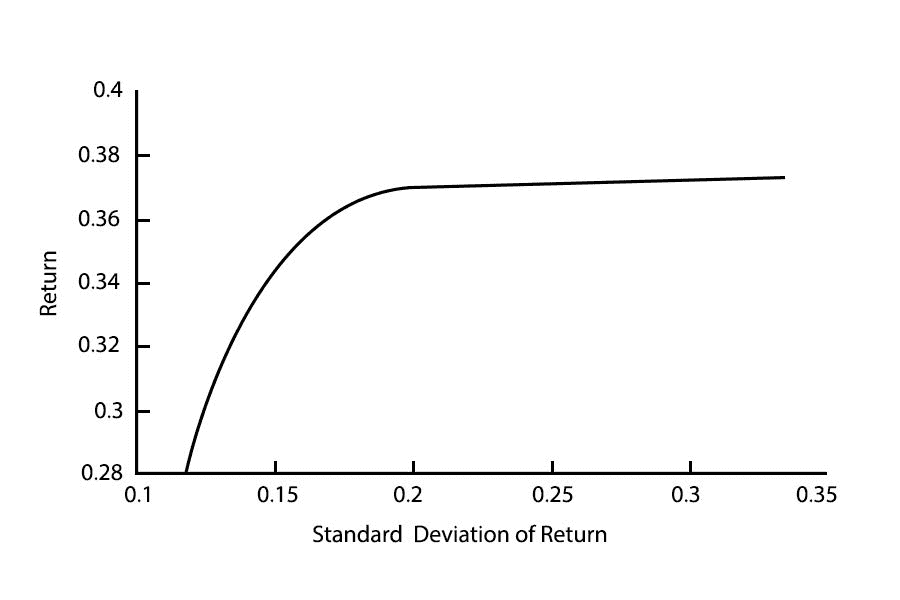

# 交易中的风险管理介绍

> 原文：<https://blog.quantinsti.com/trading-risk-management/>

由[查尼卡·塔卡](https://www.linkedin.com/in/chainika-bahl-thakar-b32971155/)

风险管理是交易最重要的方面之一，交易者需要对风险识别、评估和管理有很好的了解。本文涵盖了风险管理的以下方面:

*   什么是交易中的风险管理？
*   [风险识别](#identification-of-risks)
*   [交易风险评估](#evaluation-of-trading-risks)
*   [流行的风险管理策略和要素](#popular-risk-management-strategies-and-elements)

## 什么是交易中的风险管理？

交易中的风险管理对于避免承担股票市场交易损失的风险至关重要。风险管理涉及风险的识别、评估和缓解，这些风险通常在市场走势与预期相反时出现。

因此，在对市场进行彻底分析的基础上，在预测所有风险之后，设定你的预期是非常重要的。

趋势是这里最重要的因素。趋势意味着市场的大方向或[势头](https://quantra.quantinsti.com/course/momentum-trading-strategies)，资产价格或其他类似的措施。

趋势是由投资者的风险偏好形成的，这意味着在某些事件中的预期风险，如选举(政治事件)、利率决策(经济事件)和新技术进步(商业事件)。

因此，在预见到这些风险后，你可以投资于[股市](https://quantra.quantinsti.com/course/stock-market-basics)，权衡你的预期风险和预期收益。

在这段视频中，我们的专家 Rajib Ranjan Borah 详细介绍了当前市场中风险管理理念的变化:

[https://www.youtube.com/embed/uzAhV94UiF8?feature=oembed](https://www.youtube.com/embed/uzAhV94UiF8?feature=oembed)

接下来，我们将了解交易风险的识别和评估。

## 风险识别

在识别交易风险时，你需要知道市场中起作用的不同变量。

这些变量可以是经济因素，如中央银行的利率决定或贸易战。

在做出交易决策时，我们必须确保我们考虑了那些可能影响我们资产的经济因素。

在这里，我们提到了这些因素造成这些资产价格波动的能力，如果它们确实对价格有很大影响，那么我们必须知道这些因素的频率。

找出这些要点将有助于我们识别这些因素对投资组合的潜在威胁。通过这种方式，我们可以借助对冲、投资于[期权](/tag/options-trading/)、将资产分散为低风险和高风险等做法，为应对市场中的风险情景做好准备。

建议阅读:[关于投资组合的文章&风险管理](/tag/portfolio-risk-management/)

现在让我们开始评估交易风险。

## 交易风险评估

交易风险评估意味着找出投资组合在市场中的表现。

评估市场风险有两种方法。一个是α，另一个是β。

**Alpha** 是衡量一项投资相对于某个基准的表现。投资组合超过基准[指数](https://quantra.quantinsti.com/glossary/Index)的超额回报是投资组合的 alpha。如果阿尔法是积极的投资超过了基准。同样，如果是负数，则投资组合表现不佳。alpha 值为 0 表示投资组合完全符合基准。

例如，阿尔法值为 1 意味着基金比基准指数的[回报率](https://quantra.quantinsti.com/glossary/Returns)高出 1%，阿尔法值为-1 意味着基金表现差 1%。

建议阅读:[阿尔法生成-控制日内风险概况](/controlling-intraday-risk-profile-10-jan-2017/)

是一种[证券](https://quantra.quantinsti.com/glossary/Security)或投资组合相对于整个市场的波动性的度量。一般来说，贝塔系数大于 1 表明投资组合或证券比市场波动更大，而贝塔系数小于 1 表明投资波动相对较小。低贝塔股票也被称为防御性股票，因为投资者喜欢在市场波动特别大的时候持有它们。当市场稳步上升，投资者乐于承担更大风险以实现利润最大化时，高贝塔股票往往会受到青睐。

例如，如果一只股票的贝塔系数是 1.5，理论上它比市场波动大 50%。相反，如果一只股票的贝塔系数是 0.60，理论上它比市场波动小 40%。

接下来，我们将找出有助于良好资金管理的风险管理方法。

建议阅读:[动态资金管理](/dynamic-money-management/)

## 流行的风险管理策略和要素

最受欢迎的风险管理策略和元素，使您的交易成功，同时规避风险如下:

*   投资组合优化
*   对冲
*   1%法则和 2%投资法则
*   利用先进技术监测贸易
*   避免不明确的交易设置
*   止损

**投资组合优化**

[投资组合优化](https://quantra.quantinsti.com/course/quantitative-portfolio-management)是构建投资组合以最大化预期回报同时最小化风险的过程。它包括通过计算每个投资组合的风险和回报来分析具有不同投资比例的投资组合，并选择实现期望的风险回报平衡的投资组合。

现代投资组合理论是由 Harry Markowitz 于 1952 年提出的一个假设，假设投资者希望在给定的风险下最大化投资组合的预期回报，风险由投资组合回报率的标准差来衡量。一个投资组合的风险和回报可以绘制成图表:

最佳风险投资组合通常被确定在曲线中间的某个位置，因为当你走得越高，你承担的风险就越大，回报就越低，当你走得越低，投资组合的回报就越低，所以投资这样的投资组合是没有意义的，因为你可以通过投资无风险资产来获得类似的回报。

讨论桌录制了 QuantInsti 专门为算法交易(EPAT)高管课程的学生制作的视频。

[https://www.youtube.com/embed/bqAZHvG89DQ?rel=0](https://www.youtube.com/embed/bqAZHvG89DQ?rel=0)

**对冲**

对冲是一种投资策略，旨在抵消潜在的损失。换句话说，对冲就是投资以降低风险。对冲市场价格风险意味着通过锁定价格来保护自己免受价格不利变动的影响。这是通过在对冲信贷风险的同时，利用对冲合约来对冲你所持有的自然头寸来实现的。

可以使用[衍生产品](/derivatives-market/)进行套期保值，因为在大多数情况下，衍生产品与其相应基础产品之间的关系是明确定义的。其他金融工具如保险、[期货合约](https://quantra.quantinsti.com/glossary/Futures)、[掉期](https://quantra.quantinsti.com/glossary/Swap)、[期权](https://quantra.quantinsti.com/glossary/Option)以及多种类型的[场外](https://quantra.quantinsti.com/glossary/OTC-Over-The-Counter)产品被用于对冲。

**例子**

让我们假设 ABC 公司生产玉米片作为其消费者的早餐产品。那么对于 ABC 公司来说，商品市场上玉米价格的波动就是一种风险。由于 ABC 公司处于天然的空头头寸(因为它是以玉米片的形式出售玉米)，它必须确保玉米价格在玉米采购过程中不会一成不变地上涨。

该公司将在玉米期货市场以 400 美元/蒲式耳的价格签订对冲多头合约。明天，如果玉米的[现货价格](https://quantra.quantinsti.com/glossary/Spot-Price)为 425 美元/蒲式耳，ABC 公司通过签订玉米采购的[期货](https://quantra.quantinsti.com/glossary/Futures)多头合同成功对冲了这一价格波动。如果现货价格低于 400 美元，比如 375 美元/蒲式耳，ABC 公司仍然会以 400 美元/蒲式耳的价格购买玉米，因为它已经签订了期货合同。因此，ABC 公司获得了 400 美元/蒲式耳的价格锁定。

**1%法则的意义和重要性& 2%投资法则**

交易中的 1%和 2%原则意味着每笔交易中可行的最大风险应该是 1%或 2%。

这有助于你避免否则可能发生的过度损失。因此，单笔交易的风险不应超过资本的 1%或 2%。这通常可以通过[日交易](/day-trading/)实现。

例如，持有 10，000 美元资金的交易者不会在单笔交易中冒险超过 100 美元。

**利用先进技术监控交易**

监控你的交易是非常重要的。可以通过以下方式监控交易:

*   利用[算法交易](https://quantra.quantinsti.com/courses?author_id=7)——股票的趋势不断变化，为了最大限度地利用你的交易，密切关注市场的变化是极其重要/关键的。在今天的高级交易中，自动化交易使得找到最有利可图的位置并自动投资变得更加容易，因为交易是由[算法](https://quantra.quantinsti.com/glossary/Algorithm)驱动的。这被称为[算法交易](/algorithmic-trading/)。像[神经网络](https://quantra.quantinsti.com/course/neural-networks-deep-learning-trading-ernest-chan)、[机器学习和深度学习模型](https://quantra.quantinsti.com/learning-track/machine-learning-deep-learning-in-financial-markets)这样的技术有助于监控的自动化以及在几秒钟内决定交易头寸。
*   回溯测试策略- [回溯测试](/backtesting/)是使用历史数据测试[交易策略](/tag/more-trading-strategies/)的过程，以确定该策略的有效性。回溯测试结果通常以一些流行的性能统计数据来显示策略的性能，如[夏普比率](https://quantra.quantinsti.com/glossary/Sharpe-Ratio)和索蒂诺比率，这有助于量化策略的风险回报。如果结果满足必要的标准，就可以在一定程度上合理地确信该策略可以实现。如果结果不太理想，可以修改、调整和优化战略，以达到理想的结果。

**避免不明确的交易设置**

当你的一个指标同意某个交易头寸，而其他指标不同意时，不清楚的交易设置就发生了。例如，如果你使用均线、均线等移动指标。其中一个指标显示了清晰的交易设置，但与其他指标的交易设置不一致，这就造成了混乱。

在这种情况下，最好等待合适的交易，不要在不确定的时候做任何决定。一套混合交易系统不应该成为你决策的基础。

**止损**

止损是当股票价格达到被称为止损价格的特定价格时触发的买入或卖出指令。止损对于不想持续监控证券的投资者来说非常有用。使用止损的另一个好处是防止过多的损失，并能更好地控制你的账户。止损的一个缺点是，它主要是一个市场订单，因此，它夸大了损失。

例如，假设你以每股 50 美元的价格购买了 XYZ 的股票，你担心它会下跌，如果价格跌至每股 45 美元以下，你可以使用止损单卖出，以保护自己免受更大的损失。

此外，您可以观看这段精心制作的视频，了解我们的专家 Marco Nicolas Dibo 关于风险管理实践的更多信息:

[https://www.youtube.com/embed/kt1jSw9BDt0?feature=oembed](https://www.youtube.com/embed/kt1jSw9BDt0?feature=oembed)

### 结论

在交易实践中，确保你的交易是安全的，有正确的风险管理是非常重要的。对风险管理实践和策略有很好的了解对任何交易者都有好处，因为它能帮助你最小化损失，最大化收益。通过对风险的正确识别和评估，你可以成功地管理风险。

风险管理也有必要了解与[日交易](https://quantra.quantinsti.com/course/day-trading-strategies)、日内交易以及现代加密货币交易相关的风险。您可以查看我们关于[加密交易策略](https://quantra.quantinsti.com/course/crypto-trading-strategies-advanced)的课程，以了解[加密货币](https://quantra.quantinsti.com/course/crypto-trading-strategies-intermediate)及其所涉及的风险。

<small>免责声明:本文中提供的所有数据和信息仅供参考。QuantInsti 对本文中任何信息的准确性、完整性、现时性、适用性或有效性不做任何陈述，也不对这些信息中的任何错误、遗漏或延迟或因其显示或使用而导致的任何损失、伤害或损害承担任何责任。所有信息均按原样提供。</small>