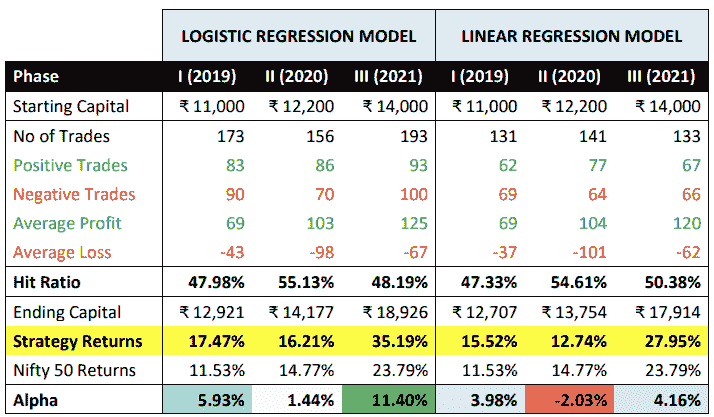

# 使用逻辑和线性回归的 Nifty 50 指数的交易策略

> 原文：<https://blog.quantinsti.com/trading-strategies-nifty-50-index-logistic-linear-regression-project-vatsin-thaker/>

该项目涉及使用逻辑和线性回归模型，以预测 Nifty 50 指数下一个交易时段的收盘价，使用一组来自该指数 OHLC 数据的输入变量。

使用一组输入变量，例如(C-L) > (H-C)，(H > Ht-1)&(L>Lt-1)我们拟合上一个日历年的模型，并使用当前年份运行模型并回溯测试交易策略。

基于由逻辑模型和线性回归模型创建的策略的性能，我们通过在它们之间以及与基准进行比较来评估性能。

本文是作者提交的最后一个项目，作为他在 QuantInsti 的算法交易管理课程( [EPAT](https://www.quantinsti.com/epat) )的一部分。请务必查看我们的[项目页面](/tag/epat-trading-projects/)，看看我们的学生正在构建什么。

* * *

## **关于作者**

[Vatsin Thaker](https://www.linkedin.com/in/vatsin-thaker-09b5a1184/) 将自己描述为一个期待整合金融知识和技术的人。Vatsin 目前在 Vista Intelligence 担任研究主管，在那里他将技术&人工智能与金融界&商业融合在一起。

他拥有金融硕士学位和金融市场学士学位，并在衍生品、研究和证券等领域获得认证。瓦辛也是 EPAT 大学的校友。

* * *

## **项目摘要**

复杂的机器学习和深度学习技术、人工神经网络和计算密集型数学模型正在金融领域得到广泛应用。特别是在全球证券和股票市场指数的预测方面。

这个项目的最终目标是使用简化的机器学习模型，使用合理的逻辑创建交易策略。这样做是为了根据基准评估这些模型的预测能力。

这有助于评估这些模型是否可以用来生成 alpha，作为高度复杂的模型和技术的替代。

* * *

## **简介**

随着技术的出现，多种机器学习技术已经发展用于证券价格的预测。

*   线性回归是机器学习技术的最简单形式之一，用于根据自变量集合估计因变量的值。
*   逻辑回归是另一种类型的机器学习技术，它基于一组二元独立变量来估计事件发生(或不发生)的概率。

该项目是一项研究，涉及线性和逻辑回归技术，以创建交易策略，以确定两个模型的预测能力，并与基准 Nifty 50 指数进行比较。

* * *

## **数据挖掘**

出于本研究的目的，我们从 NSE 网站收集了 4 个日历年(2018-2021)期间该指数的每日收盘价数据。我们将数据分为训练期和测试期。

2018 年的数据用于训练模型，2019 年是测试期，之后根据各种指标等对战略进行评估。该过程在所有年份重复，其中当年的数据用于训练模型，下一年的数据用于测试模型。

4 年的数据将捕捉市场的多个阶段，即 COVID 前阶段、COVID 下降阶段和 COVID 后恢复阶段。这些策略在不同阶段的表现可以让我们深入了解这些模型在较长时间框架和不同市场阶段的能力和可靠性。

* * *

## **数据分析**

### **逻辑回归模型**

逻辑回归模型也称为预测模型，它以二元结果的形式给出输出。

*   线性回归以基于自变量的贝塔值和自变量的值的形式给出输出值
*   逻辑回归模型给出的输出可以解释为事件发生的概率。

当数据是二分的或二进制的(1 或 0)时，使用这样的模型。对于这个模型，独立变量被转换成二进制的基础上，从原始数据提供的 Nifty 50 指数。

我们希望计算的概率是 Nifty 50 指数第二天的收盘价是否高于当天的收盘价。

如果该事件发生的概率大于提供的阈值(50%)，

*   我们以当天的收盘价建仓
*   以第二天的收盘价平仓
*   前提是第二天的交易时段的开盘价不低于我们的进场价。

在这种情况下，我们在开盘价本身的基础上平方，并基于市场开盘疲软可能导致进一步走软的假设来限制损失。

为了计算这个概率，我们使用我们的训练数据集通过创建编码为 1 和 0 的 3 个独立变量来创建逻辑模型。我们根据提供的数据拟合模型，并通过最大化可能性的自然对数来计算贝塔系数。

用于逻辑模型的独立变量为:

**1。(C-L) > (H-C):** 当日收盘与当日低点之差大于当日高点与当日收盘之差。这个变量表示当天的收盘价是接近高价位还是低价位。

如果它更接近高价，那么高价和收盘价之间的差异将小于收盘价和低价之间的差异，这是看涨的标志。

*如果满足该条件，则当天变量的值为 1，否则为 0。*

**2。(H > H t-1 ):** 当日高点高于前一日高点。这是一个看涨的迹象，因为前一天的高点被打破，标志着购买势头，可以推动价格进一步上涨。

*如果条件满足，变量被赋 1，否则赋 0。*

**3。(L > L t-1 ):** 当日低点高于前一日低点。这是一个看涨的信号，因为前一天的低点没有被打破，这表明有强大的支撑，可以推动价格进一步上涨。

*如果条件满足，变量被赋 1，否则赋 0。*

因变量是与当天收盘价相比的下一天的收盘价。

**(C t+1**

基于 Nifty 50 指数历史价格数据编码为 1 和 0 的上述变量，我们对 2018 年 1 月 1 日至 2018 年 12 月 31 日期间的数据拟合了一个逻辑模型，以计算自变量的贝塔系数。

给定比值比，我们以线性方程的形式表示 Z，由下式给出:

**zI= c+β1 xI1+β2 xI2+？。+ βkX 我 k**

z 也称为比值比，由下式给出:

**ZI= log[pI/(1-pI)]**

在我们的研究中，我们将 Z 表示为:

**zI= c+β1[(c-l)>(h-c)]+β2[h>【t-1】【t-4】+β3[l>【t-1】【t-6】]。**

对于表示为 1 和 0 的上述独立变量的值，β乘以相同的值，并且基于该等式，计算 Z 的值。

在逻辑回归中，该模型依赖于比值比，该比值比使用 sigmoid 函数转换成概率，该函数由下式给出:

**pI= 1/(1+e-z)**

在我们的研究中，优势比是成功概率除以失败概率的比值。这里，成功的概率是第二天收盘价高于当天收盘价。

然后通过使用 sigmoid 函数(也称为逻辑转换)将优势比转换为成功的概率。通过最大化自然对数似然的总和来计算贝塔系数后，使用 sigmoid 函数对 Z 值进行变换并进行预测。

为了评估模型的准确性，我们创建了一个称为混淆矩阵的矩阵，用于计算模型预测与实际事件相比的准确性。

### 线性回归模型

线性回归，顾名思义，就是在因变量和自变量之间建立线性关系的线性模型，也就是说是两者的线性组合。

线性回归中最常用的符号是用 Y 表示的**独立变量**(或多个变量)，它们被用作输入，通过使用由方程的截距和斜率表示的线性方程来确定**因变量** X 的值，该方程也被称为独立变量的β。

在线性回归中，因变量是用 Y 表示的单一特征，它是用自变量预测的。根据用于预测因变量数值的变量数量，回归模型可分为:

*   **简单线性回归模型** -在单一自变量的情况下，或
*   **多元线性回归模型** -在多个自变量的情况下。

从给定数据集创建线性回归模型最常用的技术是使用**普通最小二乘(OLS)** 或**最小二乘回归**。

为了这项研究的目的，我们使用逻辑回归模型创建了一个交易策略，并与基准 Nifty 50 指数进行了比较。

我们使用由(C-L) > (H-C)、H>H t-1 和 L > L t-1 给出的三个独立变量来预测第二天的收盘价是否会高于当天的收盘价。

我们使用多元线性回归建立了一个类似的交易策略，使用相同的独立变量，但创建了一个与逻辑模型中使用的逻辑密切相关的进入逻辑。

多元线性回归模型表示如下

yI= c+β1 xI1+β2 xI2+？。+ βkX 我 k

上面给定，我们用 x 表示的自变量来预测 Y(因变量)的值。

独立变量的系数(也称为**斜率**或**β**)由 **OLS 方法**给出的迭代方法确定，该方法计算来自给定线的每个数据点的平方和，并使用迭代过程最小化该和。

在迭代过程的最后，我们得到一条具有最小平方和的直线，这是模型的回归方程。对于我们的研究，要形成的回归方程由下式给出

和我= c+β1(h-c)+β2(c-l)+β3[h>ht-1]+β4【l>lt-1

* * *

## **主要发现**

上表总结了使用逻辑回归模型和线性回归模型构建的策略的各种指标。

这些模型与基准 Nifty 50 指数在给定年份产生的回报方面进行了比较，我们看到这两个模型在 6 种情况中的 5 种情况下都表现出色。

如果我们要比较这两个模型，就所有阶段的回报而言，逻辑回归模型比线性回归模型表现得更好。

就衡量交易准确性的命中率而言，这两种模型之间没有太大区别。

* * *

## 限制

尽管这些策略优于其基准，但在研究中还是有一些限制

*   对交易成本和下滑的无知
*   考虑到漂亮的 50 指数作为基础，而不是它的期货合约
*   假设执行发生在准确的开盘价和收盘价
*   无法实施职位调整

* * *

### 结论

这些模型表现出显著优于 Nifty50 基准的能力。它强调了这样一个事实，即使用这些变量创建的简单策略可以被证明是有利可图的。

在交易策略的形成过程中，必须注意合理的逻辑，包括进场、出场和止损逻辑，在此之前要创建和计算相应的模型。

* * *

下面的 Python 代码中提供了完整的 Python 代码和相关信息。可以下载参考一下。

如果你想学习算法交易的各个方面，那就去看看这个[算法交易课程](https://www.quantinsti.com/epat/)，它涵盖了统计学&计量经济学、金融计算&技术和算法&量化交易等培训模块。EPAT 教你在算法交易中建立一个有前途的职业所需的技能。立即注册！

* * *

****文件在下载****

*   项目的完整 Python 代码
*   excel 格式的 2018 年至 2021 年的数据文件

* * *

免责声明:就我们学生所知，本项目中的信息是真实和完整的。学生或 QuantInsti 不保证提供所有推荐。学生和 QuantInsti 否认与这些信息的使用有关的任何责任。本项目中提供的所有内容仅供参考，我们不保证通过使用该指南您将获得一定的利润。