# 使用时间序列动量和连续预测的期货趋势跟踪策略

> 原文：<https://blog.quantinsti.com/trend-following-strategy-futures-time-series-momentum-continuous-forecasts-project-jirong-huang/>

黄继荣的这个 EPAT 项目解释了如何使用时间序列动量(TSMOM)和连续预测(CF)来创建一个趋势跟踪期货交易策略。

本文是作者提交的最后一个项目，作为他在 QuantInsti 的算法交易管理课程( [EPAT](https://www.quantinsti.com/epat) )的一部分。请务必查看我们的[项目页面](/tag/epat-trading-projects/)，看看我们的学生正在构建什么。

* * *

## **关于作者**

<figure class="kg-card kg-image-card"></figure>

黄继荣目前是一名独立的量化交易员，通过系统性策略管理其投资组合(> 50 万英镑)，投资工具(股票、期货、期权)的风险回报率较高。他在过去的 3 年里保持着大于 1 的夏普比率。

作为一名经济学家和数据科学家，吉荣拥有多学科的学术和专业背景。他拥有统计学硕士学位、经济学和金融学学士学位以及计算机科学研究生文凭。

为了加深他在机器学习领域的理解，他目前正在佐治亚理工学院攻读计算机科学的兼职硕士学位。目前，他住在新加坡。

* * *

## **概述**

在 2010 年 6 月之前，在不同的配置中，趋势跟踪策略表现良好，Sharpe > 1，Calmar 比率高，提取合理。

2010 年 6 月后，风险调整后的回报率、夏普比率显著下降，两种策略的业绩都降至 0.7 以下。

尽管[趋势跟踪策略](/indicators-build-trend-following-strategy/)的表现有所恶化，但它仍可能在投资者的投资组合中占有一席之地。

根据凯瑟琳·卡明斯基的说法:

> "*趋势跟随表现出危机阿尔法特征*"

凯瑟琳是 AlphaSimplex group 的首席投资策略师，也是麻省理工学院斯隆管理学院的金融学客座讲师。她研究了 800 年来的危机，发现所有的危机都会创造趋势，并且存在采取不同策略的机会。

* * *

## **项目动机**

正如 19 世纪英国经济学家大卫·李嘉图所说:

> "*缩短你的损失，让你的利润趋势*"

这暗示了一点，趋势跟踪作为一种有利可图的策略甚至可以追溯到那个时候。

在阅读了 AQR 关于时间序列[动量](https://quantra.quantinsti.com/course/momentum-trading-strategies) (TSMOM)的论文后，我热衷于在期货领域探索这个话题(*莫斯科维茨、T. J .、Ooi、Y. H .、&彼得森、L. H. (2012)* )。

除了 AQR 的论文，我还密切关注罗伯特·卡弗的工作，他以前是 AHL 的定量分析师，专门研究中长期趋势跟踪期货策略。

在这项研究中，我将探索两种方法:

*   AQR 开发的 TSMOM 方法
*   持续预测方法(大致基于罗伯特·卡弗在他的书《杠杆交易和系统交易》中的框架)

*注意:由于我将使用的数据集的限制，我无法在罗伯特·卡弗的书中加入“结转回报预测”。我认为这将对该战略的有效性产生影响。*

战略的绩效将分两个阶段进行评估，

*   样本期:1984 年至 2010 年 6 月
*   样本期外:2010 年 6 月至 2016 年

* * *

## **数据集**

在这项研究中，我将使用 Quantopian 提供的截至 2016 年的 4 个资产类别的[期货](https://quantra.quantinsti.com/course/futures-trading)数据集:指数、债券、货币、大宗商品。

连续数据集可能是通过向后、向前或按比例调整的方法缝合的(在 Quantopian 的 [github 知识库](https://github.com/quantopian/research_public/tree/master/advanced_sample_analyses/TSMOM)中没有明确提到)。

下面是本研究中使用的 50 种仪器的描述性统计。

<figure class="kg-card kg-image-card kg-width-full">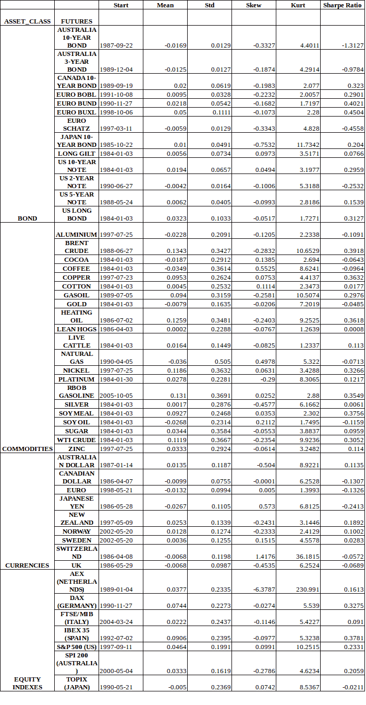</figure>

* * *

## **时间序列动量(TSMOM)方法**

在 AQR 的论文中，作者试验了 1 年的固定回顾期，这决定了下个月的交易信号，即如果资产价格在 1 年内上涨，下个月的交易信号将会很长。

当资产价格下跌时，情况正好相反。每项资产的头寸基于每日回报的回顾指数标准差，年波动率为 40%。

以下是作者的解释，

<figure class="kg-card kg-image-card kg-width-full">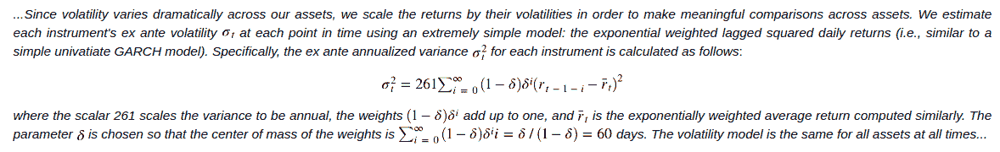</figure>

资本分布在具有可用数据的工具中。例如，如果在 1987 年之前只有 X 种工具，投资组合收益将是 X 种工具的平均收益。

* * *

## **连续预测(CF)方法**

在传统的技术分析中，交易的进场和出场通常是二元的，当前的头寸大小取决于之前定义的进场和出场条件。

***当前仓位大小~进场、出场条件(取决于当前状态)t 期前定义***

但是在[金融世界](https://quantra.quantinsti.com/course/financial-time-series-analysis-trading)中，资产回报结果在本质上是连续的，具有分布性。因此，根据当前预测、风险资本分配、工具的当前波动性、整体投资组合波动性、相关矩阵、再平衡成本，当前头寸规模最好与预期回报成正比。

这与贝叶斯学派产生了共鸣，在贝叶斯学派中，假设的概率应该随着更多证据的出现而更新。

***当前头寸规模~ E(收益|当前预测、风险资本、工具的当前波动率、整体投资组合波动率、相关矩阵、再平衡成本)***

连续预测方法的优势在于，您只需将当前条件下的最佳头寸规模与当前头寸进行比较。如果它偏离了 x%，那么你重新平衡。

风险管理层和[头寸规模](https://quantra.quantinsti.com/course/position-sizing-trading)固有地构建在框架中。并且它不依赖于当前位置的状态。这不同于依赖于国家的二元交易系统。

* * *

## **原始连续预报的计算**

出于我的研究目的，我将考虑两个常用的技术指标，

*   指数移动平均线
*   唐奇安海峡

### **1.1 指数移动平均线**

1)选择成对的快速移动平均线和慢速移动平均线以反映不同的时间范围:8-32、16-64、32-128、64-254

2)原始预测:首先，我取一对移动平均线的差值

3)风险调整后的预测:接下来，我将原始预测除以工具风险(工具在价格单位中的波动性)，得到风险调整后的预测。

<figure class="kg-card kg-image-card kg-width-full">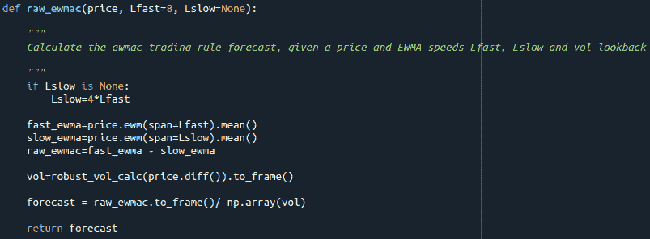</figure>

### **1.2 唐奇安频道**

1)选择回顾以反映不同的时间范围:40、80、160、320

1.  预测:通过将当前价格与中间价格之间的差值(N 次回顾中最高价和最低价的一半)除以 N 次回顾中最高价和最低价的差值得出。公式如下，其中乘数 40 适用于将预测范围扩大到(-20，20)

\(Forecast \)= \(40 \)* \(P _ t \)–\((R _ { middleN })\)/\((R _ { maxN })\)–\((R _ { minN })\)

<figure class="kg-card kg-image-card kg-width-full">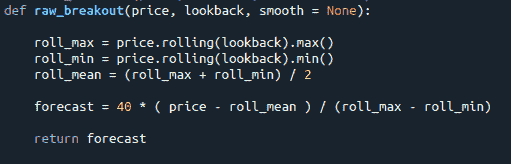</figure>

### **1.3 预测标量**

**(a)为了跨工具和时间的一致性，将预测重新调整到平均值 10**

1)每天提取预测类型(例如 8-32 指数移动平均预测)内跨工具的绝对中值预测。

2)接下来，使用扩展窗口来计算点中值预测的平均值

3)然后，我通过将点 2 中的平均值除以 10 来计算预测标量，即我们将预测调整为平均绝对值 10。10 代表每个工具的平均预测强度。在下图中，您会注意到随着时间的推移，预测标量会达到一个水平(即，由于较大数据点的平均效应)。

**(b)预测标量，即原始预测的乘数，以将平均预测缩放至 10 的平均绝对值**

EWMAC 预测标量

<figure class="kg-card kg-image-card kg-width-full">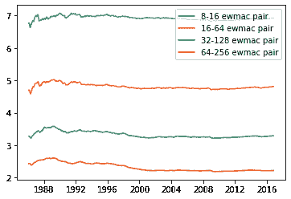</figure>

突破预测标量

<figure class="kg-card kg-image-card kg-width-full"></figure>

4)最后，预测标量被映射到工具的单个预测时间序列。调整后的预测上限在[-20，20]之间。这是为了避免过度乐观或悲观的预测导致投资组合中任何特定工具的过大头寸。

<figure class="kg-card kg-image-card kg-width-full">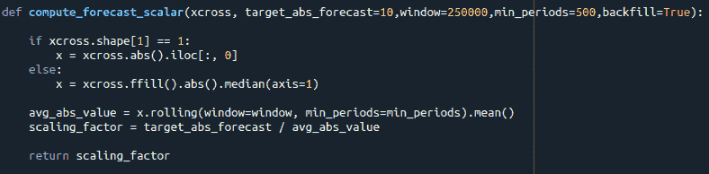</figure>

<figure class="kg-card kg-image-card kg-width-full">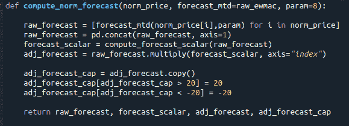</figure>

### **1.4 将调整后的预测合并为每个工具的加权预测**

从之前的第 1.3(a)节，我将获得每个工具的调整预测。下一步是通过权重合并预测。在这项研究中，我将使用两种加权方案，

**1)重量相等**

在第一个加权方案中，我给规则分配相等的权重。在我的研究中，我有 8 个不同的预测，4 个指数移动平均线，4 个唐奇安通道。这些预测各占 12.5%的权重。

**2)通过块自举进行加权**

在下一个加权方案中，我执行了以下步骤，

在样本期内，我抽取了 25 个连续的日周期。每个周期占可用天数的 25%。

ii. For each instrument, I compute the returns stream, \(AR_{it}\) associated with each forecast. First, similar to TSMOM, I find the leverage, \(L_{it}\) required to bring up the realized volatility, \(Vol_{it-1}\) to a reference level of 40%. Next, I scale the leverage up/down according to the strength of the forecasts.

\(AR _ { it } \)= \(40% \)/\(Vol _ { it-1 } \)* \(F _ { it } \)* \(R _ { it } \)= \(L _ { it } \)* \(F _ { it } \)* \(R _ { it } \)

三。每笔交易还收取 0.1%的佣金，以惩罚频繁的再平衡。仅当当前预测与上次预测相差 X 点(在优化中，发现总体水平相差 6 点)时，才会发生重新平衡。

iv. With the derived returns stream, I proceed to find optimal weights, \(W_{rbi}\) amongst rules, r for the highest Sharpe associated for each bootstrapped block, b per instrument, i.

动词 （verb 的缩写）最后，我将权重汇总在一起，找出样本期内所有工具的平均最优权重，

\(W _ r \)= \(Average _ { bi } \)\((W _ { RBI })\)

<figure class="kg-card kg-image-card kg-width-full">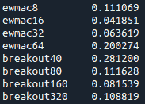</figure>

*注意:由于自举模块的数量相对较少，因此避免了对每个仪器应用优化的权重。根据罗伯特·卡弗的建议，乐器在它们的[动量](/momentum-trading-strategies/)特性上更可能是相似的而不是不同的。也就是说，在我的下一次迭代中，我可以测试这个假设。*

### **根据允许的最大整体投资组合风险，在投资组合层面扩大或缩小规模**

随着工具和预测的多样化，投资组合的已实现波动率将大大低于每个工具 40%的参考年化波动率。在 AQR 的研究中，年化波动率平均在 12%左右。

出于本研究的目的，我将使用 15%的最大已实现波动率上限。步骤如下:

i. Assume forecasts, \(F_{t-1}\) are at both extreme of -20 and +20 depending on the polarity of the forecasts. And find the maximum realized volatility, \(Mv_{t-1}\)

<figure class="kg-card kg-image-card kg-width-full">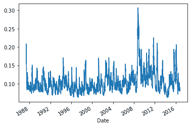</figure>

二。接下来，在投资组合层面找到杠杆调整系数，

\(A_t\) = \(最大已实现波动率上限 15%\) / \(Mv_{t-1}\)

<figure class="kg-card kg-image-card kg-width-full">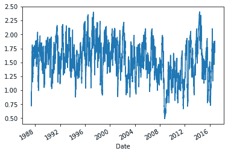</figure>

*注:在 2008-2009 年危机期间，投资组合的调整系数下降到 0.50，表明各种工具之间的相关性可能已经增加。*

iii. Last but not the least, I will map the leverage adjustment factor, At to the leverage factor in section 1.4,2,ii. The final leverage, \(FL_{it}\) for the instrument will be as follows:

\(FL_{it}\) = \(A_t\) * \(L_{it}\)

四。就头寸规模而言，假设该工具的风险资本为 20，000 美元。

The notional capital, \(NC_{it}\) to be deployed for this instrument would be

\(NC _ { it } \)= \(FL _ { it } \)* 20，000 美元

*注:另一种方法是考虑仪器之间的相关矩阵，并找出调整系数。*

* * *

## **策略评估**

我在样本期内(2010-06-07 之前)和样本期外(2010-06-06 之后)测试了以下策略。下面是不同的配置，

一、样本内不含成本的 ts mom:AQR ts mom 策略在样本内不含成本期间进行检验。

二。包含样本成本的 ts mom:AQR ts mom 策略在包含成本的样本期内进行测试。

三。样本中的预优化:为不同的预测分配相同的权重。并在样本期内对该策略进行了测试。

四。在样本中优化:基于块引导的优化权重被分配给不同的预测。并在样本期内对该策略进行了检验。

动词 （verb 的缩写）样本外预优化:为不同的预测分配相等的权重。并且在“样本外”期间测试该策略。

不及物动词样本外优化:基于块引导的优化权重被分配给不同的预测。并在样本期内对该策略进行了检验。

* * *

## **月度回报汇总统计**

**采样期间的性能**

总的来说，在样本期内，我注意到两种类型的策略都表现良好，Sharpe > 1，Calmar 比率高，TSMOM 和连续预测方法的提取合理。

令人惊讶的是，尽管在投资组合层面上信号和风险管理多样化，TSMOM 1 年回顾方法的表现优于连续预测。

**样本期外的性能**

在样本外期间，风险调整回报、夏普比率显著下降，两种策略的绩效都下降到 0.7 以下。TSMOM 策略的表现仍然优于连续预测。

根据温顿集团的创始人和量化趋势跟踪的先驱大卫·哈丁在一篇文章**中提到的，回报恶化的一个原因可能是策略的过度拥挤和商品化。**

***两种方法的权益曲线***

<figure class="kg-card kg-image-card kg-width-full">*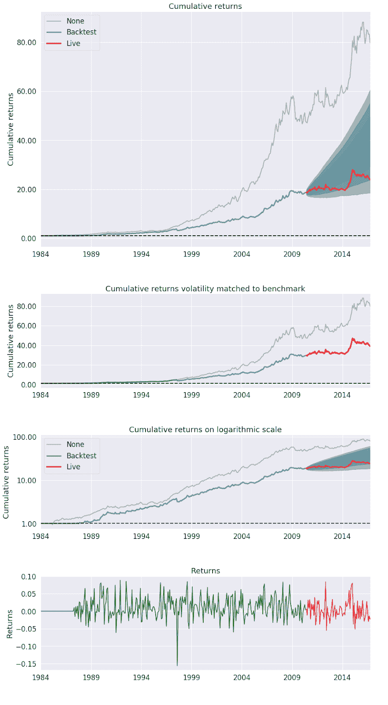*</figure>

<figure class="kg-card kg-image-card kg-width-full">*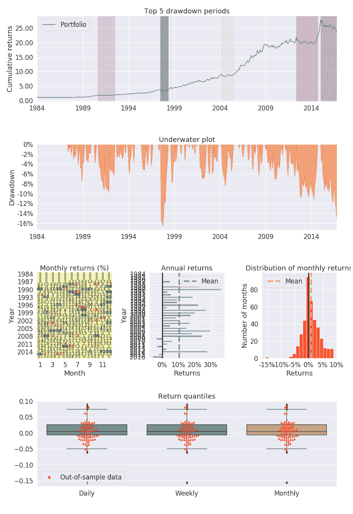*</figure>

<figure class="kg-card kg-image-card kg-width-full">*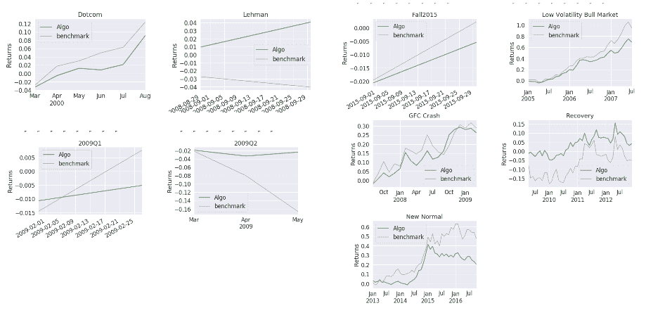*</figure>

### ***针对 Fama French 3 因子、动量因子、债券和商品回报的因子分析***

***t 样本数据中的 mom***

*因子分析表明，只有债券和市场(股票)因素是显著的。TSMOM 显示了市场(股票)因子的负 beta 和债券因子的巨大 beta。这似乎预示着一个基于危机阿尔法的策略，因为股票往往在危机期间跳水。*

<figure class="kg-card kg-image-card kg-width-full">*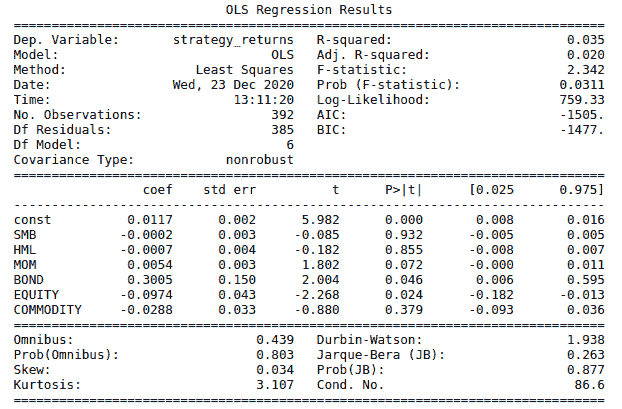*</figure>

***在样本中优化的引导程序***

*与 TSMOM 类似，该策略显示了市场(权益)因子的负 beta。这对于基于危机阿尔法的策略来说也是个好兆头，因为在危机期间，股票往往会跳水。*

<figure class="kg-card kg-image-card kg-width-full">*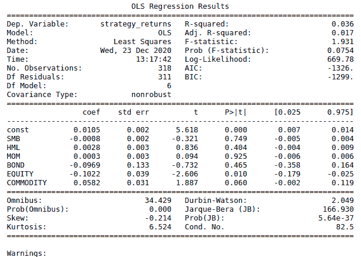*</figure>

***t 样本中的 mom***

*结果反映在样本数据中。*

<figure class="kg-card kg-image-card kg-width-full">*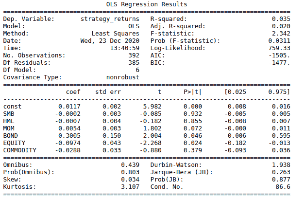*</figure>

***从样本中优化的助推器***

*结果不会反映在样本数据中。样本外数据中不存在负的市场贝塔关系。*

*此外，它与债券表现出显著的正相关关系，与商品表现出显著的负相关关系。*

<figure class="kg-card kg-image-card kg-width-full">*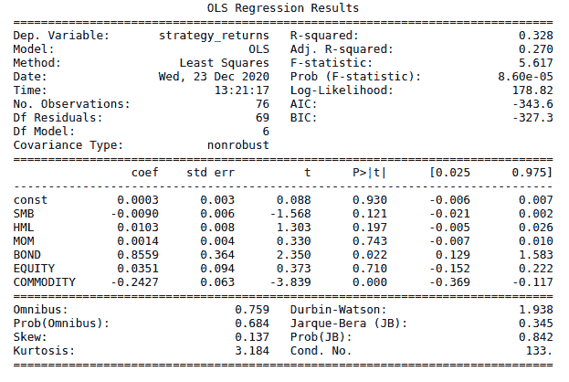*</figure>

* * *

## ***结论***

*尽管趋势跟踪策略的表现有所恶化，但它仍然在投资者的投资组合中占有一席之地。根据凯瑟琳·卡明斯基的说法，“趋势跟踪表现出危机阿尔法特征”。*

* * *

## ***战略的未来发展***

*在下一次迭代中，我热衷于探索超越 2016 年数据的策略的可行性*

*目前，这项研究中使用的数据是由 Quantopian(摘自彭博)拼凑的。在下一次迭代中，我热衷于通过向前或向后调整的方法将合同缝合在一起。*

*对于单个合约，我还能够将套利期限结构(期货溢价或现货溢价)信号纳入连续预测系统*

*块引导优化可能没有很好地工作，因为我只从数据集中提取了 25 个连续周期。理想情况下，我更愿意提取更多的数据块(~1000)。*

*但是，我受限于计算能力。在下一次迭代中，我将探索使用云平台(例如 Google Collaboratory 或 AWS)进行引导优化*

*在具有更多计算能力的下一次迭代中，我将执行引导优化和向前分析。也就是说，我从 **t-x** 到 **t** 推导优化权重，并在 **t+1** 测试结果。这将在每个时间步中随着窗口的扩大而重复。*

* * *

***免责声明:**作者对这项研究的策略没有立场，但对开发和投资跨资产类别的可行趋势跟踪策略有浓厚的兴趣。*

* * *

***参考文献***

*   *赫斯特，布赖恩，华钥 Ooi，和 Lasse Heje 彼得森。“趋势跟踪投资的一个世纪的证据。”《投资组合管理杂志》44 期，第 1 期(2017): 15-29。*
*   *莫斯科维茨，托拜厄斯 j .，华钥 Ooi，和 Lasse Heje 彼得森。“时间序列动量。”《金融经济学报》104 期，第 2 期(2012): 228-250。*
*   *罗伯特·卡弗。系统交易:设计交易和投资系统的独特新方法。哈里曼建筑有限公司，2015 年*
*   *罗伯特·卡弗。杠杆交易。哈里曼房屋有限公司，2019。*
*   *[温顿公司的大卫·哈丁在谈到背离潮流时说道](https://www.winton.com/davids-views/july-2018/wintons-david-harding-on-turning-away-from-trend-following-risk-net)*

* * *

*如果你想学习算法交易的各个方面，那就去看看算法交易(EPAT) 的[高管课程。该课程包括各种培训模块，让你具备在算法交易中建立一个有前途的职业生涯所需的技能。](https://www.quantinsti.com/epat)*

* * *

*黄继荣的这个策略可以在他的 Github 页面上看到。*

* * *

*免责声明:就我们学生所知，本项目中的信息是真实和完整的。学生或 QuantInsti 不保证提供所有推荐。学生和 QuantInsti 否认与这些信息的使用有关的任何责任。本项目中提供的所有内容仅供参考，我们不保证通过使用该指南您将获得一定的利润。*