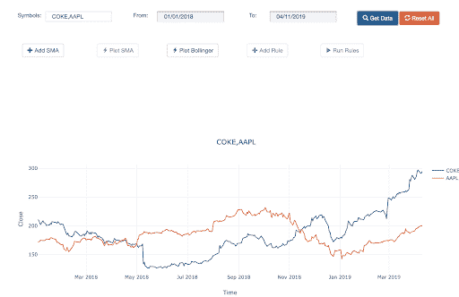
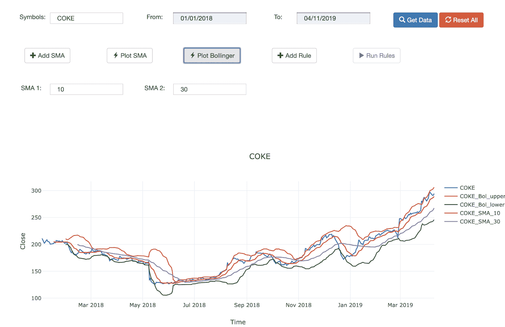
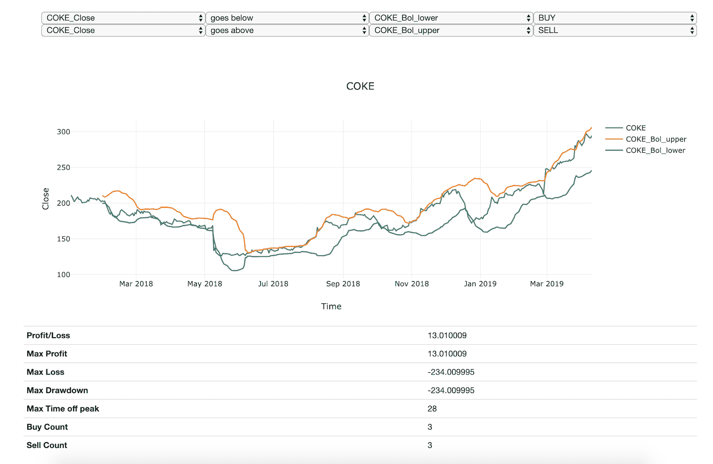

# 算法交易中的趋势测试

> 原文：<https://blog.quantinsti.com/trend-testing-algorithmic-trading/>

这是一个项目，将指导你了解如何通过使用某些技术和工具来执行你的战略。简而言之，如何测试一个趋势。

本文是作者提交的最后一个项目，作为他们在 QuantInsti 的算法交易 (EPAT)的[管理课程的一部分；。请务必查看我们的项目页面，看看我们的学生正在构建什么。](https://www.quantinsti.com/epat)

## **关于作者**

Gunraj Mehta 是来自孟买 VJTI 的一名华人华侨；拥有孟买大学的计算机科学学士学位。他目前在加拿大多伦多工作，担任加拿大丰业银行流动性风险技术高级软件程序员。

## **目的**

我想开发一个简单的工具，我们可以输入股票代码，添加一些技术指标和一些基本规则，以便在进行实际实施和花费额外的时间优化它之前，了解策略将如何执行。

结果是一个网络工具，能够绘制 OLHC 数据的收盘价，增加了基本的统计指标，如 SMA 和布林线；然后应用定制的交易策略来获得性能。

## **趋势跟踪策略**

趋势跟踪策略使用简单的统计系统，它们是对变化做出反应，而不是预测市场走向。它们的简单性质使人们很容易想象何时买卖和评估利润。市场趋势如何并不重要，它总是趋势向上或向下，这些策略遵循更科学的交易方法。一些用于趋势跟踪策略的指标有 SMAs，布林线，MACD 和 RSI。

## **工具详情**

该工具是用 Python 编写的。它对 web 服务使用 Flask，对 UI 使用 JQuery 和 Bootstrap。Numpy，熊猫和雅虎负责数据和运营。Gunicorn 部署在 Heroku。

## **逻辑**

executeRule 函数构成了执行逻辑的核心。它将输入作为规则，检查指令，并相应地选择要比较的列。然后，基于逻辑输入翻转买/卖标志。在同一函数下，我们计算损益值、提款期和买入/卖出次数。

## **特性**

多滚动条搜索可用于配对策略(目前仅交叉)

## **添加均线，布林线**

## **添加规则并执行它们，以获得关于性能的基本细节**

## **限制**

*   只能与交叉配合使用
*   考虑 1 次股票买入/卖出
*   使用交叉时不能理解日志、ln 等
*   每个规则中只允许一个条件
*   未添加 MACD 和 RSI

## **未来范围/可能的改进**

*   掩盖局限性
*   能够获取实时提要并设置规则执行警报
*   添加复杂的规则评估，可能是一个基本的 excel 公式，如脚本

项目文件可以在 [Github](https://github.com/g33kism/trendtester) 上获得。

如果你想学习算法交易的各个方面，那就去看看算法交易的高管课程( [EPAT](https://www.quantinsti.com) )。课程涵盖统计学&计量经济学、金融计算&技术和算法&定量交易等培训模块。EPAT 教你在算法交易中建立一个有前途的职业所需的技能。[现在报名](https://www.quantinsti.com)！

免责声明:就我们学生所知，本项目中的信息是真实和完整的。所有推荐都是学生或 QuantInsti *不做任何保证的。学生和 QuantInsti* *否认与使用这些信息有关的任何责任。本项目中提供的所有内容仅供参考，我们不保证通过使用该指南您将获得一定的利润。*