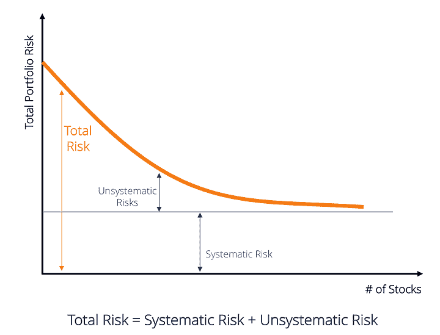
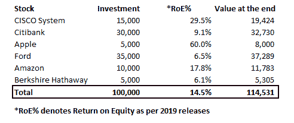

# 非系统风险:类型，计算，避免和更多！

> 原文：<https://blog.quantinsti.com/unsystematic-risk/>

由[查尼卡·塔卡](https://www.linkedin.com/in/chainika-bahl-thakar-b32971155/)

围绕非系统风险管理有几个概念。这篇文章是你的指南，它以一种非常全面的方式解释了你需要知道的关于非系统风险的所有知识。

本文涵盖:

*   什么是非系统风险？
*   [什么导致了非系统风险？](#What-causes-unsystematic-risk)
*   [非系统性风险示例](#Example-unsystematic-risk)
*   [系统性风险公式](#Formula-systematic-risk)
*   [如何计算非系统风险？](#How-calculate)
*   [系统风险与非系统风险](#Systematic-vs-unsystematic)
*   [非系统风险的类型](#Types-unsystematic-risks)
*   [如何防范商业风险？](#Protect-business-risk)
*   [如何防范金融风险？](#Protect-financial-risk)

* * *

## 什么是非系统风险？

就像这个问题一样，答案也很简单，因为非系统风险与公司的内部风险因素有关。非系统风险也称为特定风险、可分散风险、特质风险或剩余风险。

非系统性风险来自企业没有准备好的任何此类事件，它会扰乱企业的正常运作。

例如，在股票价格上涨的情况下，一个公司可能产生高利润。另一方面，一些其他公司可能产生低利润，使其股票价格下跌。

* * *

## 什么导致了非系统风险？

导致非系统性风险的一些因素包括:

*   管理层的低效率
*   商业模式的缺陷
*   企业中的流动性紧缩
*   资本结构的变化
*   生产不需要的产品
*   劳工罢工

非系统风险本质上是可以分散的，因此是可以避免的。事实上，你可以通过购买不同地理位置的不同公司的股票来分散你的投资组合。

这样，即使你投资的一些企业因为非系统风险而面临逆境，也不是所有的企业都会。因此，一只或几只股票特有的非系统风险得以避免。

下面，你可以看到解释非系统性风险的图表。

Source: [CFI](https://corporatefinanceinstitute.com/resources/knowledge/finance/systematic-risk/)

在图表中，我们在 y 轴上表示总投资组合风险，在 x 轴上表示股票数量。

从图中可以清楚地看到，如果你没有多样化的投资组合，非系统风险更大。但是，当你开始投资一只以上的股票时，你的非系统风险就会下降，接近于零。

然而，系统性风险取决于各种宏观经济因素，如加息和通货膨胀，这是不可避免的。

最近，我们可以以疫情冠状病毒的爆发为例。它影响了整个金融生态系统，金融市场遭受了巨大损失。

我们现在将讨论非系统风险的定义，以简单明了地说明这种类型的风险意味着什么。

接下来，让我们看一个例子。

* * *

## 非系统风险示例

让我们假设，在 2019 年 1 月 1 日，你在你的投资组合中投资了 100，000 美元，这是一个多元化的投资组合，投资情况如下:

*   思科系统- 15%
*   花旗银行- 30%
*   苹果公司- 5%
*   福特- 35%
*   亚马逊- 10%
*   伯克希尔·哈撒韦公司

现在，在 2019 年 12 月 31 日，你发现投资组合的总价值现在是 114，531 美元，因为总投资年增长率为 14.5%。

在下面你可以看到一个详细的计算方法，在你的投资组合中分解投资和回报:

当你试图找出哪些股票表现良好时，你就会知道，如果你只投资于花旗银行(Citibank)和伯克希尔哈撒韦(Berkshire Hathaway)这样的金融服务行业，回报率会低得多。

但是像思科系统、苹果和亚马逊这样的公司表现很好，因此你的 10 万美元总投资上涨了 14.5%。因此，你从投资组合多样化中受益。

非系统风险的最大好处在于它与市场风险无关，因此可以借助投资组合的多样化来消除。

通过这种方式，你减轻了像花旗银行、福特和伯克希尔·哈撒韦这样的少数公司由于内部问题而面临的非系统性风险。

接下来，我们将看看如何计算系统和非系统风险。

* * *

## 系统风险公式

系统风险由公司的[贝塔](https://quantra.quantinsti.com/glossary/Beta)系数表示。贝塔系数就是金融市场中股票的波动水平。

现在，你可以很容易地在雅虎财经等在线网站上找到你的股票的贝塔系数。例如，苹果公司在雅虎财经上的贝塔系数是 1.17，而微软的贝塔系数是 0.93。

由于微软的贝塔系数较小，这表明它是一只波动性较小的股票，因此可以对微软进行更多的投资，而对苹果公司进行更少的投资。

### 计算总体贝塔系数

我们将使用以下公式计算您的投资组合的总体 beta 或潜在风险:

**总贝塔=总投资的百分比 1 x(投资 1 的贝塔)+总投资的百分比 2 x(投资 2 的贝塔)**

### 计算每项投资的贝塔系数

在上面的公式中，你可以借助下面的公式求出每项投资的 beta，即投资 1 和投资 2:

**贝塔=协方差/方差**

在哪里，

*   **[协方差](/calculating-covariance-matrix-portfolio-variance/)** 暗示了两只股票如何一起运动的度量。当股票价格上涨或下跌时，如果股票一起运动，这就是正协方差。另一方面，如果它们彼此远离，这是一个负协方差。
*   [**方差**](https://quantra.quantinsti.com/glossary/Variance) 暗指股票价格在一段时间内波动性的度量。此外，这是股票相对于其均值的度量。

太好了！接下来，我们还将了解如何计算非系统风险，以便能够减轻同样的风险。

* * *

## 如何计算非系统风险？

计算非系统风险很简单，可以通过系统风险的减轻来衡量，这种减轻发生在你分散投资组合的时候。

如上所述，系统性风险是一种依赖于宏观经济因素的风险，而宏观经济因素是市场因素。这些因素是不可避免的，因为它们不是内在的。

我们假设投资 1 可以是苹果公司的股票，投资 2 可以是微软的股票。

假设我们在苹果公司投资 40%,在微软投资 60%。这样，我们将按如下方式计算总β值:

**总β= 0.40 x(1.17)+. 60 x(0.93)= 0.468+0.558 = 1.026**

从上面的计算中我们可以看出，在整个投资组合中，我们的总 beta 或潜在风险为 1.026。

让我们来看看这两种类型的风险，即系统风险和非系统风险有什么不同。

* * *

## 系统风险与非系统风险

### 系统性风险

系统风险也称为不可分散风险或因市场中的宏观经济因素而上升的市场风险。例如，这些因素可以大致分为社会、政治和经济因素。系统风险可以是公司面临的利率风险、通货膨胀风险或任何市场风险。这种风险降临到整个行业。

系统风险与非系统风险在本质上有很大不同。

### 非系统性风险

某些微观经济因素会影响特定企业的经营，因此，这些因素会导致企业回报的波动。由于这些风险因素是内部的，如果在组织内部采取了必要的措施，它们是可以避免的。

例如，罢工和经营管理不善是一家公司可能以非系统性风险的形式面临困境的两个原因。

非系统风险的类型有业务风险、财务风险和运营风险，我们将在下一个分主题中讨论这些风险。

* * *

## 非系统风险的类型

非系统风险本身是一种可由组织控制的风险。

然而，如果组织不能照顾任何部分，如管理，流动性等。，非系统风险会干扰正常运营。

主要有三种类型的非系统风险:

*   业务风险/流动性风险
*   金融风险/信用风险
*   操作风险

### 业务风险/流动性风险

商业风险，基本上，意味着非系统风险的类型，质疑公司是否能够赚取可观的利润。

每个企业都有一些日常开支，为了支付这些开支，至少应该有足够的收入来支付这些日常开支。例如，工资、营销成本等等。

### 金融风险/信用风险

一家公司的财务风险意味着使用财务杠杆或贷款，该公司可能使用这些杠杆或贷款为其业务或部分业务提供资金。财务风险是公司支付贷款利息的责任。

还可能有其他债务相关的义务，如在贷款到期日支付本金。如果公司不能产生足够的收入来支付贷款和相关费用，它就会成为金融风险的牺牲品。

一家公司背负的贷款相关债务越多，风险就越高。不履行与杠杆或贷款相关的承诺会让任何公司陷入困境，这也可能导致破产。

有一些因素会使公司容易受到财务风险的影响，例如:

*   与收入相比，市场利率的提高会突然增加支出
*   与杠杆融资相比，股权融资较少
*   关于费用和收入投机的管理问题

通常，分析师和投资者会考虑财务风险比率，即负债/权益比率。

**负债/权益比率=负债总额/股东权益**

债务与权益比率是确定运营融资杠杆数量(债务)的恰当方法，因为该比率有助于保持负债或债务低于权益。因此，你最终不会增加你的负债。

此外，如果您的业务扩展到国外，外币兑换风险也是金融风险的一部分。外币价值的下降可能会导致突然的损失，因为您将收到以该国货币支付的款项。

### 操作风险

运营风险意味着每个组织都准备承担的损失，因为它包括所有那些自然的错误。

错误可能是:

*   员工相关，如人为错误
*   涉及硬件系统(计算机、机器)等技术问题
*   与需要高级过程的任务的旧过程有关的

然而，需要建立运营风险管理，以避免损害组织的财务。应该清楚地确定一家公司准备承受的操作失误或损失的数量。此外，有些错误也是可以纠正的，但是公司也必须准备好承担纠正这些错误的费用。

因此，总运营风险是以下因素的组合:

*   公司愿意承担的损失
*   纠正某些错误的成本

导致操作风险的操作错误在确定有助于避免这种风险的程序中起着关键作用。这种程序的例子有风险管理程序、灾难恢复程序等等。此类计划有助于评估潜在的风险因素，传达这些因素，然后最终确定减轻风险的步骤。

现在，我们知道计划和有效的措施可以帮助降低运营风险。

但是商业风险和财务风险呢？

在降低业务风险和财务风险时，业务风险和财务风险都比运营风险稍微复杂一些。此外，对于经营风险，管理层准备承担。但是，商业风险和财务风险就不一样了，因为承担这些风险会给组织带来巨大的损失。

* * *

## 如何防范商业风险？

商业风险可以通过减少不必要的成本来减轻，例如，实体营销的营销成本(在不需要的情况下)，而不是转移到在线营销。

**减轻业务风险的措施** -现在让我们详细了解一下减轻每种风险的措施。

*   识别风险
*   分析每个风险的影响，并根据影响对其进行排序
*   从需要立即关注的风险开始处理风险
*   定期监控和审查已识别的风险

### 识别风险

这仅仅意味着识别和揭示与你的业务相关的风险。这些可以是营销、维修、欺诈等方面的过度支出。

### 分析每种风险的影响，并对其进行排序

在您确定了您的企业更容易遭受的风险之后，您可以找出影响的严重程度，然后根据严重程度对每个风险进行排序。

企业可以接受这样的风险，因为它们可能不会对企业造成损害。另一方面，一些足够严重的风险需要尽早解决。

例如，如果业务的一个关键部分发生故障，需要立即修复。然而，如果一个不重要的部分因为维护而停机，它可以等到重要的事情被处理好之后。

### 从需要立即关注的风险开始处理风险

在上面的步骤中，根据严重性对风险进行分级将有助于您尽早处理最严重的风险(对利润有相当大的影响)。一旦你处理完最严重的问题，你可以移到列表中不太严重的地方。

### 定期监控和审查已识别的风险

应定期跟踪和审查所有已识别和解决的风险，以防将来出现任何不便。可以为同样的事情成立一个员工团队，领导或经理可以实施所需的解决方案。

* * *

## 如何防范金融风险？

企业还可以通过管理财务来降低财务风险，例如，计算负债/权益比率，并明智地在负债和权益之间分配资金。

**减轻财务风险的措施** -财务风险可以通过以下一些简单的步骤来避免。

*   从收入中节省足够的钱
*   为企业投保
*   建立收益最大化的业务结构
*   涉及股东

### 从收入中节省足够的钱

弄清楚你的企业是否可以在没有你正在承担的某些费用的情况下生存下去。例如，你发现外包一些临时工作(如研究统计数据)比雇佣全职员工更好。

### 为企业投保

你的企业应该为某些不可预见的事件投保，如网络攻击、自然灾害等。这种保险可以帮助你节省大量的收入，并作为一种保障。

### 建立收益最大化的业务结构

有了正确的业务结构，你将只在正确的地方消费。例如，你必须在培养人才上花些钱，这能让你的员工坚持在公司工作。

从长远来看，一批优秀的员工可以帮助你，但如果你不需要全职员工，那么在他们身上的支出会以额外支出的名义增加你的财务风险。

### 根据度量标准做出决策

除非你能衡量其后果，否则你不能做任何决定。例如，在举办活动之前，你知道你想从中获得什么，这可以通过营销你的公司获得更多的客户，更好的认可等等。

同样，在采取任何关键步骤之前，如雇佣员工、签署协议等。你必须确保它给你带来长期的利益。

* * *

### 结论

通过计算非系统风险，可以了解金融市场中股票的波动水平。任何企业都可以通过采取必要的措施来降低任何类型的风险。

这篇博客已经深入讨论了非系统风险的所有要点。如果你想了解它，请随时查看关于[量化投资组合管理](https://quantra.quantinsti.com/course/quantitative-portfolio-management)课程的免费预览，在其中你将学习不同的投资组合管理技术，如因素投资、风险平价和凯利投资组合，以及现代投资组合理论。

* * *

<small>*免责声明:股票市场的所有投资和交易都涉及风险。在金融市场进行交易的任何决定，包括股票或期权或其他金融工具的交易，都是个人决定，只能在彻底研究后做出，包括个人风险和财务评估以及在您认为必要的范围内寻求专业帮助。本文提到的交易策略或相关信息仅供参考。*T3】</small>