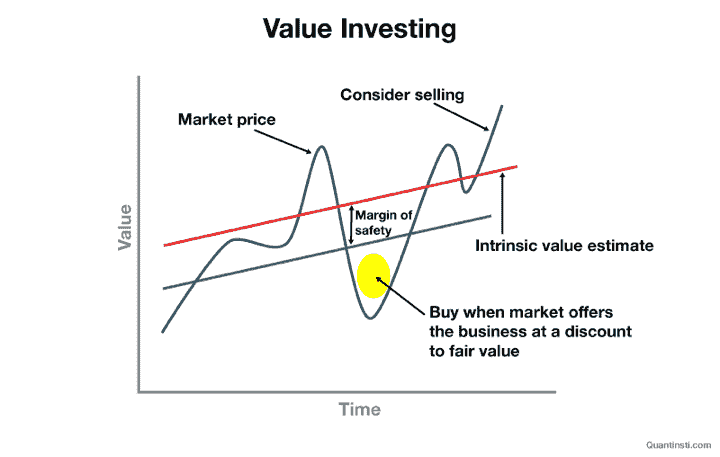

# 价值投资:意义，例子，重要性和更多

> 原文：<https://blog.quantinsti.com/value-investing/>

由[查尼卡·塔卡](https://www.linkedin.com/in/chainika-bahl-thakar-b32971155/)和[拉什达·安萨里](https://www.linkedin.com/in/rushda-ansari-82261214a)

价值投资是交易领域中最有趣的投资方法之一，它不仅仅基于股票的合理价格。一只股票可能以较低的价格交易，但同时价值却高得多。与真实价值相比，这种股票折价出售，对交易者来说肯定是有利的。

让我们通过这篇博客了解更多关于价值投资的内容，内容包括:

*   [什么是价值投资？](#what-is-value-investing)
*   [价值投资的例子](#example-of-value-investing)
*   [价值投资的重要性](#importance-of-value-investing)
*   [本杰明·格拉哈姆公式](#formula-of-benjamin-graham)
*   [如何识别价值投资机会？](#how-to-identify-value-investing-opportunities)
*   [价值投资者的特质](#traits-of-a-value investor)
*   [新手价值投资](#value-investing-for-beginners)
*   [价值投资 vs 成长型投资](#value-investing-vs-growth-investing)
*   [价值投资的优势](#advantages-of-value-investing)
*   [价值投资的弊端](#disadvantages-of-value-investing)

* * *

## 什么是价值投资？

价值投资策略主要集中于投资那些交易价格远低于其真实价值的股票。

简而言之，价值投资有助于降低风险，因为我们只在价值股的当前价格远低于其真实价值时投资价值股。

这种真实价值和购买价格的差异也被称为“安全边际”。价值投资的概念首先由本杰明·格拉哈姆提出，他也是 T2 的导师。

对本杰明·格拉哈姆来说，价值投资意味着找到被低估的公司，等待市场将它们抬高到真正的价值。

价值投资者的主要动机是寻找这类被低估的公司。通过投资这种被低估的股票，已经有了安全边际，因为支付的价格更低。

这里的策略是当股票的价格反映了它的真实价值或者当它超过了它的真实价值时卖出股票。

<figure class="kg-card kg-image-card kg-width-full kg-card-hascaption">

<figcaption>Value investing</figcaption>

</figure>

*   **内在价值** -反映公司实际价值或价值的价格水平
*   **安全边际** -购买价值与真实价值之间的差异

* * *

## 价值投资的例子

由于 2020 年 3 月的疫情，全球金融市场出现下跌。市场参与者受到惊吓，导致大幅抛售。

但即使在如此动荡的时期，价值投资者也看到了机会。几乎每个部门都有多种机会。这些股票是根据它们的估价确定的。

被低估且盈利的公司吸引了价值投资者的目光，并在他们的投资组合中获得了优先地位。此外，一年后他们在这些股票上获得的回报几乎令人难以置信！

让我们来看看几只股票以及它们在 1 年内获得的回报:

| 名字 | 2020 年 3 月至 2021 年 3 月期间返回 |
| 现代公司 | 343% |
| 德文能源公司 | 261% |
| 马拉松石油公司 | 215% |

Source: Yahoo Finance

但是价值投资并不全是购买由于最近事件的发生而大幅下跌的股票。以元股票(脸书)的价格下跌为例。

### 2022 年 2 月的脸书崩盘

2022 年 2 月 2 日，[脸书的股价暴跌近 26%](https://www.cnbc.com/2022/02/03/facebook-shares-plummet-22percent-after-reporting-weak-guidance.html) 。这有三个原因:

**用户**

首先，该公司报告称，自 2004 年推出以来，用户数量首次出现下降。用户数量是预测这家公司未来增长的一个关键指标。

根据价值投资理论，这种你可能开始质疑公司未来存在的情况是一个主要的危险信号。

**元宇宙**

dull earning 报告的第二个原因是用于“Meta-Verse”项目的费用增加。这些费用预计在不久的将来还会增加，这意味着收入预计也将保持低迷。

对于那些从短期角度重新平衡投资组合的交易者来说，这是退出的信号。但另一方面，价值投资者可能会尝试更深入地研究，并可能会发现这对未来的增长前景是一个很好的贡献。

**苹果**

第三个原因是苹果的隐私更新，这迫使脸书在跟踪用户的活动之前征得用户的同意。众所周知，脸书收入的很大一部分来自于运营广告。

广告是在跟踪用户活动后有策略地投放的。苹果最近的更新直接影响了脸书的收入。这将再次对该公司未来的收益增长提出质疑。

作为一个价值投资者，如果你怀疑 Meta 的价值可能会因为某些项目而增加，比如元宇宙，那么你可以购买这只股票。但是，如果根据你的真实价值低于现在的价格，那就不要打扰了。

成为一个成功的价值投资者的一个重要特征是正确估计公司的真实价值，并在市场对特定股票的定价明显偏低时利用机会。

* * *

## 价值投资的重要性

你有没有仅仅因为一只股票正在经历上涨趋势或者因为其他人都在买而买了它？

那么，就像大多数散户投资者一样，你也会受到市场情绪的影响。对于短线交易者来说，能够跟踪市场趋势是一个重要的特质。

但对于具有长期眼光的投资者来说，这可能不是正确的选择。价值投资与基于市场情绪的交易相反。价值投资的概念很简单——当高质量股票的估值较低时买入。

价值投资对于确保你的钱花得值很重要。你可以在一定程度上预测未来的增长和业绩，但你无法控制未来的事件。即使公司未来有望做得很好，但任何事情都有可能发生！

例如，疫情病毒可能会爆发。或者发展中国家可以开始暗示冷战。或者你自己的国家可以经历一些边境骚乱。

所有这些都会影响整体经济，而且这些事件不在任何人的控制范围之内。你唯一能控制的是你的进场和出场价格。

那么，难道你不想确保你做得对吗？
你不能确定一项投资是好是坏，但你可以肯定它的真正价值。

*你是否见过因与业务无关的事件而引起购买/出售兴趣的股票？* 基于不相关事件的发生投资股票可能导致不利后果。这类股票非常不稳定，其走势很难预测。

但作为一个价值投资者，如果你看到一只股票价格因无关事件而大幅下跌，那么这就是买入的机会。

我们以特斯拉为例。特斯拉创始人埃隆·马斯克(Elon Musk)发布的推文导致股价突然波动，这已经成为新闻。

这里有一个例子:

<figure class="kg-card kg-embed-card">

> 最近有很多人认为未实现收益是避税的一种手段，因此我提议卖掉我 10%的特斯拉股票。
> 
> 你支持这个吗？
> 
> — Elon Musk (@elonmusk) [November 6, 2021](https://twitter.com/elonmusk/status/1457064697782489088?ref_src=twsrc%5Etfw)

</figure>