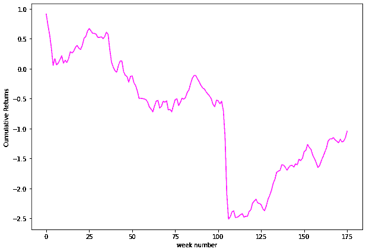
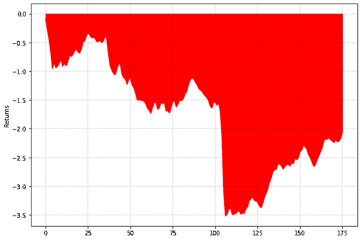

# 具有尾部保护的方差风险溢价捕获

> 原文：<https://blog.quantinsti.com/variance-risk-premium-capture-tail-protection-project-siddharth-bhatia/>

卖出指数波动性已被证明是一种有利可图的策略。但是，回报曲线是倾斜的，带有脂肪损失尾部。新冠肺炎危机加剧了市场的波动性，导致这种流行策略的缩减。

这是每周机械地卖出 SPY ETF 上的交叉头寸并持有至到期的回溯测试。没有 delta 对冲或损失管理。DTE 在 45-60 之间。

我们的目标是看看这段时间的情况有多糟糕，以及恢复期(如果有的话)。用 python 编写代码很简单，但是需要创建正确的数据帧，这是项目中的主要挑战。

本文是作者提交的最后一个项目，作为他在 QuantInsti 的算法交易管理课程( [EPAT](https://www.quantinsti.com/epat) )的一部分。请务必查看我们的[项目页面](/tag/epat-trading-projects/)，看看我们的学生正在构建什么。

* * *

## 关于作者

<figure class="kg-card kg-image-card"></figure>

[西达尔特·巴蒂亚](https://www.linkedin.com/in/siddharth-bhatia-cfa-a87395209/)自 2006 年以来一直在孟买工作，目前在迪拜工作，自 2011 年以来拥有特定的交易经验。他最初是一家活跃在美国和欧盟债券期货市场的阿联酋本地自营公司的交易员，拥有交易期货的经验。

然后，他转到一家著名的家族办公室从事交易，管理着一个活跃于全球指数和期货期权的波动性交易账户。然后，他在一家财富管理公司工作，为公司的客户监督结构化产品的定价和交易以及各种保护性/尾部风险策略。在这里，他还负责一本包含结构化产品和基金的复杂书籍的投资组合管理。

从 2018 年开始，他创立了一家名为 Third Group 的自营交易和投资研究公司。第三组活跃于波动性交易，应用先进的定量分析来开发和部署交易策略。

西达尔特是 CFA 特许持有者，于 2012 年获得特许资格。他是 2021 年第 50 批毕业的 QuantInsti 校友。他对算法交易有浓厚的兴趣，主要是探索所有类型的机器学习和人工智能(AI)，以在市场中获得优势。

* * *

## 战略思想

*   选择美国股票和期货市场最具流动性的 8 大期权链
*   选择 DTE:35–25
*   在 16-20 delta，空头 ATM 空头加上多头 OTM 空头
*   多头 OTM 扼杀的数量应该使 ATM 织女星在交易开始时保持中性。
*   Delta 中性将通过 delta 套期保值在开盘时和收盘时各维持一次。
*   让头寸到期。

* * *

## 可能的优化参数

可能的优化参数如下:

*   入口 DTE
*   OTM 之翼三角洲
*   Delta 对冲频率
*   织女星中立每周调整与否？
*   退出 DTE(到期前退出？)
*   扩展到全球期货、股票、指数等更多市场？

* * *

## 要使用的数据集

就每日交易量而言，这些大致是流动性最强的美国期权市场

*   ES1 -埃米尼 S&P 期货公司
*   AAPL 苹果公司
*   TSLA -特斯拉
*   九-九 ADR
*   CL1 - WTI 原油期货
*   GC1 -黄金期货
*   ZC1 -美国玉米
*   AMD -高级微型设备

我需要过去 3 年的每日现货和期权价格。我有一个 IBKR 基金账户，可以付费订阅这些市场数据。我将尝试使用 API 进行检索。

* * *

## 选择的动机

我已经用正 PNL 交易了 2 年了。我想检查这是否是一个有效的战略，以扩大规模并长期持续下去，同时优化以获得最佳的风险调整结果。

* * *

## 项目大纲

有许多研究和各种商业网站谈论一个著名的策略，涉及机械销售股票指数主要是 SPX 的跨和扼杀。由于持续的市场风险溢价称为**方差风险溢价**，它被认为是长期有利可图的。

严格来说，这是隐含波动率高于指数实际实现波动率的过高定价。由于恐惧/需求，市场参与者超额支付期权，因此期权，尤其是稍微长期的期权定价过高(在以向下倾斜的期限结构为标志的正常市场机制期间)。

我想测试一个非常简单的策略，每周在 SPY ETF 上机械地卖出交叉盘。为避免疑问，多头是一种期权头寸，在这种情况下，一个人在货币买入时卖出，然后将期权放在一起，将净贷方记入账户。

当基础资产在启动时没有移动到离选择的 ATM 攻击太远时，它起作用。到期时，如果标的处于原始 ATM 执行价格，那么多空产生最大利润。

因此，可以看出，这种头寸是利用标的波动性的直接方式，因为如果标的的移动距离(表现出更大的波动性)超过了多空合约的定价，这就是我们亏损的时候。

实际上，由于基础资产的变动可能远远超过正常衡量的标准差，这种策略有很大的风险。它的优势仅限于启动时收到的信贷，但下行风险是无限的，尤其是在优势方面。

* * *

## 战略

周一卖出 60 DTE(到期日)的多头头寸。我们使用了[或](https://www.orats.com/)的期权数据。这些价格基本上是美国市场的收盘价(收盘前 5 分钟捕捉的)。数据源使用 endpoint REST URLs 来检索所有需要的数据。

我们选择了 60 天左右的到期日，因为这正好在期货溢价最高的期限结构点上。每笔多空交易将一直持有到到期，同时进场的交易每周都会发生。

因为所选的 DTE 大约是 8 周，所以最多可以有 8 次跨骑，每次间隔一周。12.5%的资本将专门用于每只基金。

* * *

## 用 Python 编写策略代码

python 中的实际编码非常简单。

*   创建一个每周输入日期的数据框架。
*   使用这些输入日期作为 REST URL 的输入，我们检索对应于每个输入日期的到期日期。通常是 45-60 天。
*   然后，我们创建一个例程来检索进场日的执行价格。然后将这些执行价格输入到其他 REST URL 中，以便在输入日期之后的任何需要的日期检索期权价格。
*   在我们的例子中，我们持有到到期日，因此我们检索进入日期和到期日本身的跨期价格。
*   使用上述例程逐个单元格地创建两列，以填充对应于同一行的进场日期和到期日期的跨仓进场价格和出场价格。

* * *

**注:**

*   这里的每个单元格必须单独填充，因为 API 不产生时间序列数据，而只产生单独的数据点。
*   这确实需要一些时间，因此使用该数据源进行回溯测试是一件耗时的事情。
*   我们已经提交了代码，导出的数据帧作为一个 CSV 文件，所以人们可以直接导入它，而不是从 API 中重新检索所有的期权价格。

* * *

## 结果

最后，简单的百分比回报是用出场价格和出场价格计算的。计算累积回报，最后计算提款。

<figure class="kg-card kg-image-card kg-width-full"></figure>

结果这个策略表现很差。该数据集涵盖了冠状病毒崩盘期间，SPX 在一个月内下跌 30%，并以同样快的速度反弹。由于指数表现出严重的波动性，所有进入这一机制的基金都遭受了损失，这是理所当然的。

<figure class="kg-card kg-image-card kg-width-full"></figure>

* * *

### 结论

机械地卖出空头头寸风险很大，下跌的风险比上涨的收益更大。可以根据隐含波动率水平或期限结构的形状对时间条目进行进一步研究。

* * *

下面的 Python 代码中提供了完整的 Python 代码和相关信息。可以下载参考一下。

如果你想学习算法交易的各个方面，那就去看看这个[算法交易课程](https://www.quantinsti.com/epat/)，它涵盖了统计学&计量经济学、金融计算&技术和算法&量化交易等培训模块。EPAT 教你在算法交易中建立一个有前途的职业所需的技能。立即注册！

* * *

****文件在下载****

*   项目的完整 Python 代码
*   作为 csv 文件的数据帧
*   excel 文件

* * *

免责声明:就我们学生所知，本项目中的信息是真实和完整的。学生或 QuantInsti 不保证提供所有推荐。学生和 QuantInsti 否认与这些信息的使用有关的任何责任。本项目中提供的所有内容仅供参考，我们不保证通过使用该指南您将获得一定的利润。