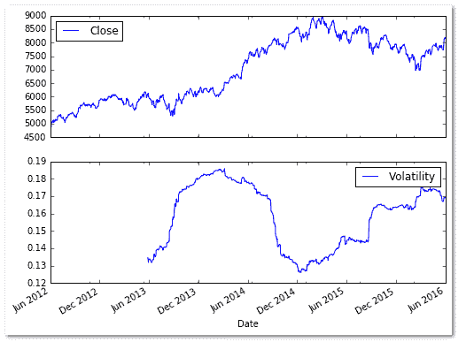

# 基于 Python 的风险调整收益率的波动性和度量

> 原文：<https://blog.quantinsti.com/volatility-and-measures-of-risk-adjusted-return-based-on-volatility/>

在这篇文章中，我们将看到如何在 python 中计算历史波动率，以及基于它的不同的风险调整回报率度量。我们还提供了这些措施的 python 代码，可能对读者有所帮助。

### **简介**

波动性衡量给定证券回报的离差。在[期权交易](https://quantra.quantinsti.com/course/options-trading-strategies-python-basic)中起到关键作用。

波动性可以用一段时间内证券回报的标准差来衡量。

历史波动率来自于过去价格数据的时间序列，而隐含波动率来自于期权合约等交易衍生工具的市场价格。

#### **示例:计算 NIFTY 的风险调整回报的历史波动率**

首先，我们使用 numpy 的 log 函数来计算使用 NIFTY 收盘价的对数回报，然后使用 pandas 的 rolling_std 函数加上 numpy 的平方根函数来计算年波动率。

滚动函数使用 252 个交易日的窗口。所选回顾期内的每一天都分配有相等的权重。用户可以根据自己的需要选择更长或更短的时间。

```py
## Computing Volatility

# Load the required modules and packages
import numpy as np
import pandas as pd
import pandas_datareader.data as web
import yfinance as yf

# Pull NIFTY data from Yahoo finance 
NIFTY = yf.download('^NSEI',start='2012-6-1', end='2016-6-1')

# Compute the logarithmic returns using the Closing price 
NIFTY['Log_Ret'] = np.log(NIFTY['Close'] / NIFTY['Close'].shift(1))

# Compute Volatility using the pandas rolling standard deviation function
NIFTY['Volatility'] = NIFTY['Log_Ret'].rolling(window=252).std() * np.sqrt(252)
print(NIFTY.tail(15))

# Plot the NIFTY Price series and the Volatility
NIFTY[['Close', 'Volatility']].plot(subplots=True, color='blue',figsize=(8, 6))

```



### **基于波动性的风险调整回报率的衡量**

#### **夏普比率**

诺贝尔奖获得者威廉·夏普于 1966 年引入的夏普比率是一种计算风险调整后回报的方法。夏普比率是每单位波动率超过无风险利率的平均回报率。

```py
Sharpe ratio = (Mean return − Risk-free rate) / Standard deviation of return
```

以下是 python 中计算夏普比率的代码。所需的投入是投资的回报。

```py
# Sharpe Ratio function
def sharpe(returns, daily_risk_free_rate, days=252):
    volatility = returns.std() 
    sharpe_ratio = (returns.mean() - daily_risk_free_rate) / volatility * np.sqrt(days)
    return sharpe_ratio
```

#### **信息比率(IR)**

信息比率是夏普比率的延伸，夏普比率将基准投资组合的回报与投入相加。它衡量交易者创造相对于基准的超额回报的能力。

下面是用 python 计算信息比率的代码。所需的投入是投资回报和基准回报。

```py
import numpy as np
def information_ratio(returns, benchmark_returns, days=252):
 return_difference = returns - benchmark_returns
 volatility = return_difference.std() 
 information_ratio = return_difference.mean() / volatility * np.sqrt(days)
 return information_ratio
```

#### **莫迪利阿尼比率(M2 比率)**

莫迪利亚尼比率衡量投资组合的回报，根据投资组合相对于某个基准的风险进行调整。

为了计算 M2 比率，我们首先计算夏普比率，然后乘以所选基准的年化标准差。然后，我们将无风险利率加到衍生价值上，得到 M2 比率。

以下是 python 中计算莫迪利亚尼比率的代码。所需的输入是投资回报、基准回报和无风险利率。

```py
# Modigliani Ratio
import numpy as np
def modigliani_ratio(returns, benchmark_returns, rf, days=252):
 volatility = returns.std() 
 sharpe_ratio = (returns.mean() - rf) / volatility * np.sqrt(days)
 benchmark_volatility = benchmark_returns.std() * np.sqrt(days)
 m2_ratio = (sharpe_ratio * benchmark_volatility) + rf
 return m2_ratio
```

* * *

因此，这就是我们在 python 中计算历史波动率的方式，我们还基于它研究了不同的风险调整回报率衡量标准。

学习使用[蒙特卡洛模拟](/monte-carlo-simulation/)在 Python 中优化你的投资组合。

[本文](/portfolio-optimization-maximum-return-risk-ratio-python/)解释了如何给你的股票分配随机权重，并计算你的投资组合的年回报率和标准差，这将允许你选择一个具有最大夏普比率的投资组合。

* * *

*<small>更新——我们注意到，一些用户在从雅虎和谷歌金融平台下载市场数据时面临挑战。如果您正在寻找市场数据的替代来源，您可以使用 [Quandl](https://www.quandl.com/) 来获得相同的数据。</small>*

免责声明:就我们学生所知，本项目中的信息是真实和完整的。学生或 QuantInsti 不保证提供所有推荐。学生和 QuantInsti 否认与这些信息的使用有关的任何责任。本项目中提供的所有内容仅供参考，我们不保证通过使用该指南您将获得一定的利润。

**文件在下载**

*   风险调整回报的波动性和度量- Python 代码