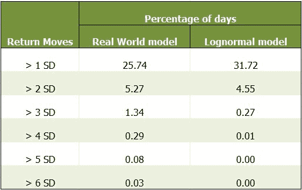
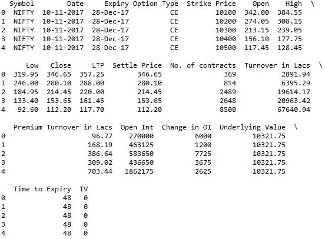
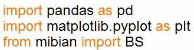
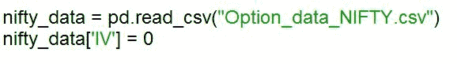
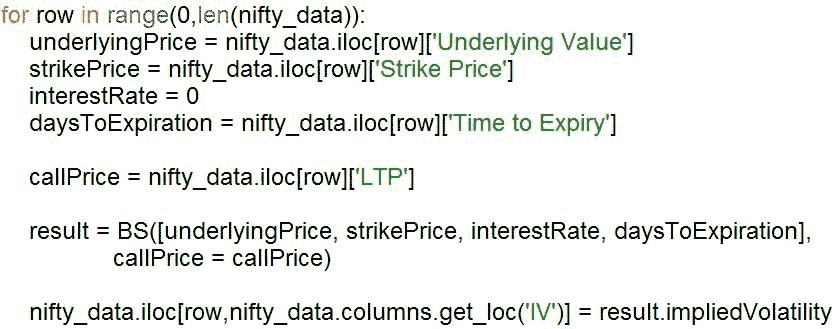
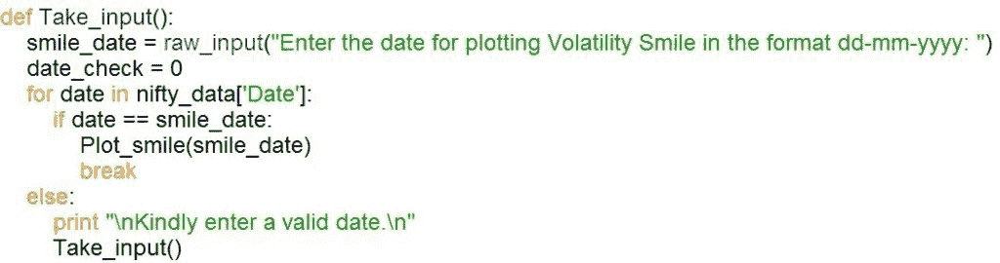
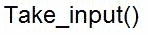
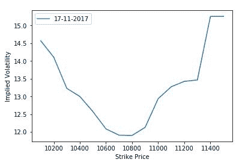

# 如何在 Python 中对波动微笑建模

> 原文：<https://blog.quantinsti.com/volatility-smile-origin-implications/>

由[德旺·辛格](https://www.linkedin.com/in/devang-singh-2402882b/)

在本文中，你将了解易变性微笑的起源和含义。您还将看到如何用 Python 绘制波动率微笑曲线。首先，我们将通过分析 Black Scholes 模型(BSM)中的假设来理解波动率微笑的概念，该假设认为标的的每日收益是对数正态分布的。

### **布莱克-斯科尔斯模型-对数正态假设**

[Black Scholes 模型](/black-scholes-model/)假设标的收益服从对数正态分布。然而在现实世界中，回报的分布要比这复杂得多。为了更好地理解这一点，让我们通过分析下表中所示的基础资产的每日回报来看一个例子。

<figure class="kg-card kg-image-card kg-width-full"></figure>

第一列表示给定一天的每日回报的偏差量，即每日回报的偏差大于一个标准偏差、两个标准偏差等等，直到六个标准偏差。第二列和第三列存储日收益率偏离超过一个、两个等等直到六个标准差的百分比或概率。第二列存储真实资产的值，而第三列存储人工创建的对数正态模型的值。

现在，在比较百分比值时，可以观察到，在现实世界中，与对数正态模型相比，回报率值偏离超过 4、5 和 6 个标准差的天数百分比要高得多。可以看出，对于真实世界的资产，超出 4 个标准差的值的百分比是对数正态模型的 29 倍。因此，我们希望做得比假设收益是对数正态更好。

### **波动的微笑**

深度价外期权需要更高的偏差来结束。这意味着，在现实世界中，与具有对数正态分布的标的相比，远高于货币的期权更有可能以货币结束。BSM 模型计算期权溢价时考虑了标的的不变波动性和对数正态分布。因此，考虑到基础资产不遵循对数正态分布且不具有恒定的波动性，使用 BSM 计算的溢价相对于公允价值会更便宜。因此，当将看涨期权和看跌期权溢价的值放入 BSM 公式以得出[隐含波动率](/implied-volatility/)的值时，可以观察到隐含波动率呈微笑状，货币期权的最小值和波动率随着您向任一侧移动而上升，如下图所示。

### **用 Python 绘制波动微笑**

现在让我们了解如何在 Python 中绘制波动微笑。首先，您需要了解数据的结构。看看下面的数据帧，观察数据的结构，从 NSE 的 Nifty50 选项的网站下载后，数据的结构略有修改。

<figure class="kg-card kg-image-card kg-width-full"></figure>

#### **1。导入库**

现在让我们看看如何使用这些数据来绘制波动微笑。我们将从导入相关的库开始。

<figure class="kg-card kg-image-card kg-width-full"></figure>

我们将导入 pandas 库以使用其强大的数据框架的特性。接下来，我们将导入 matplotlib.pyplot 库来绘制微笑。最后，我们将导入 Mibian 库，它用于计算隐含波动率。我们从这个库中导入了函数 BS，它有助于实现 BSM 公式。要了解更多关于这个库以及它是如何被用来进行各种计算的，你可以看看下面这篇博文的后半部分:[期权定价模型——布莱克·斯科尔斯、德曼·卡尼&赫斯顿模型](/options-pricing-models-black-scholes-derman-kani-heston-model/)

#### **2。提取选项数据**

接下来，我们将获取以上述格式存储在 CSV 文件中的选项数据。

<figure class="kg-card kg-image-card kg-width-full"></figure>

我们使用 pandas 库将 csv 文件中的数据转换成名为 nifty_data 的数据帧。然后，我们在列标题“IV”下创建一个新列来存储隐含波动率，并初始化该列来存储零。

#### **3。计算隐含波动率**

<figure class="kg-card kg-image-card kg-width-full"></figure>

我们现在将计算 dataframe nifty *数据中所有期权在不同日期的隐含波动率。我们通过运行 for 循环，遍历 dataframe nifty* 数据的所有行来实现这一点。然后，我们定义不同的变量，这些变量将用于调用 BS 函数来计算隐含波动率。利率设为 0 是因为我们的数据框架中的基础价值是期货合约价格 50，而不是现货价格 50。隐含波动率的值使用所示的 BS 函数计算，并存储在列标题“IV”下的数据框架 nifty_data 中。

#### **4。定义 Plot_smile()函数**

<figure class="kg-card kg-image-card kg-width-full"></figure>

接下来，我们定义 Plot *smile()函数，该函数将日期作为输入，并绘制特定日期的微笑。这是通过定义一个名为 option* data 的新数据帧来实现的，该数据帧存储该特定日期的数据行。然后，我们通过将期权数据的“执行价格”和“IV”列作为 x 轴和 y 轴作为 plot()函数的参数来绘制微笑。然后，我们为该图定义图例和标签，最后在函数的末尾显示该图。

#### **5。定义接受输入的函数**

<figure class="kg-card kg-image-card kg-width-full"></figure>

#### **6。调用 Take_input()函数**

<figure class="kg-card kg-image-card"></figure>

最后，我们调用 Take_input()函数从用户那里获取输入。下面显示了 2017 年 11 月 17 日代码的输出图。

<figure class="kg-card kg-image-card kg-width-full"></figure>

### **结论**

我们观察到隐含波动率曲线是一个微笑的形状，而不是像 BSM 模型假设的那样平坦。因此，基础并不遵循对数正态分布，而是遵循修正的随机游走。德曼卡尼模型和赫斯顿模型是为了纠正 BSM 模型中的错误假设而开发的。

如果你有兴趣学习基于波动性的编码交易策略，你应该报名参加 Quantra 的以下课程:

### **下载数据文件**

*   Option_data_NIFTY.csv
*   VOL SMILE.py