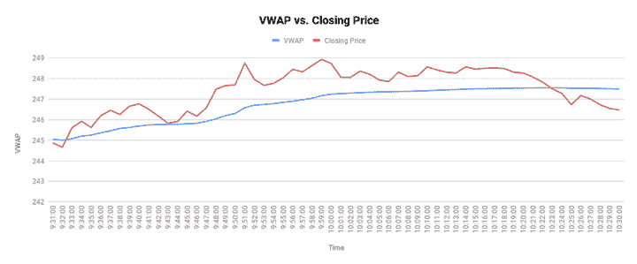

# VWAP 教程:计算、使用和限制

> 原文：<https://blog.quantinsti.com/vwap-strategy/>

由[查尼卡·塔卡](https://www.linkedin.com/in/chainika-bahl-thakar-b32971155/)

通常如果一个交易者必须比较两个看起来不错的证券，一个有经验的交易者会检查股票的价格和交易量。

现在，你会问，“价格是显而易见的，但为什么是数量呢？”

成交量和价格一样重要，因为我们不想被一只只有少数人买的股票套牢，即使价格太有吸引力。因此，VWAP 的建立是为了同时考虑数量和价格。

用 VWAP 作为交易的衡量标准，潜在的交易者会比仅仅考虑价格更准确地决定多头和空头头寸。

让我们通过这篇博客了解更多关于 VWAP 的信息，因为它包括:

*   什么是 VWAP？
*   [VWAP 公式](#formula-of-vwap)
*   [VWAP 在 Excel 中的应用](#application-of-vwap-in-excel)
*   [与 VWAP 的交易——解读](#trading-with-vwap-the-interpretation)
*   [如何使用 VWAP](#how-to-use-vwap)
    *   [VWAP 作为趋势的确认](#vwap-as-a-confirmation-of-trend)
    *   [VWAP 作为交易者的执行策略](#vwap-as-a-trade-execution-strategy)
    *   [VWAP 作为一个指标](#vwap-as-an-indicator)
    *   [VWAP 作为盈利能力的检查](#vwap-as-a-check-of-profitability)
*   [VWAP vs MVWAP](#vwap-vs-mvwap)
*   [使用 VWAP 的好处](#pros-of-using-vwap)
*   [使用 VWAP 的缺点](#cons-of-using-vwap)

* * *

## 什么是 VWAP？

成交量加权平均价格，也称为 VWAP，是衡量金融工具根据交易量调整后的平均价格的方法。

简单来说，成交量加权平均价格就是相对于成交量的累计平均价格。

数量加权平均价格(VWAP)计算简单，用途广泛。当对冲基金或共同基金使用 VWAP 来指导其购买大量股票的决定时，散户投资者会使用它来检查价格是否足够好来做多。

* * *

## VWAP 公式

计算 VWAP 的公式是累计典型价格乘以总交易量，再除以累计交易量。内容如下:

**VWAP =(累计(价格*成交量))(累计成交量)**

虽然公式很简单，但让我们通过一个例子来了解 VWAP 在 Excel 中的应用。

* * *

## VWAP 在 Excel 中的应用

为了计算 VWAP，我们将采用亚马逊的分钟级数据。你可以从阿尔法华帝 [⁽ ⁾](https://www.alphavantage.co/) 获得样本历史数据。你也可以阅读更多关于股票 API 提供商如 Alpha Vantage 如何根据分割和股息调整历史价格的 [⁽ ⁾](/p/cf485baa-516b-4df8-af5e-6d7b68dc4534/%E2%81%BD%C2%B2%E2%81%BE) 。我们使用了 2022 年 4 月 1 日的数据。数据示例如下:

| **日期** | **打开** | **高** | **低** | **关闭** | **体积** |
| 2022-04-01 08:00:00 | 3281.0000 | 283.7374 | 3281.0000 | 3281.0000 | Three hundred |
| 2022-04-01 08:01:00 | 3284.9000 | 3284.9000 | 3284.9000 | 3284.9000 | Two hundred and fifty |
| 2022-04-01 08:02:00 | 3284.9000 | 3284.9000 | 3284.9000 | 3284.9000 | One hundred |

### 第一步:求平均值

为了获得给定期间证券交易价格的可靠估计，我们取价格数据的平均值，在这种情况下，是最高价、最低价和收盘价的平均值。

因此，8:00 时的平均价格=(283.7374+3281.000+3281.000)/3 = 2281.91

同样，对于 8:01，平均价格=(3284.9000+3284.9000+3284.9000)/3 = 3284.90

### 第二步:将平均价格乘以该时期的交易量，并加上前一时期的累计总额

因为我们要寻找的时间段是 8:00，所以交易量是 300。

因此，8:00 时的价格累计总额=(价格*成交量)= 2，281.91*300 = 684573。

因为是一天的第一节，所以是简单的乘法。从第二列开始，我们取累计总数，即将前一期的值加到当前值上。

因此，对于 8:01，交易量为 250，累计平均价格=((8:01 的平均价格)* 8:01 的交易量)+8:00 的累计总额

= [ 3284.90 * 250] + 684573 = 15,05,798.

### 第三步:求累计总量

因为我们找到了累计平均价格*交易量，所以我们必须保存证券交易量的累计总数。

因此，对于 8:00，刚好是 300，因为这是一天的第一个时段。

对于 8:01，则为(8:01 的成交量)+前期累计成交量，即

(250+ 300) = 550.

### 第四步:找到 VWAP

我们简单的用累计价格*成交量除以累计成交量。

因此，对于 8:00，VWAP = 684573 / 300 = 2281.91

对于 8:01，VWAP = 15，05，798 / 550 = 2737.8145

在 Excel 中，它看起来像这样:

​

| **日期** | **打开** | **高** | **低** | **关闭** | **体积** | **平均价格** | **均价*成交量** | **累计量** | **VWAP** |
| 2022-04-01 08:00:00 | 3281.0000 | 283.7374 | 3281.0000 | 3281.0000 | Three hundred | Two thousand two hundred and eighty-one point nine one | Six hundred and eighty-four thousand five hundred and seventy-three | Three hundred | Two thousand two hundred and eighty-one point nine one |
| 2022-04-01 08:01:00 | 3284.9000 | 3284.9000 | 3284.9000 | 3284.9000 | Two hundred and fifty | Three thousand two hundred and eighty-four point nine | 15,05,798 | Five hundred | 2737.8145 |
| 2022-04-01 08:02:00 | 3284.9000 | 3284.9000 | 3284.9000 | 3284.9000 | One hundred | Three thousand two hundred and eighty-four point nine | 18,34,198 | Three hundred and fifty | Five thousand two hundred and forty point five six five |

* * *

## 与 VWAP 的交易——解读

有了 VWAP，交易者可以获得关于股票价格变动的完整信息，帮助他们确定最佳进场点。

例如，一个交易者等待特定股票的价格线超过 VWAP 线。如果市场上有大量卖出(空头头寸)该股票，该股票可能无法突破 VWAP 线。

这是因为 VWAP 线以上的股票被认为是昂贵的，因此价值很高。当股价上涨到 VWAP 线以上时，这意味着很多交易者在买入股票。这是当交易者在价格达到最高点之前就离开的时候。

另一方面，低于 VWAP 线的股票被认为是被低估的，并呈下降趋势，这使得交易者做空这些股票。

借助趋势线(支撑线和阻力线)和烛台模式(代表价格运动)，交易者可以发现股票何时高于或低于 VWAP 线。

* * *

## 如何使用 VWAP

至此，我们在 Excel 的帮助下学习了 VWAP 的计算和应用。让我们看看交易者是如何利用 VWAP 的，原因有很多，如下所示:

*   VWAP 是趋势的印证
*   VWAP 作为交易者的执行策略
*   VWAP 作为一个指标
*   VWAP 作为盈利能力的检验

### VWAP 是趋势的印证

我们以前提到过 VWAP 如何给我们提供与数量和价格相关的信息。它还帮助我们确认可能正在出现的趋势的存在。

让我们用下面的一个图表例子来理解这一点(显示 VWAP 和股票的收盘价),计算完成后可以在 Excel 中绘制出来。

<figure class="kg-card kg-image-card kg-width-full kg-card-hascaption">

<figcaption>VWAP vs. Closing price</figcaption>

</figure>

如果你看到 VWAP 的图表，尽管收盘价频繁波动，我们可以清楚地看到 VWAP 在上升。上升的 VWAP 表明买方比卖方多。

它也表明一个看涨阶段，反之，下降的 VWAP 表明一个看跌阶段。

### 作为交易执行策略的 VWAP

机构买家也使用 VWAP，他们需要购买或出售大量股票，但不想引起交易量飙升，因为它会吸引注意力并影响价格。

为了进一步解释这一点，我们假设一家机构有兴趣购买 10，000 股亚马逊股票。如果他们下了 10，000 份订单，当交易所执行订单时，立即采取的行动将是价格飙升。

现在，如果其他交易员知道对该股票的需求很大，他们会要求更高的股票价格，从而使该机构的股票价格更高。

为了避免这种情况，这些机构开发了一种自动交易策略，将股票数量分成更小的数量，并以这样的方式出价，即他们的交易不会让收盘价远离 VWAP。

由于 VWAP 是某些交易者交易决策的依据，它有助于使收盘价尽可能接近 VWAP。

### VWAP 作为一个指标

在日内交易者中，VWAP 指标也可以用于交易策略。关于如何准确地使用 VWAP 作为一个指标，存在着相互矛盾的理论，因此我们将试图更详细地了解这一方面。

我们通常会考虑收盘价穿过 VWAP 作为信号的情况，因此，VWAP 交叉可以根据你的风险状况用来进场或出场。

在我们看不同的场景之前，让我们退后一步，理解 VWAP 在交易者身上实际上是自我实现的。如前所述，某些机构交易者试图以收盘价不超过 VWAP 的方式执行交易。

这可能会影响其他交易者，他们会查看收盘价并做出交易决定，认为收盘价最终会接近 VWAP。

因此，当收盘价开始上涨并远离 VWAP 时，交易者之间会有卖出的压力，因为逻辑是其他人会在任何时候卖出。

这就造成了一种普遍认为股票被高估的情况。类似地，当收盘价开始下跌并远离 VWAP 时，人们认为股票被低估，交易者有购买股票的压力。

这样，我们可以称 VWAP 为自我实现。当然，根据市场的心态，可能会有不同的情况，因此，人们不能只依靠 VWAP 来做出交易决定。

现在让我们看看其他几个场景。

一些交易者更喜欢将 VWAP 交叉作为一个指标，当收盘价从下方穿过 VWAP 并攀升时，买入该股，这表明了看涨趋势。

然后，要么等待收盘价达到当天的高点，然后卖出并退出交易。一旦收盘价出现反转迹象，其他交易者就会退出。

相反，当收盘价从上方穿过 VWAP 并持续下跌时，一些交易者会做空股票。一旦收盘价达到当天的低点，他们就会结束交易。

现在，一些交易者更喜欢低于 VWAP 的价格，因为这是买入的好价格，高于 VWAP 的价格可能表明这是卖出的好时机。以前面的 VWAP 图为例，你可以看到当价格高于 VWAP 时，有一个小的时期，价格持续上涨，然后价格下跌。

然而，对于交易策略来说，交易者认为收盘价与 VWAP 的交叉是一个信号。然而，人们应该注意到，VWAP 是一个滞后指标，这意味着它是完全基于历史数据计算的。因此，它不应该是交易策略中的唯一指标。

### VWAP 作为盈利能力的检验

一旦交易者结束了交易，他们就会查看 VWAP 来检查他们的交易是否盈利。例如，如果一个交易者以 248 美元的价格购买了一股亚马逊股票，当天的 VWAP 是 250 美元，那么这个交易者实际上是以一个好价格购买了这只股票，并可以在这笔交易中获利。

到目前为止，我们已经看到了 VWAP 的一些用途。然而，通读这篇文章时，你是否有某种似曾相识的感觉，或者说，你是否意识到你曾读到过不同指标的类似特征？

你认为 VWAP 只是均线的另一种变化吗？为了回答这个问题，让我们看看 VWAP 和移动 VWAP (MWAP)之间的区别。

* * *

## VWAP vs MVWAP

以下是 VWAP 和 MVWAP 的区别:

| **MVWAP** | **VWAP** |
| 移动 VWAP 是一条移动平均线，直观地表示股价运动。它在一段时间内跟踪一天结束时的 VWAP。 | VWAP 代表通常在特定一天内根据交易量调整的平均价格。 |
| MVWAP 给出了要分析的 VWAP 计算的平均数量。这意味着 MVWAP 可以从一天运行到下一天，给出一段时间内 VWAP 值的平均值。这使得 MVWAP 更加可定制，因为它是为满足特定需求而定制的。它还可以对短期交易的市场波动做出更灵敏的反应，如果选择更长的周期，它还可以消除市场噪音。 | VWAP 将提供全天的运行总数。因此，当天的最终价值就是当天的成交量加权平均价格。

例如，如果对某只股票使用一分钟图表，当天将进行 390 次(6.5 小时 X 60 分钟)计算，最后一次计算提供当天的 VWAP。 |
| MVWAP 看起来与 VWAP 相似，但不如 VWAP 流畅。这意味着 MVWAP 中有更多的突然变化，因为它处理的数据周期更长。 | VWAP 是一条平滑得多的线，它所建立的数据中的突然变化要少得多。 |

因此，虽然 MVWAP 和 VWAP 之间只有一线之隔，但这一线之隔也代表了显著的差异。

* * *

## 使用 VWAP 的优点

说到优点，我必须提到，成交量加权调整价格是股票的真正平均价格，并不影响其收盘价。

让我们看看 VWAP 如此受欢迎的原因:

**VWAP 可以指示市场是看跌还是看涨:**
当价格低于 VWAP 时，市场是看跌的，如果价格高于 VWAP，则市场是看涨的。牛市表明有买入压力，图表上的趋势线向上移动。熊市表明抛售压力，导致股价图呈下降趋势。

**在 VWAP，买卖的指标很突出:**
以 VWAP 线为指标的交易者，将可以低价买入，从而在卖出股票时获得更有利的回报。因此，VWAP 帮助投资者做出明智的决定。

**VWAP 可以和移动平均线以及其他交易策略和指标一起使用:**
在选择购买什么股票时，VWAP 是一个很好的指标，但在和其他交易策略一起使用时，它能提供更大的价值。VWAP 可以告诉你很多关于股票的当前和未来状态，包括多头和空头。

此外，VWAP 可以与另一个技术指标相结合来确认趋势，使用这种多指标策略可以大大减少错误信号的数量。

* * *

## 使用 VWAP 的缺点

VWAP 是一个滞后指标，因此，如果你试图用它超过一天，它将无法描绘正确的趋势。因此，它应该只被日内交易者使用。

此外，在某些情况下，某些股票(或市场本身)处于强劲的牛市阶段，因此全天不会有交叉，这反过来向交易者和机构描绘了非常少的信息。

在某种程度上，VWAP 的主要缺点是它不能被使用超过一天，因此，从历史的角度来看，它不能提供太多的信息。

* * *

### 结论

VWAP 是价格和交易量的结合，因此与均线相比，它为交易者提供了一组有价值的信息。计算 VWAP 听起来很复杂，但非常简单，这就是我们在博客前面讨论过的。

此外，当 VWAP 和收盘价一起使用时，解释起来也很简单。记住 VWAP 是做多或做空决策的工具，你可以成功运用 VWAP 方法。

通过 Python 中的[技术指标策略课程，你可以了解更多关于技术指标的知识，并使用 Python 建立自己的交易策略。](https://quantra.quantinsti.com/course/technical-indicators-strategies-python)

* * *

*<small>免责声明:股票市场的所有投资和交易都涉及风险。在金融市场进行交易的任何决定，包括股票或期权或其他金融工具的交易，都是个人决定，只能在彻底研究后做出，包括个人风险和财务评估以及在您认为必要的范围内寻求专业帮助。本文提到的交易策略或相关信息仅供参考。</small>T3】*