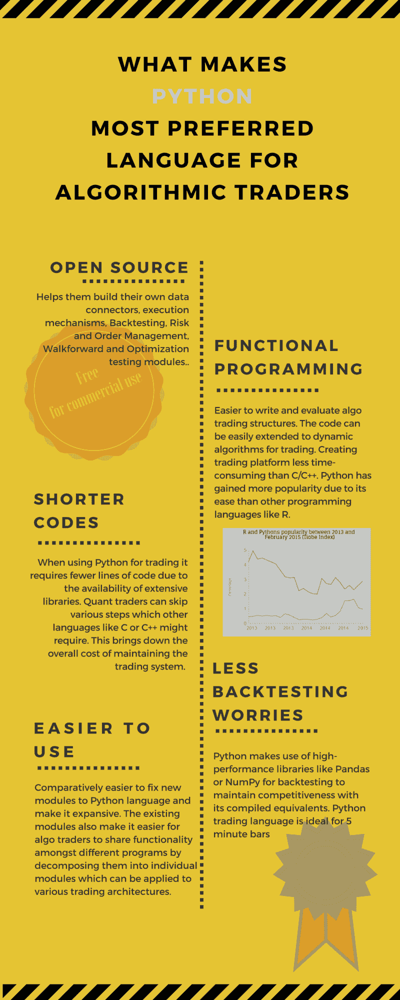

# 是什么让 Python 成为算法交易者最喜欢的语言

> 原文：<https://blog.quantinsti.com/what-makes-python-most-preferred-language-for-algorithmic-traders/>

生存！知识！[技能](https://blog.quantinsti.com/epat-cater-need-essential-skill-sets-required-algorithmic-trading/)！

对于那些希望在竞争激烈的量化交易市场中茁壮成长的人来说，Python、C++或 Java 编程技能是必须的。使用这些编程语言进行算法交易的核心概念是一样的。

我们在 QuantInsti 收到的最常见的问题之一是:“对于算法交易，我应该学习哪种编程语言？”这个问题的答案是:没有什么比算法交易更好的语言了。但是你可以看看 Python，当谈到算法交易时，它是一个完全不同的游戏改变者。

## **Python 是什么？**

Python 是一种免费的开源和跨平台语言，它有一个丰富的库，可以用于几乎所有可以想象的任务和专门的研究环境。

在低/中交易频率的情况下，即对于持续时间不少于几秒钟的交易，这是自动交易的[绝佳选择。它有多个 APIs 库，可以链接起来，使它更优化，更便宜，并允许多种贸易想法的更大探索性发展。](https://blog.quantinsti.com/automated-trading-with-python-webinar/)

## 是什么让 Python 成为算法交易者最喜欢的语言？

### **开源:**

帮助他们建立自己的:

*   数据连接器，
*   执行机制，
*   [回溯测试](https://blog.quantinsti.com/backtesting/)，
*   风险和订单管理，
*   向前走，然后
*   优化测试模块。

### **功能编程:**

*   更容易编写和评估算法交易结构
*   该代码可以很容易地扩展到动态交易算法
*   与 C/C++相比，创建[交易平台](https://blog.quantinsti.com/automated-trading-with-python-webinar/)需要更少的时间
*   与其他语言(如 R)相比，易于使用

### **较短的代码:**

*   使用 Python 进行交易需要更少的代码行，因为有大量的库可用
*   量化交易者可以跳过其他语言如 C 或 C++可能需要的各种步骤
*   这降低了维护交易系统的总成本

### **更少的回溯测试担忧:**

*   Python 使用像 [Pandas](https://blog.quantinsti.com/tick-tick-ohlc-data-pandas-tutorial/) 或 [NumPy](https://blog.quantinsti.com/python-numpy-tutorial-installation-arrays-random-sampling/) 这样的高性能库来进行回溯测试，以保持与编译后的对等库的竞争力
*   Python 交易语言是 5 分钟棒线的理想语言

## **更容易使用:**

*   相对更容易将新模块固定到 Python 语言中，并使其具有可扩展性
*   现有的模块也使算法交易者更容易在不同程序之间共享功能，方法是将它们分解成可应用于各种[交易架构](https://blog.quantinsti.com/trading-systems-architecture/)的独立模块

## **下一步**

如果你正在寻找更多关于算法交易的 Python 库的信息，请查看我们的[博客文章](https://blog.quantinsti.com/python-trading-library/)。如果你是一名程序员或技术专家，希望向 Yves Hilpisch 博士这样的专家学习自动化交易，看看我们的课程[算法交易(EPAT)](https://www.quantinsti.com/epat/) 高管课程。课程涵盖统计学&计量经济学、金融计算&技术和算法&定量交易等培训模块。EPAT 教你成为成功交易者所需的技能。立即注册！

您还可以查看我们的互动课程' [Python for Trading](https://quantra.quantinsti.com/course/python-for-trading) '，通过对自己的策略进行编码和回溯测试，以及 QuantInsti 和 MCX 的联合认证，您将获得 Python 编码的实践经验。