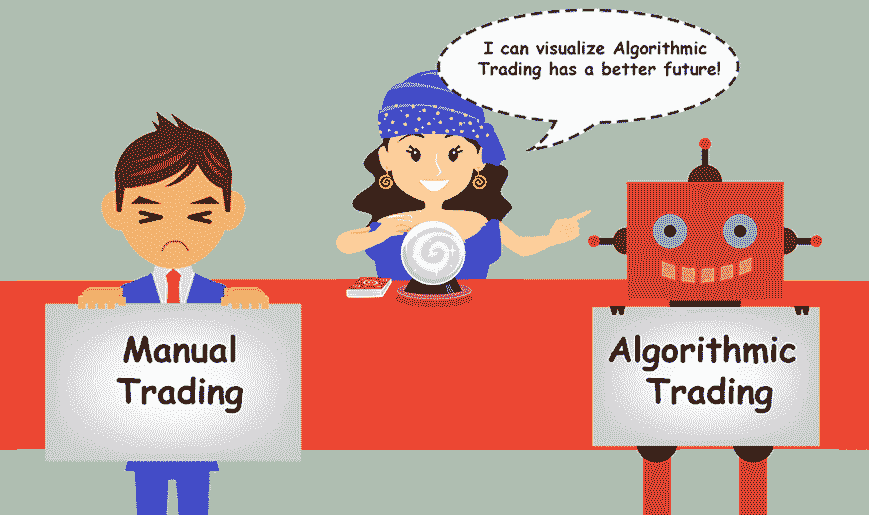
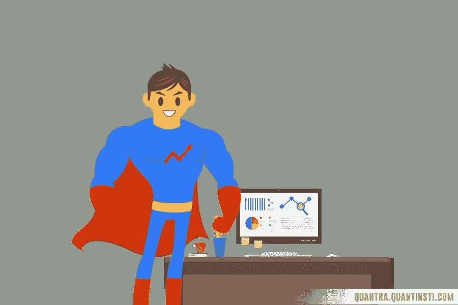
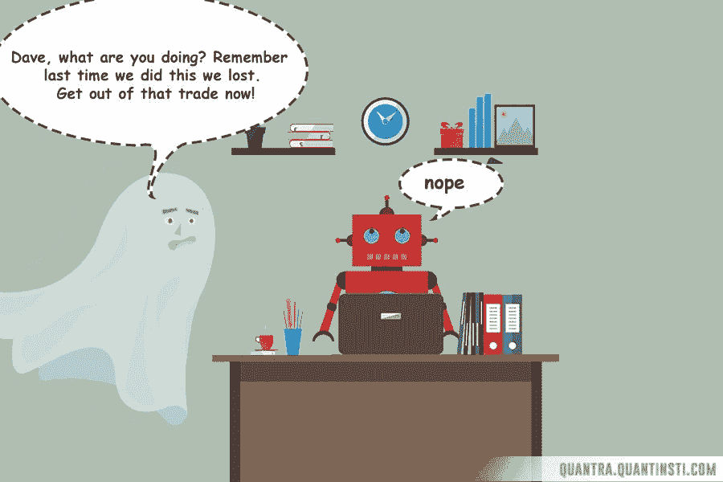
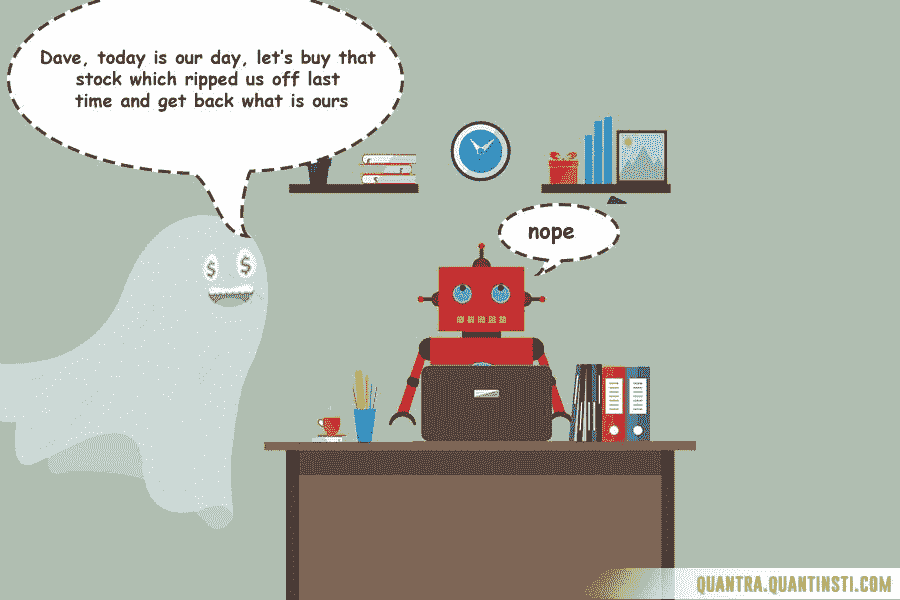
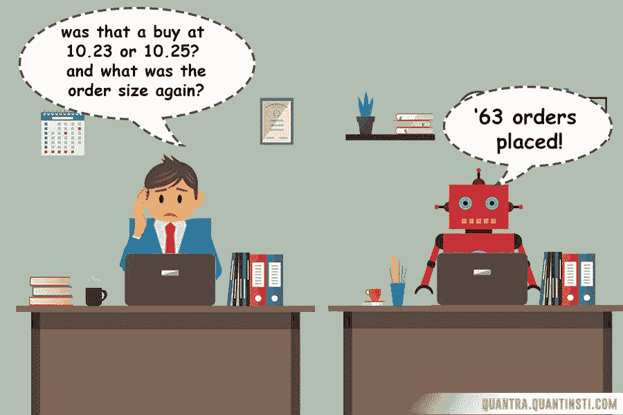
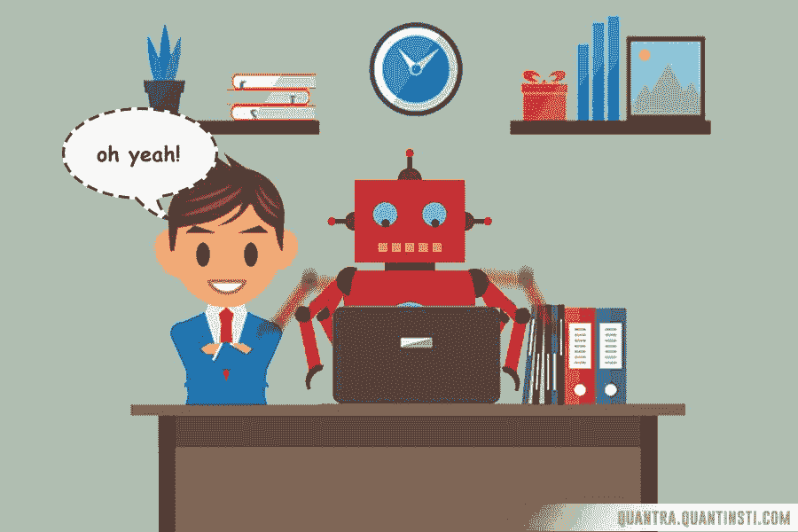
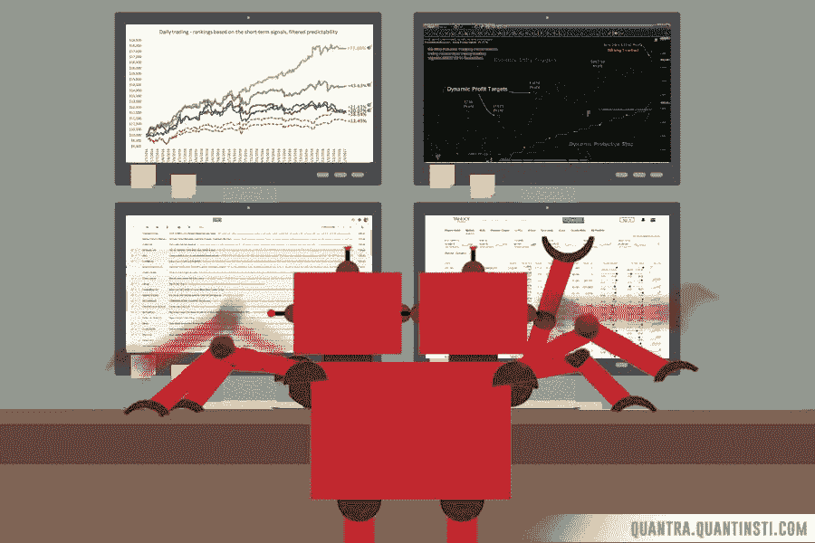

# 为什么你应该做算法交易？

> 原文：<https://blog.quantinsti.com/why-you-should-be-doing-algorithmic-trading/>

由[SushantT5RatnaparkhiT9】](https://twitter.com/ssushh_79?lang=en)

“机器人！啊？他们对交易了解多少？当我问他对算法交易的看法时，我的朋友说:“股票市场需要只有人类才能拥有的洞察力、时机把握和天才水平。”。这可能是真的吗？算法交易是噱头吗？不完全是这样，事实上正相反。

纽约证交所 84%的交易、伦敦证交所 60%的交易和纽约证交所 40%的交易都是通过算法交易完成的。从表面上看，似乎每笔交易迟早都会使用算法来完成。但这是为什么呢？

### **什么是算法交易？**

假设你有一个基于定量分析的策略，这个策略是你开发(或窃取)的，并且对你很有效。让我们假设你的策略告诉你什么时候买/卖股票，什么时候记录利润或减少损失。这是一项战略应该具备的最低要求。如果你的没有，孩子，你就有麻烦了！因此，当你坐在办公桌前啜饮伯爵茶时，你在任何时候都在做以下事情之一

*   根据你的策略，看图表、报价或新闻，试图找到交易信号
*   当你发现交易信号时，填写订单细节(赚钱时间！耶！)
*   监控你的交易，看看它们是否达到了你的目标或者相反的方向(就像他们经常做的那样)
*   平仓，要么记录利润，要么减少损失
*   冲洗并重复

这是你工作时的样子(平均而言):

现在记住，你的策略，无论在理论上多么成功，只要你坚持，它就是好的。虔诚地遵循你的策略是长期获利的重要前提。这意味着你不会屈服于你的情绪，你不会进行近似计算，你不会过早地预定利润或取消止损，因为你认为股票最终会朝着你的方向发展。让我们假设你没有做所有这些事情，假设你像一个虔诚的天主教徒一样遵循你的系统，你是一个像佛教僧侣一样控制自己情绪的超人(我知道你甚至没有接近，但让我们假设你是)。

即使做了所有这些(达到超人/僧侣的水平)，你还没有完成。在你开始从你的策略中获得实际利润之前，还有许多因素你需要弄清楚。例如，你需要不断地回溯测试和调整你的策略，以确保它与这些不断变化的市场相关。只有一种策略会让你面临各种风险，为了减轻这种风险，你必须分散投资，使用至少两种不同的策略。为此，你需要不断扫描市场，寻找适合你策略的新交易资产，等等。

简而言之，要想在交易中成功(特别是量化交易)，你应该表现得像个超人。但我们都知道真相是不同的。我们经常犯错误，我们经常做我们不应该做的事情，我们最终会变得悲伤、痛苦和净资产减少。

但是，如果有一种方法可以外包大部分这种沉重和令人沮丧的工作，如果其他人揪着自己的头发尖叫着亏损，如果你只是站在旁边(啜饮马提尼)知道你的战略被正确地遵循，你最终会赚钱，你唯一要做的工作是专注于战略，会怎么样？

让我为你调制马提尼，欢迎你来到算法交易的世界。算法交易正在把控制权交给计算机。你只需要用计算机能理解的语言写下你的策略，然后让计算机来帮你完成繁重的工作。作为交易者，你在一天中所做的所有工作(如上所述)本质上都是机械的，可以由机器以更好的方式来完成。计算机可以扫描数百只股票，并在几秒钟内执行尽可能多的订单(这用于高频交易或 HFT)，自动化交易台的设置成本也在下降。让机器做平凡的工作，而我们专注于更高智能的事情，这一概念不仅在交易领域，而且在其他任何地方都是一种趋势。阅读:自动驾驶汽车、智能家居、siri 等。

### **算法交易的好处**

#### 人类情感= 0

机器没有情感(至少现在没有，祝你好运谷歌！)我们可以利用这一点。在手动交易中，这是一个巨大的损失。恐惧和贪婪阻止我们做正确的事情。机器不会因为任何外部因素而影响它们的决策，因为它们只是遵循程序中写的东西。当你意识到市场上的大多数交易都不是由情绪驱动的，它会自动让你陷入被动，让算法交易成为一种必要。当你把情绪排除在等式之外时，你的策略真正获得了一个公平的机会。

*T2】*

#### 准确度+速度= 100

机器在处理交易中的操作问题时，每次都很准确。例如，填写正确的订单明细，我发现自己在这个部门犯了很多次愚蠢的错误。我很确定每个人在他们的交易生涯中至少这样做过一次。我们在速度和准确性方面的低效率会让我们失去很多机会。即使是熟练的交易者也至少需要 10-15 秒才能下单，在机器交易的时代，10-15 秒是永恒的，价格可以大幅波动。这是真的，尤其是在 HFT 交易方面。在这段时间内，计算机将会发出和关闭 100 多个订单。

#### 舒适度= 1000%

想象一下，不用每天都经历那种紧张的过山车。仅此一点就足够让你开始学习算法交易了。毕竟，当他们把交易作为一种职业卖给你时，压力部分并没有提到，所以为什么现在要处理它呢？相信我，这种感觉棒极了。

#### 可扩展性= 100 级

考虑到当今巨大的计算能力，我们可以同时运行多种策略来扫描成千上万的交易机会信号。这对于人类来说无论如何都是不可能的。见鬼，我们人类甚至不能长时间专注于一项任务，我们怎么能呢？去你的，9gag！

说到这里，让我告诉你一些与算法交易相关的次要但重要的细节。

### **更多详情**

[算法交易](https://www.quantinsti.com/epat)是一种使用计算机编程的过程，遵循一套定义好的指令进行交易，以便以人类交易员无法实现的速度和频率产生利润。有多种编程语言可用于此目的，其中一些是 R、Python、C++等([点击这里](https://blog.quantinsti.com/what-makes-python-most-preferred-language-for-algorithmic-traders/)阅读为什么 Python 是算法交易者最喜欢的语言)。无论你选择哪种语言，你都需要确保你的算法能正确地与计算机沟通，并涵盖市场可能发生的所有事件。否则，你的电脑将像一个松散的大炮。这种情况下的损害可能是巨大的。

如果你对建立自己的 algo 交易平台感兴趣，这篇文章将指导你完成一整套的要求。简而言之，你需要一个有效的策略，允许自动程序运行的交易软件，为你的策略编码的编程技能，以及测试用的历史数据，这是除了经纪人、许可证等通常的交易之外的东西。

### **下一步**

算法交易是未来，唯一的问题是你什么时候上船？

通过查看 Quantra 上的自定进度认证课程，现在就开始学习交易策略范例、可用于交易的不同编程语言以及算法交易相对于传统交易技术的优势！

如果你想学习算法交易的各个方面，那就去看看《算法交易》( EPAT)的高管课程。这个[算法交易课程](https://www.quantinsti.com/epat/)涵盖了统计学&计量经济学、金融计算&技术、算法&量化交易等培训模块。EPAT 为你提供了在算法交易中建立一个有前途的职业生涯所需的技能。