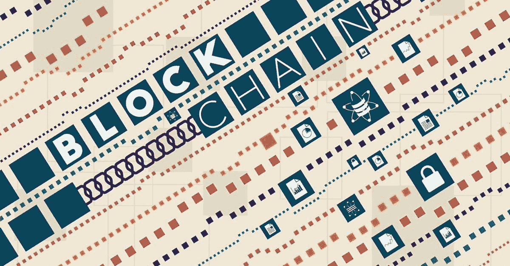
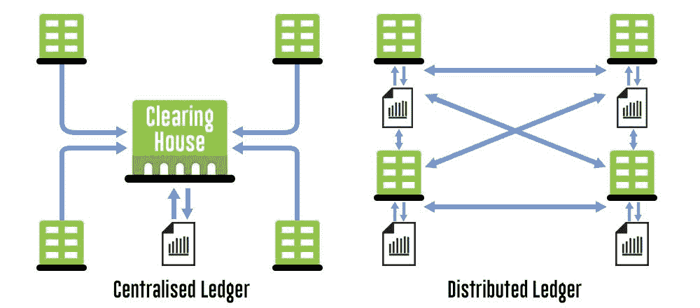

# 区块链将如何改变股市？

> 原文：<https://blog.quantinsti.com/will-blockchain-change-stock-markets/>

Sushant Ratnaparkhi

不，我们不是在谈论比特币。[比特币](https://blog.quantinsti.com/hackers-wannacry-ransom-ware-demand-bitcoins-trader-care/)和区块链是两回事，人们经常会误解。区块链是一个比比特币大得多的概念，你可以说比特币是区块链的一个应用。

### 那么，什么是区块链呢？

区块链的快速而简单的定义——一个分布式在线账本系统，它有多个节点，每个节点(一台计算机)维护账本的更新副本。可以有任意数量的节点，任何人或组织都可以成为节点。分类帐中有交易条目块，这些块是公共的，任何节点都可以添加新的块(假设节点遵循规则)。

块在网络中一个接一个地被正式化，并且分类帐(具有新块)由整个网络更新。尽管这些块是公开的，但它的内容受密码保护，不允许修改过去的块。由于分类帐有多个副本，任何人都不能删除或修改现有的块，这提供了内在的安全性，而不需要中央机构。

由于区块链的性质，它有许多优势，可以在各种领域实施，如智能合同、资产注册和其他金融和法律用途。

让我们关注一下，如果区块链技术在股票市场实施，会发生什么。

#### 没有中间人

目前，有许多实体参与股票市场，如经纪人，监管机构和证券交易所本身。区块链可以让证券交易所去中心化。该技术可以强制执行规则和条例，并确保 100%的合规性。这不仅会降低客户在佣金方面的巨额成本，还会加快交易过程，从而大大加快交易结算。

区块链还可以在很大程度上消除对第三方监管机构的需求，因为规则和法规将被建立并要求每次都遵循，以使你的交易成为官方的(作为区块链的一部分)，所以在这种情况下，网络充当每一笔交易的监管机构。

转向区块链的行动已经开始，日本金融服务厅已经允许东京证券交易所的运营商日本交易所集团使用区块链作为其核心交易基础设施[【1】](https://www.cryptocoinsnews.com/blockchain-trading-greenlit-japan/)

2015 年，纳斯达克公开了使用其纳斯达克 Linq 区块链总账技术成功完成并记录私人证券交易[【2】](http://www.nasdaq.com/article/how-stock-exchanges-are-experimenting-with-blockchain-technology-cm801802)

#### 降低交易成本

目前，区块链交易比任何其他跨境交易都要快得多。交易确认是由同行而不是任何第三方完成的，几乎可以是即时的。

例如，从一个国家向另一个国家汇款需要大约 2-3 天，而设计用于此目的的区块链应用程序可以在几分钟内完成。不难想象这种效率对全球经济发展的影响。

此外，由于系统中的中介数量减少，与它们相关的成本，如交易记录保存、审计和交易验证也将减少。例如，在当前的系统中，1%的处理费可能看起来不多，但增加了许多中介，成本会显著增加，从长远来看会产生影响。这也限制了很多小玩家的进入。区块链扫除了这个障碍。任何有助于小企业与大企业竞争的变革都会产生重大的全球影响。

#### 更高的安全性和透明度

基于区块链的交易所可以具有内置功能，可以自动阻止和报告网络中任何人的恶意尝试。这使得市场监管机构的监管更加透明。由于制度的缺陷给政策制定者带来的限制可以消除，他们可以在不降低标准的情况下实现政策目标。这可以极大地加速世界经济的增长。

由于区块链分类账的设计方式是所有参与者都有交易的完整记录，因此投资者的持股情况也是如此，这为市场带来了完全的透明度和信任。

#### 更高的流动性

区块链削减了低效率，从而降低了准入门槛和成本。这意味着许多由于这些障碍而无法进入市场的人现在可以参与进来。这意味着流动性增加，谁不喜欢流动性呢？更高的流动性意味着更多的投资。

### 结论

当然，在部署区块链方面存在挑战，首先是重新思考定义当前基于旧纸张(伪装成数字)系统的可能性和政策。该系统的性质也带来了新的挑战，例如，比特币区块链的运作方式，首先解决数学问题的矿工可以决定他/她的区块为官方区块，这将对股票市场的时机产生巨大影响。如果投资者能够使用高端基础设施首先记录他们的交易，这将造成一个实体比其他实体更有优势的局面。然而，这些挑战是可以克服的，我们将有一个真正彻底改变金融世界的系统，为每个人造福。从我们的博客了解更多关于[加密货币交易平台的信息。](https://blog.quantinsti.com/top-9-cryptocurrency-trading-platforms/)

QuantInsti 的 Quantra 专门提供算法和量化交易的自定进度在线课程。凭借最先进的人工智能学习技术，Quantra 提供了高度互动的练习，有助于促进对交易中复杂概念的理解。请点击查看课程[。](https://quantra.quantinsti.com/courses?utm_source=qiblog&utm_medium=referral)