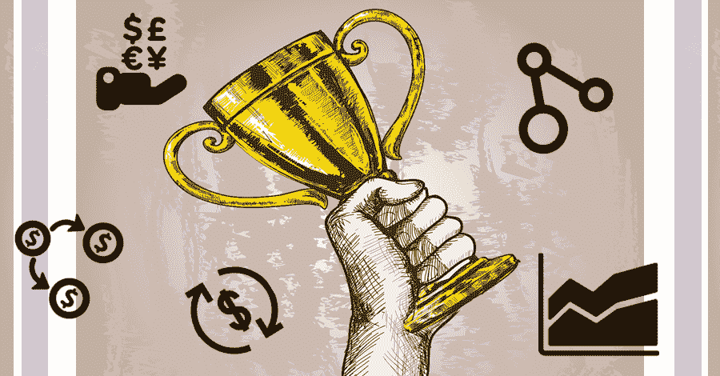
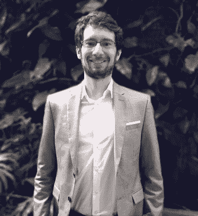

# 赢得世界交易冠军- Nikolas 分享他的学习经验

> 原文：<https://blog.quantinsti.com/world-trading-champion-trader-experience/>

交易一直是一个有利可图的领域，人们不断被它吸引。虽然情况并不总是这样，但时代变了，交易的方式也变了。

没有人生来就有成为任何职业一部分的本能，是他们的兴趣、动力和渴望驱使他们选择自己喜欢的工作。为了实现这一目标，全球无数人自学成才。算法交易的追求者没有落后。有了像 Quantra 这样的程序指导，他们正在快速进入这个领域。

令人惊讶的是，有像尼古拉这样的人让这一切看起来简直不可思议！他的故事是一个不屈不挠的坚持，渴望了解更多，渴望实现的故事。这难道不像是直接出自电影剧本吗？嗯，是真的！

加入我们的旅程，尼古拉与我们分享他的故事。

### **我们与 Nikolas Pareschi 的对话**

#### 你好，Nikolas，给我们介绍一下你自己吧！

嗨！我是来自巴西的 Nikolas Pareschi。我毕业于应用数学专业，并获得了金融工程硕士学位。除了独立交易，我还是巴西教育网站 Investidor de Sucesso 的讲师。

#### 是什么让你成为交易者的？

我一直对碰运气的游戏感兴趣，在大学期间和几年后，我玩过专业水平的扑克。金融界自然而然地成为从扑克和其他来源赚取资本的途径。我在 2007 年开始交易，对新手来说这一年并不好，至少从财务角度来看是这样。然而，最初几年是艰难的。这并没有让我放弃，我读了我能找到的每一本书(超过 200 本)，并不断进步。

#### 你能解释一下你的交易之旅吗？

2011 年，我开始从事算法交易，那一刻是一个顿悟。现实情况是，大多数指标和方法都经受不住统计稳健性测试。即使是那些通过交叉验证或向前走的人，他们也可能突然停止工作！我的道路逐渐变得越来越量化。

我不认为我是一个有创造力的人，我自己在我的生活中没有发现很多阿尔法甚至贝塔，但是我能认出宝石在哪里。我开始阅读关于 SSRN 的金融论文，这是我第二次顿悟的时刻。金融论文是交易思想的一个很好的来源，大多数论文写得很好，后验测试通常以一种形式完成，这样它们可以有统计学意义。

顺便说一下，我开始阅读学术论文是由于欧内斯特·陈博士在他的一本书中提出的建议。

#### **赢得外汇锦标赛世界杯——这是怎么回事？**

在 2015 年获得巨大回报后，2016 年我决定参加 [2017 外汇世界杯](https://www.worldcupchampionships.com/live-stats-3-2-2)。这是因为一个朋友的坚持，过了一会儿我说，为什么不呢，如果我参加了，2016 年的成绩会是第二名。如果真的发生了，那就太好了。要赢得世界交易冠军，你必须持续交易阿尔法(理想情况下)和贝塔，达到高夏普比率，当然，还需要一些运气。2017 年是美妙的一年，我对交易员的承诺和特朗普/墨西哥局势进行了计时，并利用购买力平价、回归均值和动量在东欧货币中进行了一些操作。这些都是伟大的比赛，我也犯了一些错误，但很高兴这些错误被最小化了。

#### **在算法、回溯测试等方面有着丰富的经验，是什么让你加入了 Quantra？**

我非常尊重欧内斯特·陈博士的工作，当我知道 Quantra 时，我立即报名参加了一些课程。我最喜欢 Quantra 的是交易经验和学术水平的完美结合。

我在交易中融入的一些想法来自于我在 Quantra 课程中的学习。

#### 对交易者有什么提示或建议吗？

我建议新手在每个市场交易，并且要全面。一切都是相互关联的，有些外汇失衡来自股市，有些时候则来自大宗商品，有些时候则来自国债。此外，如果你在每个市场都交易，你可以开始更有选择性地玩游戏，你也不会有分散投资的问题。有时更好的投资是房地产投资信托基金，有时是期权。

例如，在 2014 年和 2015 年美元走强和布伦特原油价格暴跌之后，我在 2016 年早些时候发现，一家巴西石油公司的现金超过了其市值，同时还考虑到了债务(PRIO3)。从那时起，它的价值已经超过了 700%(不幸的是，我在 700%之前卖出了股票，但获得了一些不错的利润)。

我们永远不知道机会会在哪里。但是以整体的方式思考，我们会有线索去寻找。由于美元走强，当时的新兴市场遭受了疯狂的打击，石油公司遭受的打击更大。为什么不在新兴市场寻找石油公司呢？

> 去贝叶斯，永远坚持科学的方法。

#### **在 QuantInsti 学习解决方案**

学习交易策略有一些特别之处，从一行代码开始，一步一步来！如果你正在寻找量化和算法交易的短期自学课程，我们推荐你 [Quantra](https://quantra.quantinsti.com/) 。它提供实用的实践培训来创建你自己的交易策略。对于那些正在寻找算法交易认证，并在算法交易中开始自己的事业的人，请了解更多关于 EPAT 的信息。

*免责声明:为了帮助那些正在考虑从事算法和量化交易的人，这个案例研究是根据一个学生或 QuantInsti 的[EPAT](https://www.quantinsti.com/EPAT)项目的校友的个人经历整理的。案例研究仅用于说明目的，并不意味着用于投资目的。EPAT 项目完成后取得的结果对所有人来说可能并不一致。*